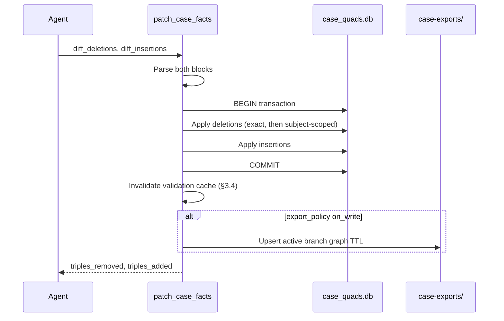

# Knowledge Management System Specification — Addendum 1

**Case graph correction, reconciling branch merge, and store sync**

This document is **Addendum 1** to [knowledge-management-specification.md](./knowledge-management-specification.md). It specifies platform extensions required to eliminate agent workflows that hand-edit `case-exports/graphs/*.ttl` or bypass MCP with ad-hoc Python bootstrap scripts when correcting Case facts, resolving branch merges, or recovering from store/export drift.

Addendum 1 is normative where it defines new tools, config keys, and algorithms. Unchanged behavior in the base specification remains authoritative.

---

## A.0 Motivation and scope

### A.0.1 Problem statement

The base specification defines `ingest_case_facts` as **insert-only** (§4.1). Branch merge resolution under §5.3 copies quads from the source graph into the target graph but does **not** remove superseded target triples. Bootstrap (§2.6, §3.2) may rebuild `.km/case_quads.db` from `case-exports/` when checksums indicate exports are newer than the runtime store.

Together, these behaviors produce three failure modes observed in production agent sessions:

| Failure mode                  | Symptom                                                                                                                                                             | Current workaround (undesired)                            |
| :---------------------------- | :------------------------------------------------------------------------------------------------------------------------------------------------------------------ | :-------------------------------------------------------- |
| **Uncorrectable ingest**      | Agent ingests corrected types but old triples remain (e.g. remove `ApplicationCore` from a subject)                                                                 | Hand-edit export TTL; rebuild store                       |
| **Additive merge residue**    | `resolve_branch_merge MERGE` imports feature-branch fixes but stale target triples survive (e.g. phantom subject deleted on feature branch still present on `main`) | Hand-edit `refs-heads-main.ttl` after merge               |
| **Session / bootstrap drift** | Long-lived MCP session or bootstrap re-import reports stale SHACL violations despite on-disk exports being correct                                                  | Run `KMApplication.bootstrap()` in a one-off Python shell |

### A.0.2 In-scope additions (highest impact)

| ID     | Addition                                        | Addresses                                             |
| :----- | :---------------------------------------------- | :---------------------------------------------------- |
| **A1** | `patch_case_facts` MCP tool                     | Insert + delete diffs on the active branch graph      |
| **A2** | `replace_subject_facts` MCP tool                | Atomic subject-scoped replace (rename / consolidate)  |
| **A3** | Reconciling branch merge (`merge_strategy`)     | Superseded target triples removed on `MERGE`          |
| **A4** | `reload_case_store` MCP tool                    | Explicit store ↔ export sync without hand-editing TTL |
| **A5** | Post-merge validation in `resolve_branch_merge` | Immediate SHACL feedback after merge                  |
| **A6** | Case sync drift fields in `status`              | Detect drift before it forces manual recovery         |

### A.0.3 Out of scope (deferred)

*   Automatic subject URI inference from AST renames (agents remain responsible for emitting correct URIs).
*   Cross-branch SPARQL-driven merge conflict UI.
*   Changes to Learning Ontology MR tools (`propose_semantic_mr` already supports `diff_deletions`).

---

## A1. `patch_case_facts`

### A1.1 Purpose

Apply a **bidirectional RDF patch** to the active branch Case named graph. Mirrors the diff model of `propose_semantic_mr` (§4.1 #6) but targets the workspace Case store, not an LO canonical graph.

Agents MUST use `patch_case_facts` (or `replace_subject_facts`, §A2) when correcting previously ingested facts. Agents MUST NOT hand-edit `case-exports/` files.

### A1.2 Parameters schema

```json
{
  "type": "object",
  "properties": {
    "diff_deletions": {
      "type": "string",
      "description": "Turtle-serialized triple patterns to remove from the active branch graph. Default: empty string (no deletions)."
    },
    "diff_insertions": {
      "type": "string",
      "description": "Turtle-serialized triples to add to the active branch graph. Default: empty string (no insertions)."
    },
    "format": {
      "type": "string",
      "enum": ["turtle"],
      "default": "turtle",
      "description": "Serialization format for both diff blocks. JSON-LD MAY be added in a future revision."
    }
  },
  "required": []
}
```

At least one of `diff_deletions` or `diff_insertions` MUST be non-empty after trimming. Supplying both empty strings is a client error.

### A1.3 Response schema

```json
{
  "type": "object",
  "properties": {
    "status": { "type": "string", "enum": ["success", "error"] },
    "triples_removed": { "type": "integer" },
    "triples_added": { "type": "integer" },
    "errors": {
      "type": "array",
      "items": {
        "type": "object",
        "properties": {
          "phase": { "type": "string", "enum": ["parse", "delete", "insert"] },
          "message": { "type": "string" }
        },
        "required": ["phase", "message"]
      }
    }
  },
  "required": ["status", "triples_removed", "triples_added"]
}
```

On `status: "error"`, the active branch graph MUST be unchanged (transaction rolled back).

### A1.4 Deletion semantics

Deletions are evaluated against the **active branch named graph** only (`git_context.graph_uri`). Two deletion modes are supported in a single `diff_deletions` block:

#### A1.4.1 Exact quad deletion (default)

Each ground triple in `diff_deletions` removes matching quads from the active graph:

```turtle
@prefix hex: <http://ontologies.hexagonal.org/core#> .
@prefix app: <http://app.local/fleet#> .

app:GameData a hex:ApplicationCore .
```

Removes the quad `(app:GameData, rdf:type, hex:ApplicationCore)` in the active graph. Non-matching triples are ignored (not an error); `triples_removed` counts only quads actually removed.

#### A1.4.2 Subject-scoped deletion (opt-in per subject)

A **deletion marker** triple signals removal of **all** quads with the given subject in the active graph (except `km:LocalException` subjects and their attached metadata — see §A1.6):

```turtle
@prefix km: <http://km.local/governance#> .
@prefix app: <http://app.local/fleet#> .

app:GalaxyTycoonEngine km:deleteSubject true .
```

When `km:deleteSubject true` appears in `diff_deletions` for subject `S`, the engine MUST:

1.  Remove every quad in the active graph where `quad.subject == S`.
2.  NOT treat `km:deleteSubject true` itself as a persistent fact (it is a patch directive only).
3.  Increment `triples_removed` by the number of quads removed for `S`.

At most one `km:deleteSubject true` directive per subject per patch call.

### A1.5 Insertion semantics

`diff_insertions` uses the same parser and graph scoping as `ingest_case_facts` (§4.1 #1). Duplicate quads are skipped; `triples_added` counts only newly added quads.

### A1.6 Protected subjects

The following MUST NOT be removed by `patch_case_facts` unless the patch explicitly targets exception lifecycle cleanup (future extension):

| Protection                    | Rule                                                                                                                                                                                                                                                |
| :---------------------------- | :-------------------------------------------------------------------------------------------------------------------------------------------------------------------------------------------------------------------------------------------------- |
| **Approved local exceptions** | Subjects typed `km:LocalException` with `km:status "APPROVED"` MUST NOT be deleted by subject-scoped deletion or caught incidentally by broad SPARQL-like patterns. Exact quad deletion of non-status triples on an exception subject is permitted. |
| **Governance graph**          | Patches MUST NOT mutate `http://km.local/case/governance`.                                                                                                                                                                                          |

Attempting subject-scoped deletion of a protected exception subject returns `status: "error"` with `phase: "delete"` and rolls back the transaction.

### A1.7 Execution order and atomicity

Within one `patch_case_facts` call:



1.  Parse `diff_deletions` and `diff_insertions`.
2.  Open a store transaction on the active branch graph.
3.  Apply all deletions (exact quads first, then subject-scoped directives in document order).
4.  Apply all insertions.
5.  Commit, or roll back on any error.
6.  Invalidate the incremental validation dirty-flag for the active graph (§3.4).
7.  Export per `case_exports.export_policy` (§2.6) — same rules as `ingest_case_facts`.

### A1.8 Export side effect

| Tool               | Runtime store       | Export side effect                                                                                         |
| :----------------- | :------------------ | :--------------------------------------------------------------------------------------------------------- |
| `patch_case_facts` | `.km/case_quads.db` | Upsert `case-exports/graphs/{active-ref}.ttl` when `export_policy` is `on_write`; otherwise defer per §2.6 |

### A1.9 Example: remove wrong type from a domain entity

**Before (active graph):**

```turtle
app:GameData a hex:ApplicationCore ;
    hex:defines app:GameDataPort .
```

**Patch call:**

```json
{
  "diff_deletions": "@prefix hex: <http://ontologies.hexagonal.org/core#> .\n@prefix app: <http://app.local/fleet#> .\n\napp:GameData a hex:ApplicationCore .\napp:GameData hex:defines app:GameDataPort .",
  "diff_insertions": "@prefix hex: <http://ontologies.hexagonal.org/core#> .\n@prefix app: <http://app.local/fleet#> .\n\napp:GameData a hex:DomainEntity .\n"
}
```

**After:** `GameData` is a `DomainEntity` only; port definition moved to the real consumer (`Engine`) in a separate ingest or patch.

### A1.10 Example: delete phantom subject

```json
{
  "diff_deletions": "@prefix km: <http://km.local/governance#> .\n@prefix app: <http://app.local/fleet#> .\n\napp:GalaxyTycoonEngine km:deleteSubject true .\n",
  "diff_insertions": ""
}
```

---

## A2. `replace_subject_facts`

### A2.1 Purpose

Convenience wrapper for the common **delete-all-triples-for-subject-then-reinsert** pattern (subject rename, consolidation, or full re-model of one component). Equivalent to a `patch_case_facts` call but easier for agents to author correctly.

### A2.2 Parameters schema

```json
{
  "type": "object",
  "properties": {
    "subject_uri": {
      "type": "string",
      "description": "URI of the subject to replace in the active branch graph."
    },
    "facts": {
      "type": "string",
      "description": "Turtle-serialized triples for the replacement subject state. MAY be empty to delete the subject entirely."
    },
    "format": {
      "type": "string",
      "enum": ["turtle"],
      "default": "turtle"
    }
  },
  "required": ["subject_uri"]
}
```

### A2.3 Behavior

1.  Resolve `subject_uri` to a `NamedNode` `S`.
2.  If `S` is a protected exception subject (§A1.6), return `status: "error"`.
3.  Remove all quads in the active graph where `quad.subject == S`.
4.  If `facts` is non-empty, parse and insert quads (same rules as `ingest_case_facts`).
5.  All steps run in one transaction (atomic).

### A2.4 Response schema

Same as §A1.3 (`triples_removed`, `triples_added`, `status`, optional `errors`).

### A2.5 Example: consolidate on real `Engine` facade

```json
{
  "subject_uri": "http://app.local/fleet#Engine",
  "facts": "@prefix hex: <http://ontologies.hexagonal.org/core#> .\n@prefix app: <http://app.local/fleet#> .\n\napp:Engine a hex:ApplicationCore ;\n    hex:defines app:FleetCommandPort, app:SimulateStepPort ;\n    hex:realizes app:FleetCommandPort, app:SimulateStepPort ;\n    hex:uses app:GameDataPort ;\n    hex:filePath \"engine/lib/src/adapters/engine_facade.dart\" .\n"
}
```

Prior to this call, the agent issues a separate `patch_case_facts` deletion (or `replace_subject_facts` with empty `facts`) for the phantom `GalaxyTycoonEngine` subject.

---

## A3. Reconciling branch merge

### A3.1 Purpose

Extend §5.3 so `MERGE` resolution can **reconcile** the target branch graph with the source branch graph instead of only **appending** source quads. Reconciliation removes target triples that belong to subjects "owned" by the source branch delta but absent or corrected on the source side.

Without reconciliation, stale target facts (e.g. phantom nodes removed on the feature branch) survive merge — the primary cause of post-merge SHACL failures in Addendum A.0.1.

### A3.2 Configuration

New key under `branch_merge` in `.km/config.json`:

```json
{
  "branch_merge": {
    "policy": "auto_merge_exception",
    "merge_strategy": "reconcile"
  }
}
```

| Field            | Values       | Default     | Description |
| :--------------- | :----------- | :---------- | :---------- |
| `merge_strategy` | `additive` \ | `reconcile` | `reconcile` |

Omitting `merge_strategy` is equivalent to `"reconcile"` for workspaces initialized after this addendum. Existing workspaces MAY keep `"additive"` until migrated.

`merge_strategy` applies only to `MERGE` resolution. `KEEP_ISOLATED` and `DELETE` are unchanged.

### A3.3 Subject ownership model

For reconciliation, a **subject** `S` is *owned by the source branch graph* when `S` appears as `quad.subject` in any non-exception quad in the source graph.

Exception subjects (`km:LocalException`) follow existing §5.3 exception copy rules and are never deleted from the target by reconciliation unless `no_auto_merge` + `DELETE` on the entire source graph.

### A3.4 `MERGE` algorithm by strategy

Let `G_src` = source branch graph URI, `G_tgt` = target branch graph URI.

#### A3.4.1 `additive` (legacy — current behavior)

```
triples_imported = copy_non_exception_quads(G_src → G_tgt)
```

Identical to base spec §5.3. No target triples removed.

#### A3.4.2 `reconcile` (default)

```
Owners = { S | ∃ quad ∈ G_src, quad.subject = S, S not an approved exception subject }

for S in Owners:
    remove from G_tgt all quads where quad.subject = S and S not a protected exception on G_tgt

triples_imported = copy_non_exception_quads(G_src → G_tgt)
```

**Intuition:** For every component modeled on the feature branch, the feature branch is authoritative on merge. The target graph is cleared of prior facts about those subjects, then the source facts are copied.

**Effects:**

| Scenario                                       | Result on target after `MERGE`                                                |
| :--------------------------------------------- | :---------------------------------------------------------------------------- |
| Phantom `GalaxyTycoonEngine` removed on source | Target copies of `GalaxyTycoonEngine` triples removed, not re-imported        |
| `GameData` retyped on source                   | Target `GameData` triples cleared, source `GameData` triples copied           |
| New subject only on source                     | Subject added to target (same as additive)                                    |
| Subject only on target (never on source)       | **Unchanged** on target — reconciliation does not delete target-only subjects |

#### A3.4.3 Reconciliation limits

Reconciliation does **not** delete target-only subjects (subjects with no quads on the source graph). Agents that need to remove obsolete target-only subjects MUST run `patch_case_facts` on the target branch after merge.

### A3.5 Governance record extension

`km:BranchMergeResolution` governance triples (§5.3) MUST include:

| Predicate               | Value                                                   |
| :---------------------- | :------------------------------------------------------ |
| `km:mergeStrategy`      | `additive` or `reconcile`                               |
| `km:subjectsReconciled` | Integer count of subjects cleared on target before copy |
| `km:triplesRemoved`     | Integer quads removed from target during reconciliation |

Existing `km:triplesImported` remains the count of quads copied from source to target.

### A3.6 Export side effects

Unchanged from base §5.3: upsert affected branch graph files and write `case-exports/governance/{event-id}.ttl`.

---

## A4. `reload_case_store`

### A4.1 Purpose

Explicitly synchronize the runtime Case store and Git-authoritative exports **without** hand-editing TTL files or spawning ad-hoc bootstrap scripts. Also refreshes the in-process MCP application state after external Git operations (checkout, pull, merge).

### A4.2 Parameters schema

```json
{
  "type": "object",
  "properties": {
    "direction": {
      "type": "string",
      "enum": ["from_exports", "to_exports", "refresh_session"],
      "description": "Sync direction (see §A4.3)."
    },
    "branches": {
      "type": "array",
      "items": { "type": "string" },
      "description": "Optional Git branch paths (e.g. \"main\", \"feature/mvp\"). Default: active branch only for to_exports; all exported refs for from_exports."
    }
  },
  "required": ["direction"]
}
```

### A4.3 Directions

| Direction         | Action                                                                                                                                        | When to use                                                                                            |
| :---------------- | :-------------------------------------------------------------------------------------------------------------------------------------------- | :----------------------------------------------------------------------------------------------------- |
| `from_exports`    | Rebuild listed branch graphs in `.km/case_quads.db` from `case-exports/graphs/*.ttl` + governance TTL. Updates `.km/sync-manifest` checksums. | After `git pull` / checkout when committed exports are authoritative; when agent suspects store drift. |
| `to_exports`      | Serialize listed branch graphs from the store to `case-exports/graphs/*.ttl` and refresh checksum manifests.                                  | Before commit when `export_policy` is `on_commit`; after a batch of patches without export.            |
| `refresh_session` | Re-read active branch context from Git HEAD, invalidate validation cache, reload active graph into memory **without** wiping the full store.  | When MCP reports stale violations but store is believed correct; lighter than `from_exports`.          |

### A4.4 `from_exports` safety

`from_exports` MUST:

1.  Refuse to run if the workspace has **unexported store mutations** on affected branches unless `force` is added in a future revision — initial implementation returns `status: "error"` with a list of branches whose store hash differs from their export checksum.
2.  Log a warning when overwriting store content for a branch.

Agents SHOULD call `status` (§A6) before `from_exports` to inspect `case_sync_drift`.

### A4.5 Response schema

```json
{
  "type": "object",
  "properties": {
    "status": { "type": "string", "enum": ["success", "error"] },
    "direction": { "type": "string" },
    "branches_affected": { "type": "array", "items": { "type": "string" } },
    "triples_imported": { "type": "integer" },
    "triples_exported": { "type": "integer" },
    "validation_cache_invalidated": { "type": "boolean" },
    "errors": { "type": "array", "items": { "type": "string" } }
  },
  "required": ["status", "direction"]
}
```

### A4.6 Interaction with `setup`

`setup` (base §4.1) MUST NOT silently rebuild the full store from exports when an MCP session is re-attached to the same workspace **if** the store is newer than exports (inverse of §2.6 bootstrap default). Instead:

*   `setup` returns `status: "ready"` and sets `case_sync_drift.unexported_store_changes: true` when detected.
*   Agents resolve drift via `reload_case_store` with an explicit `direction`.

This prevents a re-`setup` from undoing in-session patches that have not yet been exported.

---

## A5. Post-merge validation

### A5.1 Purpose

Return SHACL conformance of the **target** branch graph immediately after `resolve_branch_merge`, so agents do not need a separate validation pass (or Python bootstrap) to discover merge residue.

### A5.2 Behavior

After `resolve_branch_merge` completes successfully with `resolution: "MERGE"`:

1.  Switch validation context to the **target** branch graph (not necessarily the active Git branch).
2.  Run `validate_constraints` (§4.1 #2) against that graph with a **forced** cache refresh (ignore dirty-flag short-circuit).
3.  Attach the result to the tool response.

`KEEP_ISOLATED` and `DELETE` do not trigger post-merge validation on the target (optional: validate source only on `DELETE` — not required in v1).

### A5.3 Extended `resolve_branch_merge` response

All existing fields are preserved. New optional fields:

```json
{
  "validation": {
    "target_branch": "main",
    "conforms": true,
    "violations": []
  },
  "reconciliation": {
    "merge_strategy": "reconcile",
    "subjects_reconciled": 4,
    "triples_removed_from_target": 18,
    "triples_imported": 13
  }
}
```

`reconciliation` is present only when `resolution` is `MERGE`. `validation` is present for `MERGE` when post-merge validation is enabled (default: **on**; disable via `branch_merge.validate_after_merge: false` in config).

### A5.4 Agent obligation

If `validation.conforms` is `false` after merge, the agent MUST attempt correction via `patch_case_facts` on the target branch (after checkout) before declaring the merge complete. The agent MUST NOT hand-edit export TTL.

---

## A6. Case sync drift in `status`

### A6.1 Purpose

Surface store ↔ export ↔ validation cache mismatches in the existing `status` tool (§4.1 #7) so agents detect drift before bootstrap or MCP stale-session failures.

### A6.2 Extended response fields

Add top-level object `case_sync_drift`:

```json
{
  "case_sync_drift": {
    "active_branch": "feature/mvp",
    "export_policy": "on_commit",
    "active_branch_export_checksum": "a1b2c3…",
    "active_branch_store_checksum": "d4e5f6…",
    "exports_match_store": false,
    "unexported_store_changes": true,
    "validation_cache_stale": false,
    "branches_with_drift": [
      {
        "branch": "main",
        "exports_match_store": false,
        "export_file": "case-exports/graphs/refs-heads-main.ttl"
      }
    ],
    "recommended_action": "reload_case_store to_exports for active branch before commit"
  }
}
```

### A6.3 Field definitions

| Field                      | Meaning                                                                                                                                                |
| :------------------------- | :----------------------------------------------------------------------------------------------------------------------------------------------------- |
| `exports_match_store`      | `true` when the active branch store graph hash equals the checksum recorded in `.km/sync-manifest` for its export file.                                |
| `unexported_store_changes` | `true` when the store has mutations not reflected in `case-exports/` (export_policy `on_commit` or `manual`).                                          |
| `validation_cache_stale`   | `true` when the validation dirty-flag is cleared but the graph hash changed since the last `validate_constraints` result was computed in this session. |
| `branches_with_drift`      | Same comparison for non-active branches that have export files (bounded to refs under `case-exports/graphs/`).                                         |
| `recommended_action`       | Human- and agent-readable hint; not machine-executable.                                                                                                |

### A6.4 Checkpoints

Agents SHOULD call `status` at MCP session start (after `setup`) and before:

*   `git commit` (case-exports should be synced),
*   `resolve_branch_merge`,
*   declaring a task complete after graph mutations.

---

## A7. Updated MCP tool inventory

After Addendum 1, the MCP server exposes **thirteen** tools (was ten):

| #   | Tool                                         | Introduced               |
| :-- | :------------------------------------------- | :----------------------- |
| 1   | `setup`                                      | Base                     |
| 2   | `ingest_case_facts`                          | Base                     |
| 3   | `validate_constraints`                       | Base                     |
| 4   | `propose_local_exception`                    | Base                     |
| 5   | `approve_local_exception`                    | Base                     |
| 6   | `query_semantic_graph`                       | Base                     |
| 7   | `propose_semantic_mr`                        | Base                     |
| 8   | `status`                                     | Base (extended §A6)      |
| 9   | `export_case`                                | Base                     |
| 10  | `approve_semantic_mr` / `reject_semantic_mr` | Base                     |
| 11  | `sync_pending_branch_merges`                 | Base                     |
| 12  | `resolve_branch_merge`                       | Base (extended §A3, §A5) |
| 13  | **`patch_case_facts`**                       | **Addendum 1**           |
| 14  | **`replace_subject_facts`**                  | **Addendum 1**           |
| 15  | **`reload_case_store`**                      | **Addendum 1**           |

(Approve and reject semantic MR count as one curator pair in base docs; numbering here lists each callable tool.)

### A7.1 Updated export side-effect table

| Tool                                         | Runtime store                       | Export side effect                            |
| :------------------------------------------- | :---------------------------------- | :-------------------------------------------- |
| `patch_case_facts`                           | `.km/case_quads.db`                 | Per `export_policy` (§A1.8)                   |
| `replace_subject_facts`                      | `.km/case_quads.db`                 | Per `export_policy` (same as patch)           |
| `reload_case_store` `to_exports`             | —                                   | Upsert listed `graphs/*.ttl` + manifests      |
| `reload_case_store` `from_exports`           | `.km/case_quads.db`                 | Read-only on exports                          |
| `resolve_branch_merge` `MERGE` + `reconcile` | Target graph quads removed + copied | Upsert target (and source) graph TTLs (§A3.6) |

---

## A8. Agent workflows (informative)

### A8.1 Graph correction recipe

Replace hand-editing TTL + Python bootstrap:

```
1. setup(workspace_directory)
2. status() → inspect case_sync_drift
3. query_semantic_graph → locate incorrect triples / subjects
4. patch_case_facts(diff_deletions, diff_insertions)
   OR replace_subject_facts(subject_uri, facts)
5. validate_constraints()
6. reload_case_store(direction: "to_exports")  # if export_policy on_commit
7. status() → confirm exports_match_store
```

### A8.2 Post-merge recipe

```
1. sync_pending_branch_merges(source_branch, target_branch)
2. resolve_branch_merge(event_id, MERGE)
3. If response.validation.conforms is false:
     checkout target branch
     patch_case_facts on target
     validate_constraints()
4. reload_case_store(to_exports) before git commit of case-exports
```

### A8.3 Fact extraction guardrails

To reduce phantom-node cleanup cycles:

| Rule                                                                                                                                         | Rationale                                                       |
| :------------------------------------------------------------------------------------------------------------------------------------------- | :-------------------------------------------------------------- |
| Emit subjects only for symbols that exist in source (class, function, top-level variable, package name from `pubspec.yaml` / `package.json`) | Prevents invented package-level cores like `GalaxyTycoonEngine` |
| Prefer `filePath` + symbol name for subject URIs                                                                                             | Anchors facts to AST locations                                  |
| Run `ingest_case_facts` after structural code edits, not only at merge time                                                                  | Catches SHACL violations early                                  |
| Use `replace_subject_facts` when renaming a symbol, not duplicate subjects                                                                   | Avoids merge reconciliation gaps for target-only stale URIs     |

---

## A9. Implementation phasing

| Phase  | Deliverable                                                                               | Unblocks                                |
| :----- | :---------------------------------------------------------------------------------------- | :-------------------------------------- |
| **P1** | `patch_case_facts` + `replace_subject_facts` + transaction support in case ingest service | Graph correction without TTL hand-edits |
| **P2** | `merge_strategy: reconcile` in `MergeResolverService`                                     | Post-merge SHACL cleanliness            |
| **P3** | `reload_case_store` + `case_sync_drift` in `status` + `setup` drift guard                 | Session/bootstrap recovery              |
| **P4** | Post-merge validation on `resolve_branch_merge`                                           | Single-call merge confidence            |

P1 alone addresses the majority of manual fallbacks observed in agent transcripts. P2 addresses the remainder occurring specifically at Git merge boundaries.

---

## A10. Compatibility

| Concern                 | Rule                                                                                                                         |
| :---------------------- | :--------------------------------------------------------------------------------------------------------------------------- |
| **Existing workspaces** | `merge_strategy` defaults to `reconcile` for new inits; existing configs without the key behave as `additive` until updated. |
| **`ingest_case_facts`** | Unchanged; remains insert-only. Agents SHOULD migrate correction flows to `patch_case_facts`.                                |
| **Export files**        | No new TTL formats; `km:deleteSubject` appears only in patch payloads, never in persisted exports.                           |
| **CLI**                 | `km export-case` remains the human path for `on_commit` export; `reload_case_store to_exports` is the MCP-equivalent.        |

---

*End of Addendum 1*
