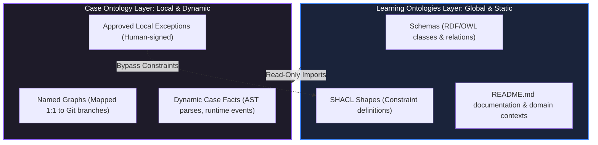
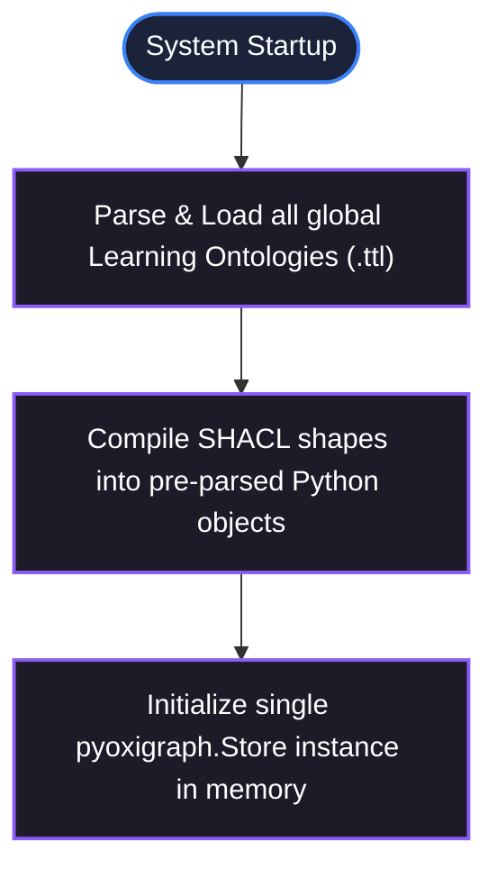
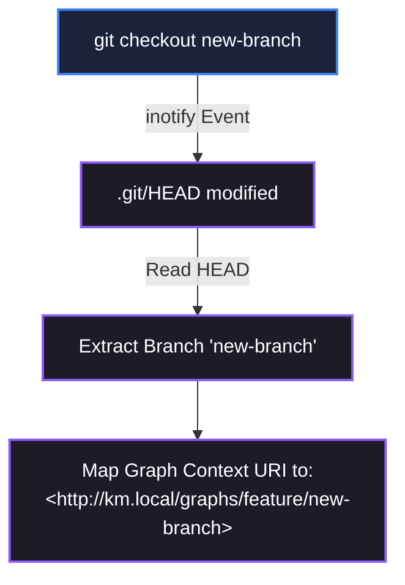

# Knowledge Management System Specification

This document defines the comprehensive engineering and architectural specification for the **Knowledge Management (KM) MCP**. The KM MCP serves as a neuro-symbolic bridge that structures, indexes, and validates agent-discovered facts ("Case Ontology") against high-level, human-curated domain rules ("Learning Ontologies"). 

The primary design objectives are **rigorous constraint enforcement via SHACL (Shapes Constraint Language)** and **extreme query/validation performance (latency <200ms)** to ensure that the system remains zero-overhead during real-time agent execution cycles.

---

## 1. Dual-Ontology System Architecture

The KM MCP divides knowledge into two distinct logical layers to balance strict global governance with highly localized, dynamic workspace realities.



### 1.1 The Learning Ontologies (Global Library)
Learning Ontologies represent version-controlled repositories of structured, domain-specific wisdom.
*   **Storage Location:** Managed globally or within specialized subdirectories of a parent repository. Each ontology occupies a distinct directory.
*   **Lifecycle:** Modified exclusively via explicit, human-approved Merge Requests (internal semantic diffs).
*   **Properties:** Read-only for the agent during execution. They define classes, relationships, and SHACL shape constraints that govern correct design patterns.

### 1.2 The Case Ontology (Local Workspace)
The Case Ontology models the dynamic, situational reality of the active workspace.
*   **Storage Location:** Contained in the local workspace inside the `.km/` directory.
*   **Structure:** Implemented as an RDF Quad-Store to support Named Graphs mapped 1:1 to Git branches.
*   **Lifecycle:** Dynamically updated by the agent at runtime (e.g., AST parse results, process flow discoveries). Bypasses global rules only via structured local exceptions signed off by the developer.

---

## 2. Directory Layout & Local Configurations

The workspace initializes its knowledge environment through a designated configuration directory.

### 2.1 Workspace Directory Structure
```
workspace-root/
├── .git/                        # Active repository indicators
│   ├── HEAD                     # Branch tracking reference
│   └── refs/                    # Branch refs tracking
├── .km/                         # Local KM Workspace directory (Git ignored)
│   ├── config.json              # Workspace-specific configuration
│   ├── case_quads.db            # High-performance sqlite-based quad-store
│   └── mrs/                     # Semantic Merge Request review documents
└── docs/
    └── knowledge-management-specification.md
```

### 2.2 Workspace Configuration (`.km/config.json`)
The configuration defines workspace identification, the imported Learning Ontologies, and the local storage engine specifications.

```json
{
  "workspace_id": "km-default-workspace-dev",
  "learning_ontologies": [
    "/ontologies/distributed-systems",
    "/ontologies/react-conventions"
  ],
  "quad_store": {
    "engine": "sqlite-quad",
    "storage_path": "./.km/case_quads.db"
  }
}
```

---

## 3. Storage Engine & Latency Optimization (<200ms)

Achieving sub-200ms latency for SPARQL queries and SHACL validations is critical to prevent blocking developer workflows or agent reasoning loops. The following optimization strategies are implemented in the core engine.

### 3.1 High-Performance Quad-Store Engine (`pyoxigraph`)
The system utilizes **`pyoxigraph`**, a Python binding for the Rust-based **`oxigraph`** engine, which provides exceptional read-write speeds by utilizing an optimized SQLite/RocksDB or in-memory backend.
*   **C++ Core Indexes:** Native C++ indexing using SPOG (Subject, Predicate, Object, Graph) layouts avoids Python interpreter overhead.
*   **Zero-Copy Queries:** Data queries are executed directly on compiled Rust memory spaces and returned as raw structured tuples.

### 3.2 In-Memory Caching & Materialization (Startup Pipeline)
To bypass recurring disk-reads and RDF parsing overhead during active workspace queries, the server maintains an in-memory active schema cache:


*   **Static Loading:** Global Learning Ontologies and SHACL shapes are loaded, parsed, and cached in-memory *exactly once* during MCP server startup.
*   **Parsing Bypass:** Future validations bypass the standard RDF graph parsing phase (`rdflib.Graph().parse()`), reducing validation startup time from ~150ms to <1ms.

### 3.3 Scoped Named Graph Queries
All read-write transactions are targeted specifically to a scoped graph rather than scanning the entire quad-store:
*   Instead of querying an unindexed union graph, SPARQL queries restrict search boundaries utilizing explicit `GRAPH <http://km.local/graphs/feature/active-branch>` blocks.
*   This narrows the search space to the exact delta representing the active branch's Case facts, capping search times under 5ms.

### 3.4 Incremental SHACL Validation
Running a comprehensive SHACL validation (`pyshacl`) on large graphs on every ingestion request can consume several hundred milliseconds. The engine optimizes this via an **Incremental Validation Pipeline**:

1.  **State Hash Checking:** The active Case Named Graph is hashed on update.
2.  **Dirty-Flag Logic:** If the state hash matches the previous validation run, the validation step is bypassed entirely, returning the cached validation report immediately (0ms overhead).
3.  **Scoped Validation Execution:** When validation is triggered, the validator operates strictly on the active Case Graph merged with the pre-compiled, cached global shapes.
4.  **Local Exception Short-Circuiting:** Approved exceptions are registered directly into the active named graph as triples. The validation engine matches these exceptions during the evaluation phase, eliminating the need to process external exception tables.

### 3.5 Latency Performance Budget
| Operation Type          | Tech Stack Component      | Direct Target Latency | Max Bound Latency | Optimization Method                              |
| :---------------------- | :------------------------ | :-------------------- | :---------------- | :----------------------------------------------- |
| **Fact Ingestion**      | `pyoxigraph`              | **5 - 15ms**          | 30ms              | Transaction batching, index auto-updates         |
| **SPARQL Query**        | `pyoxigraph`              | **2 - 10ms**          | 20ms              | Scoped named graph filters, native SPOG indexes  |
| **SHACL Validation**    | `pyshacl` + cached shapes | **35 - 85ms**         | 120ms             | Pre-compiled shapes, dirty-flag short-circuiting |
| **Branch Context Swap** | Python OS watcher         | **1 - 3ms**           | 10ms              | Cached branch URI mapping lookup                 |

---

## 4. MCP Server Interface: Tools & Resources Specifications

The KM MCP Server exposes a standard interface enabling reading, writing, validation, and human-in-the-loop control via **eight MCP tools** and **three MCP resources**.

### 4.1 MCP Tools Specification

#### 1. `ingest_case_facts`
Ingests dynamic facts, relationships, and concepts discovered during the active workspace case into the named graph corresponding to the active branch.
*   **Parameters Schema:**
    ```json
    {
      "type": "object",
      "properties": {
        "facts": { "type": "string", "description": "RDF serialization string (JSON-LD or Turtle)" },
        "format": { "type": "string", "enum": ["json-ld", "turtle"], "default": "json-ld" }
      },
      "required": ["facts"]
    }
    ```
*   **Response Schema:**
    ```json
    {
      "type": "object",
      "properties": {
        "status": { "type": "string", "enum": ["success", "error"] },
        "triples_added": { "type": "integer" }
      },
      "required": ["status", "triples_added"]
    }
    ```

#### 2. `validate_constraints`
Executes incremental SHACL validation against the pre-compiled global shapes.
*   **Parameters Schema:** `(Empty Object)`
*   **Response Schema:**
    ```json
    {
      "type": "object",
      "properties": {
        "conforms": { "type": "boolean" },
        "violations": {
          "type": "array",
          "items": {
            "type": "object",
            "properties": {
              "focus_node": { "type": "string" },
              "source_shape": { "type": "string" },
              "severity": { "type": "string" },
              "message": { "type": "string" }
            },
            "required": ["focus_node", "source_shape", "severity", "message"]
          }
        }
      },
      "required": ["conforms", "violations"]
    }
    ```

#### 3. `propose_local_exception`
Registers a proposed local exception for a specific SHACL shape constraint on a specific focus node.
*   **Parameters Schema:**
    ```json
    {
      "type": "object",
      "properties": {
        "bypasses_shape": { "type": "string", "description": "URI of the violated SHACL Shape" },
        "target_node": { "type": "string", "description": "URI of the violating focus node" },
        "rationale": { "type": "string", "description": "Detailed justification for the exception" }
      },
      "required": ["bypasses_shape", "target_node", "rationale"]
    }
    ```
*   **Response Schema:**
    ```json
    {
      "type": "object",
      "properties": {
        "exception_id": { "type": "string" },
        "status": { "type": "string", "enum": ["PENDING_APPROVAL"] }
      },
      "required": ["exception_id", "status"]
    }
    ```

#### 4. `approve_local_exception`
Registers the developer's approval signature and timestamp, enabling the SHACL validator to bypass the constraint.
*   **Parameters Schema:**
    ```json
    {
      "type": "object",
      "properties": {
        "exception_id": { "type": "string", "description": "URI of the proposed exception" },
        "approver": { "type": "string", "description": "Username of the developer" },
        "signature": { "type": "string", "description": "Cryptographic signature or authorization token" }
      },
      "required": ["exception_id", "approver", "signature"]
    }
    ```
*   **Response Schema:**
    ```json
    {
      "type": "object",
      "properties": {
        "status": { "type": "string", "enum": ["APPROVED"] },
        "timestamp": { "type": "string" }
      },
      "required": ["status", "timestamp"]
    }
    ```

#### 5. `query_semantic_graph`
Executes a read-only SPARQL query over the combined active named graph and global schemas.
*   **Parameters Schema:**
    ```json
    {
      "type": "object",
      "properties": {
        "query": { "type": "string", "description": "Valid SPARQL SELECT or ASK query string" }
      },
      "required": ["query"]
    }
    ```
*   **Response Schema:**
    ```json
    {
      "type": "object",
      "properties": {
        "head": { "type": "object" },
        "results": {
          "type": "object",
          "properties": {
            "bindings": { "type": "array" }
          }
        }
      }
    }
    ```

#### 6. `propose_semantic_mr`
Initiates a Merge Request to promote locally discovered patterns from the Case Ontology into a global Learning Ontology.
*   **Parameters Schema:**
    ```json
    {
      "type": "object",
      "properties": {
        "target_ontology": { "type": "string", "description": "URI of the target Learning Ontology" },
        "rationale": { "type": "string", "description": "Engineering rationale for the promotion" },
        "diff_insertions": { "type": "string", "description": "Turtle-serialized RDF triples to add" },
        "diff_deletions": { "type": "string", "description": "Turtle-serialized RDF triples to remove" }
      },
      "required": ["target_ontology", "rationale", "diff_insertions"]
    }
    ```
*   **Response Schema:**
    ```json
    {
      "type": "object",
      "properties": {
        "mr_id": { "type": "string" },
        "status": { "type": "string", "enum": ["PENDING"] }
      },
      "required": ["mr_id", "status"]
    }
    ```

#### 7. `get_system_status`
Returns environmental and memory states of the KM daemon.
*   **Parameters Schema:** `(Empty Object)`
*   **Response Schema:**
    ```json
    {
      "type": "object",
      "properties": {
        "active_branch": { "type": "string" },
        "learning_ontologies": { "type": "array", "items": { "type": "string" } },
        "pending_exceptions_count": { "type": "integer" }
      },
      "required": ["active_branch", "learning_ontologies", "pending_exceptions_count"]
    }
    ```

#### 8. `approve_semantic_mr`
Records human approval of a pending semantic Merge Request and applies its RDF diff to the target Learning Ontology. The agent invokes this tool after the developer issues the `approve <doc name>` command in chat.
*   **Parameters Schema:**
    ```json
    {
      "type": "object",
      "properties": {
        "doc_identifier": {
          "type": "string",
          "description": "Relative file path (e.g. .km/mrs/mr-react-conventions-042.md) or MCP URI (e.g. km://mr/react-conventions/042)"
        }
      },
      "required": ["doc_identifier"]
    }
    ```
*   **Response Schema:**
    ```json
    {
      "type": "object",
      "properties": {
        "status": { "type": "string", "enum": ["APPROVED"] },
        "mr_id": { "type": "string" },
        "target_ontology": { "type": "string" },
        "timestamp": { "type": "string" }
      },
      "required": ["status", "mr_id", "target_ontology", "timestamp"]
    }
    ```

---

### 4.2 MCP Resources Specification

Resources allow the client agent to perform bulk reads of schema metadata and active graph states.

1.  **`km://schemas/learning-ontologies`**
    *   **Description:** Retrieves a unified schema metadata document listing classes, properties, and documentation for all globally imported Learning Ontologies.
    *   **Format:** `application/ld+json`
2.  **`km://case/active-graph`**
    *   **Description:** Returns the complete, raw serialized RDF graph mapping the active branch's current Case facts.
    *   **Format:** `text/turtle`
3.  **`km://case/active-exceptions`**
    *   **Description:** Retrieves all local exceptions (pending and approved) currently declared within the active workspace branch scope.
    *   **Format:** `application/json`

---

## 5. Version Control & Git Synchronization Dynamics

Since the Case Ontology structures its facts inside a local database rather than checking raw triples into Git, the KM MCP employs a **Git Branch Watcher** to align the semantic graph context seamlessly with the repository state.

### 5.1 Branch Switch Detection Flow
1.  **File Watcher Activation:** The KM Daemon actively watches `.git/HEAD` for state modifications using a zero-CPU event listener (`inotify` or `watchdog`).
2.  **State Extraction:** Upon modification, the daemon extracts the reference pointer (e.g., `ref: refs/heads/feature/collaborative-canvas`).
3.  **Context Swapping:** The daemon dynamically remaps the active Named Graph query scope inside `pyoxigraph` to match the branch signature:
    ```
    http://km.local/graphs/feature/collaborative-canvas
    ```
4.  **Completion:** All subsequent tool executions are scoped strictly to the new named graph context.



### 5.2 Branch Inheritance & Fallback Logic
When a developer switches to a newly initialized branch:
*   The active graph context checks if the graph `http://km.local/graphs/feature/new-branch` contains triples.
*   **Inheritance Mechanism:** If the graph is empty, the daemon checks the Git tracking information (using `git merge-base` or `.git/logs/HEAD`) to identify the direct parent branch (e.g. `main`).
*   **Clone-on-Write Copying:** The daemon copy-clones all triples from the parent's named graph (`http://km.local/graphs/main`) into the new branch's named graph, providing the agent with immediate architectural and process contextual memories from the parent branch.

### 5.3 Branch Merging Logic
When branch `feature-a` is merged into the active branch (e.g., `main`):
*   The daemon detects updates in `.git/refs/heads/main` or `.git/refs/heads/feature-a`.
*   **No Auto-Merge Safety:** To prevent garbage-in, garbage-out data pollution (importing buggy, intermediate experimental facts), the system **does not automatically merge the named graphs**.
*   **Developer Warning and Options:** The system flags a warning to the developer, prompting an explicit resolution action:
    1.  `MERGE`: Import the finalized, validated Case facts and approved exceptions into `main`'s named graph.
    2.  `KEEP ISOLATED`: Do not synchronize graph states; preserve the feature graph independently.
    3.  `DELETE`: Discard the feature graph completely to maintain a clean database state.

---

## 6. Conflict Resolution & Exception Management

SHACL validations operate as strict structural constraints. When code or designs require intentional workarounds, the system utilizes a formal, human-authorized exception pathway.


### 6.1 Logical Constraint Enforcement Structure
Constraints are represented as standard SHACL shapes. The validator imports the shapes and executes target validation. Below is an engineering representation of how a SHACL shape and an authorized local exception bypass are modeled together inside the merged graph context.

#### 1. The Core SHACL Shape Constraint (Turtle)
```turtle
@prefix sh: <http://www.w3.org/ns/shacl#> .
@prefix xsd: <http://www.w3.org/2001/XMLSchema#> .
@prefix dist: <http://ontologies.distributed-systems.org/core#> .

# Enforces idempotency keys on write/update payloads
dist:IdempotentMessageShape a sh:NodeShape ;
    sh:targetClass dist:NetworkEvent ;
    sh:property [
        sh:path dist:eventType ;
        sh:in ( "WRITE" "UPDATE" "DELETE" )
    ] ;
    sh:property [
        sh:path dist:payload ;
        sh:property [
            sh:path dist:idempotencyKey ;
            sh:minCount 1 ;
            sh:datatype xsd:string ;
            sh:message "Write events over distributed networks must carry a unique uuid v4 idempotencyKey." ;
        ]
    ] .
```

#### 2. The Local Exception Bypass Definition (Turtle)
When an exception is proposed and authorized, it is serialized directly into the active Case named graph:

```turtle
@prefix baking: <http://ontologies.baking.org/core#> .
@prefix xsd: <http://www.w3.org/2001/XMLSchema#> .
@prefix case: <http://km.local/cases/> .
@prefix exception: <http://km.local/exceptions/> .
@prefix dist: <http://ontologies.distributed-systems.org/core#> .

# Local exception injected into case named graph
exception:ephemeral_coordinates_bypass a dist:LocalException ;
    baking:bypassesShape dist:IdempotentMessageShape ;
    baking:targetNode case:network/canvas_drag_event ;
    baking:rationale "High-frequency absolute mouse coordinates (60Hz) are ephemeral. Absolute position is self-superseding, making duplicate protection redundant." ;
    baking:status "APPROVED" ;
    baking:approvedBy "DeveloperJohn" ;
    baking:signature "sig_ab23d04fde103bc" ;
    baking:timestamp "2026-05-30T02:20:00Z"^^xsd:dateTime .
```

### 6.2 The Exception Checking Algorithm
The validation engine performs a pre-validation filter prior to flagging a hard violation:

```python
def check_conformance(store: pyoxigraph.Store, active_graph_uri: str) -> tuple[bool, list[dict]]:
    # 1. Run core SHACL validation
    conforms, results = run_shacl_validation(store, active_graph_uri)
    if conforms:
        return True, []
        
    filtered_results = []
    for result in results:
        focus_node = result.focus_node
        violated_shape = result.source_shape
        
        # 2. Query for an APPROVED exception bypass matching this focus node and shape
        exception_query = f"""
            ASK WHERE {{
                GRAPH <{active_graph_uri}> {{
                    ?exception a ?exceptionType ;
                               <http://ontologies.baking.org/core#bypassesShape> <{violated_shape}> ;
                               <http://ontologies.baking.org/core#targetNode> <{focus_node}> ;
                               <http://ontologies.baking.org/core#status> "APPROVED" .
                }}
            }}
        """
        has_approved_exception = store.query(exception_query)
        
        # 3. If no approved exception, include in output violations (halts execution)
        if not has_approved_exception:
            filtered_results.append(result)
            
    conforms_now = len(filtered_results) == 0
    return conforms_now, filtered_results
```
*   **Result:** By embedding the exception metadata (`bypassesShape`, `targetNode`, `status "APPROVED"`) directly into the branch-scoped Case Named Graph, the validator can quickly resolve conflicts, keeping validation latency well within the <200ms threshold while ensuring complete architectural safety.

---

## 7. Semantic Merge Request Governance & Human Approval

The promotion of dynamic Case facts into global Learning Ontologies is managed through a structured review and approval workflow to prevent database pollution and guarantee architectural governance.

### 7.1 Merge Request Document Structure
When a semantic Merge Request (MR) is initiated (via the `propose_semantic_mr` tool), the system materializes a markdown document in `.km/mrs/` (or exposes it as a virtual MCP Resource). This document MUST contain two distinct, highly structured sections:

1.  **Summary of Changes:**
    *   **Metadata:** MR ID, target ontology URI, author signature, timestamp, and the **exact human approval command** (e.g., `**Approval Command:** approve .km/mrs/mr-react-conventions-042.md`). The agent will translate this command into an `approve_semantic_mr` MCP tool call on the developer's behalf.
    *   **Rationale:** Detailed engineering justification for promoting the knowledge (e.g., performance findings, structural optimizations).
    *   **High-Level Impact:** Summary of newly introduced/deprecated classes, relationships, and SHACL constraint shapes.
2.  **Detailed Changes:**
    *   **Semantic Diff:** The exact RDF insertions and deletions representing structural modifications.
    *   **Diff Format:** Represented using a standard line-by-line diff block enclosing standard RDF Turtle syntax.

#### Concrete Example: `.km/mrs/mr-react-conventions-042.md`
```markdown
# Semantic Merge Request: MR-REACT-CONVENTIONS-042
**Status:** PENDING_APPROVAL
**Approval Command:** `approve .km/mrs/mr-react-conventions-042.md`
**Target Ontology:** `http://ontologies.react.org/core`
**Created At:** 2026-05-30T02:30:00Z
**Author:** ChefDev

## 1. Summary of Changes
High-frequency client-side component hooks emitting cursor or canvas drag events were causing network saturation over raw WebSocket links. This MR introduces a global throttling constraint shape to force developer/agent compliance to safe operational thresholds (between 16ms and 200ms).

*   **New SHACL Shape:** `react:HighFrequencyThrottleShape`
*   **Target Class:** `react:HighFrequencyEventHook`
*   **Governed Properties:** `react:throttleRateMs` (must be between 16 and 200)

---

## 2. Detailed Changes
```diff
@@ -42,3 +42,12 @@
+# New SHACL Shape for Throttling High-Frequency Hooks
+react:HighFrequencyThrottleShape a sh:NodeShape ;
+    sh:targetClass react:HighFrequencyEventHook ;
+    sh:property [
+        sh:path react:throttleRateMs ;
+        sh:datatype xsd:integer ;
+        sh:minInclusive 16 ; # Maximum 60Hz update rate
+        sh:maxInclusive 200 ;
+        sh:message "Hooks emitting continuous canvas or mouse coordinates must be throttled between 16ms and 200ms to prevent network saturation." ;
+    ] .
```
```

---

### 7.2 Human Review & Prompt-Based Approval
Reviewing and applying the semantic MR diff is strictly gated by human approval. The developer issues the approval using an explicit prompt/command format:

```
approve <doc name>
```
*Where `<doc name>` refers to the relative file path of the MR document (under `.km/mrs/`) or its unique MCP Resource URI.*

#### Examples of Developer Approval Prompts:
*   `approve .km/mrs/mr-react-conventions-042.md`
*   `approve km://mr/react-conventions/042`

#### The Approval & Merging Workflow
When the agent detects the `approve <doc name>` prompt in the developer's message, it invokes the `approve_semantic_mr` MCP tool:

```python
import re

def handle_developer_approval(prompt_input: str) -> dict:
    # 1. Parse approve command format from developer message
    match = re.match(r"^approve\s+(.+)$", prompt_input.strip(), re.IGNORECASE)
    if not match:
        raise ValueError("Unknown command pattern.")

    doc_identifier = match.group(1).strip()

    # 2. Invoke the MCP tool (server-side: MergeRequestService)
    result = mcp_client.call_tool(
        "approve_semantic_mr",
        {"doc_identifier": doc_identifier},
    )
    # Returns: { "status": "APPROVED", "mr_id": "...", "target_ontology": "...", "timestamp": "..." }
    return result
```

The server-side `MergeRequestService` (invoked by the `approve_semantic_mr` tool) executes:

1.  **Resolve** the `doc_identifier` to the corresponding pending Merge Request metadata.
2.  **Apply** the RDF diff (`diff_insertions` / `diff_deletions`) to the target Learning Ontology `.ttl` file.
3.  **Register** MR approval status (`APPROVED`) in the Case meta-graph.
4.  **Reload** the in-memory Learning Ontology cache.

*   **Result:** This workflow binds human review to a structured documentation standard. The developer uses a simple chat-native command (`approve <doc name>`), and the agent translates it into a typed MCP tool call that enforces secure semantic graph evolution.

