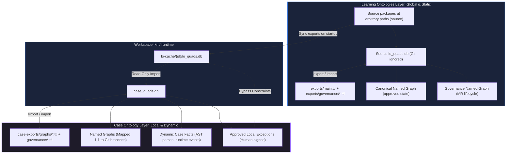
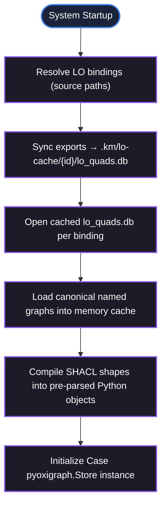
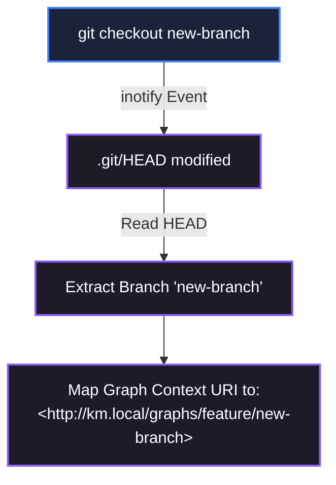
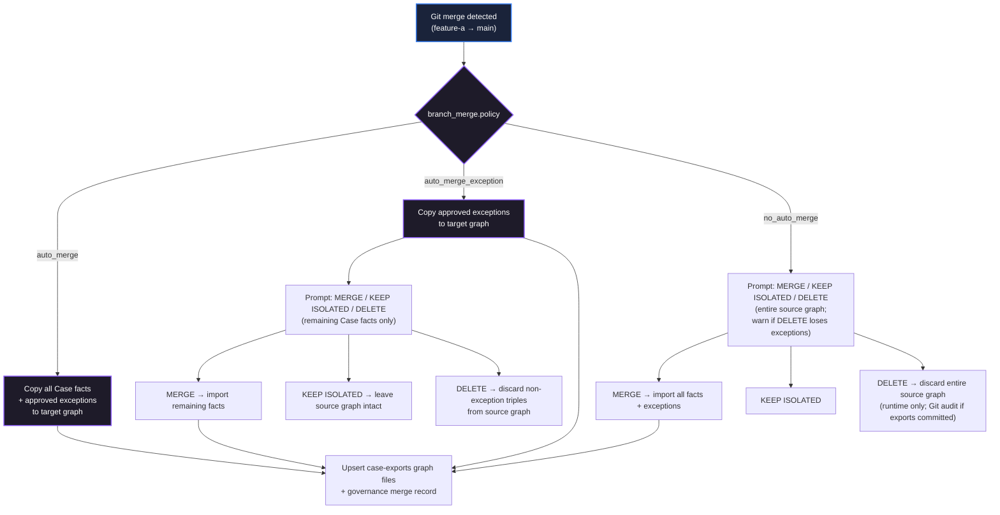

# Knowledge Management System Specification

This document defines the comprehensive engineering and architectural specification for the **Knowledge Management (KM) MCP**. The KM MCP serves as a neuro-symbolic bridge that structures, indexes, and validates agent-discovered facts ("Case Ontology") against high-level, human-curated domain rules ("Learning Ontologies"). 

The primary design objectives are **rigorous constraint enforcement via SHACL (Shapes Constraint Language)** and **extreme query/validation performance (latency <200ms)** to ensure that the system remains zero-overhead during real-time agent execution cycles.

---

## 1. Dual-Ontology System Architecture

The KM MCP divides knowledge into two distinct logical layers to balance strict global governance with highly localized, dynamic workspace realities.



### 1.1 The Learning Ontologies (Global Library)
Learning Ontologies represent version-controlled repositories of structured, domain-specific wisdom. They are **decoupled from the workspace filesystem** — a workspace references external LO packages via object bindings in `.km/config.json` and maintains a local **`lo-cache/`** for runtime quad-store access.
*   **Storage Location:** Each ontology occupies a self-contained directory at an arbitrary filesystem path (`source` in the binding). The workspace does not require LO directories to live inside the workspace tree.
*   **Workspace Cache:** Each bound LO is materialized at `.km/lo-cache/{ontology-id}/lo_quads.db` for fast, isolated runtime access. The cache is synchronized from the LO package's Git-tracked exports on startup.
*   **Structure:** Implemented as an RDF Quad-Store with scoped Named Graphs (logical URIs keyed by `ontology_id`, independent of filesystem path):
    *   **Canonical graph** — `http://km.local/learning-ontologies/{ontology-id}/canonical`: all approved classes, properties, documentation triples, and SHACL shapes. **Agents validate and query against this graph only.**
    *   **Governance graph** — `http://km.local/learning-ontologies/{ontology-id}/governance`: Merge Request metadata (status, author, rationale, timestamps, proposal graph references).
    *   **Proposal graphs** — `http://km.local/learning-ontologies/{ontology-id}/mr/{mr-id}`: pending RDF diffs awaiting human approval. **Excluded from agent validation and default queries.**
*   **Lifecycle:** Modified exclusively via explicit, human-approved Merge Requests in workspaces with `mode: "curator"`. On approval, proposal quads merge into the canonical graph at the **LO source package**; exports are regenerated there; the workspace cache is refreshed. Workspaces with `mode: "read_only"` consume cached canonical graphs only.
*   **Properties:** Read-only for the agent during execution. Pending MR proposal graphs are invisible to validation and default schema reads.

### 1.2 The Case Ontology (Local Workspace)
The Case Ontology models the dynamic, situational reality of the active workspace. It follows the **same export authority model** as Learning Ontologies (see §2.6): runtime state in a Git-ignored quad-store; Git-tracked Turtle exports for review and audit.
*   **Runtime storage:** `.km/case_quads.db` (Git ignored).
*   **Git authority:** `case-exports/` at the workspace root (sibling to `.km/`), containing per-branch graph files and per-event governance shards.
*   **Structure:** Implemented as an RDF Quad-Store with Named Graphs mapped 1:1 to Git branches:
    *   **Branch graphs** — `http://km.local/graphs/{branch-path}`: dynamic case facts and approved `km:LocalException` triples for that branch.
    *   **Workspace governance graph** — `http://km.local/case/governance`: branch-merge resolutions and other workspace-level audit records (exported under `case-exports/governance/`).
*   **Lifecycle:** Dynamically updated by the agent at runtime (e.g., AST parse results, process flow discoveries). Bypasses global rules only via structured local exceptions signed off by the developer. Export writes follow `case_exports.export_policy` in `.km/config.json` (see §2.6).

---

## 2. Directory Layout & Local Configurations

The workspace initializes its knowledge environment through a designated configuration directory.

### 2.1 Workspace Directory Structure
```
workspace-root/
├── .git/                        # Active repository indicators
│   ├── HEAD                     # Branch tracking reference
│   └── refs/                    # Branch refs tracking
├── case-exports/                # Case ontology Git authority (tracked)
│   ├── graphs/
│   │   ├── refs-heads-main.ttl
│   │   └── refs-heads-feature-collaborative-canvas.ttl
│   ├── governance/
│   │   └── merge-feature-collaborative-canvas-20260530.ttl
│   └── sync-manifest.json       # Per-file checksums for case export bootstrap
├── .km/                         # Local KM runtime directory (Git ignored)
│   ├── config.json              # Workspace-specific configuration & LO bindings
│   ├── case_quads.db            # Case ontology runtime quad-store
│   ├── lo-cache/                # Materialized LO runtime caches
│   │   └── {ontology-id}/
│   │       ├── lo_quads.db      # Synced runtime quad-store for this binding
│   │       └── sync-manifest.json  # Source path, export checksums, last sync time
│   └── mrs/                     # Derived MR review documents (generated from LO governance)
└── src/                         # Application source (example)
```

Learning Ontology **source packages** live at arbitrary paths referenced by bindings — sibling repos, submodules, system paths, etc.:

```
{lo-source}/                     # External LO package (separate Git repo)
├── README.md
├── config.json
├── lo_quads.db                  # Runtime quad-store in source repo (Git ignored)
└── exports/
    ├── main.ttl                 # Canonical graph export (Git tracked)
    └── governance/              # One Turtle file per MR record (Git tracked)
        └── MR-REACT-CONVENTIONS-042.ttl
```

### 2.2 Workspace Configuration (`.km/config.json`)
The configuration defines workspace identification, **Learning Ontology bindings**, and Case Ontology storage.

```json
{
  "workspace_id": "km-default-workspace-dev",
  "learning_ontologies": [
    {
      "ontology_id": "distributed-systems",
      "source": "../km-org-ontologies/distributed-systems",
      "mode": "read_only"
    },
    {
      "ontology_id": "react-conventions",
      "source": "/opt/shared/km/ontologies/react-conventions",
      "mode": "curator"
    }
  ],
  "quad_store": {
    "engine": "sqlite-quad",
    "storage_path": "./.km/case_quads.db"
  },
  "lo_cache": {
    "base_path": "./.km/lo-cache"
  },
  "case_exports": {
    "base_path": "./case-exports",
    "export_policy": "on_commit"
  },
  "branch_merge": {
    "policy": "auto_merge_exception"
  }
}
```

#### Case Export Policy (`case_exports.export_policy`)
Controls when the daemon writes Git-authoritative Case export files (see §2.6).

| Config value | Behavior                                                                                                                                                                                     |
| :----------- | :------------------------------------------------------------------------------------------------------------------------------------------------------------------------------------------- |
| `on_commit`  | **Default (recommended).** Export active branch graph and pending governance on `git commit` (hook) or explicit `km export-case`. Avoids rewriting graph files on every `ingest_case_facts`. |
| `on_write`   | Upsert `case-exports/graphs/{ref}.ttl` after each mutating Case MCP tool (higher churn; use only for small workspaces).                                                                      |
| `manual`     | Export only when the developer runs `km export-case`.                                                                                                                                        |

Omitting `case_exports` is equivalent to `"base_path": "./case-exports"` and `"export_policy": "on_commit"`.

#### Branch Merge Policy (`branch_merge.policy`)
Controls Case Ontology graph synchronization when Git detects that a feature branch was merged into the active branch (see §5.3).

| Config value           | Display name         | Default | Behavior                                                                                                                                                                        |
| :--------------------- | :------------------- | :------ | :------------------------------------------------------------------------------------------------------------------------------------------------------------------------------ |
| `no_auto_merge`        | NO AUTO MERGE        |         | Halt and prompt the developer with `MERGE`, `KEEP ISOLATED`, or `DELETE` options for the entire source branch graph.                                                            |
| `auto_merge`           | AUTO MERGE           |         | Automatically import all Case facts and approved exceptions from the source branch graph into the target branch graph; no prompt.                                               |
| `auto_merge_exception` | AUTO MERGE EXCEPTION | **Yes** | Automatically import **approved exceptions only** (including rationale and approval metadata) into the target branch graph; then prompt for resolution of remaining Case facts. |

Omitting `branch_merge` is equivalent to `"policy": "auto_merge_exception"`.

#### Learning Ontology Binding Schema
Each entry in `learning_ontologies` is an object:

| Field         | Required | Description                                                                                 |
| :------------ | :------- | :------------------------------------------------------------------------------------------ |
| `ontology_id` | Yes      | Stable logical identifier; drives named graph URIs and MCP resources.                       |
| `source`      | Yes      | Filesystem path to the LO package root (directory containing `config.json` and `exports/`). |
| `mode`        | Yes      | `"read_only"` (consumer) or `"curator"` (may propose and approve MRs).                      |

#### Path Resolution Rules
`source` paths are resolved as follows:
1.  **Absolute paths** (e.g. `/opt/shared/km/ontologies/baking`) — used as-is.
2.  **Relative paths** (e.g. `../km-org-ontologies/baking`) — resolved against the **workspace root** (the directory containing `.km/`), not the process CWD.
3.  **Home paths** (e.g. `~/km/ontologies/baking`) — tilde expanded to the user's home directory.

Named graph URIs (`http://km.local/learning-ontologies/{ontology_id}/…`) depend on `ontology_id` only, never on `source` path.

#### Access Modes
| Mode        | Validation / query          | `propose_semantic_mr`         | `approve_semantic_mr`                          |
| :---------- | :-------------------------- | :---------------------------- | :--------------------------------------------- |
| `read_only` | Yes (cached canonical only) | Rejected                      | Rejected                                       |
| `curator`   | Yes (cached canonical only) | Writes to **source** LO store | Merges in **source** LO store; refreshes cache |

### 2.3 Workspace LO Cache
Each binding materializes a local runtime cache under `.km/lo-cache/{ontology-id}/`:

```
.km/lo-cache/react-conventions/
├── lo_quads.db              # Runtime quad-store used by the MCP daemon
└── sync-manifest.json       # Sync metadata (see below)
```

#### Cache Synchronization (Startup)
On MCP server startup, for each binding:
1.  **Resolve** `source` to an absolute path; fail fast if the LO package or `exports/main.ttl` is missing.

**Empty governance bootstrap**

If `{source}/exports/governance/` is absent or empty (new LO package), treat governance as an empty graph. Cache sync MUST NOT fail on missing governance exports; record `"governance": {}` in `export_checksums` until the first MR is proposed.

2.  **Compare** export checksums in `sync-manifest.json` against `{source}/exports/main.ttl` and every file under `{source}/exports/governance/*.ttl`.
3.  **Rebuild cache** if the manifest is absent, checksums differ, or `lo_quads.db` is missing — import `main.ttl` and all `governance/*.ttl` into `.km/lo-cache/{ontology-id}/lo_quads.db`.
4.  **Load canonical** graphs from the cache into the in-memory schema cache.

#### `sync-manifest.json` Example
```json
{
  "ontology_id": "react-conventions",
  "source": "/opt/shared/km/ontologies/react-conventions",
  "mode": "curator",
  "synced_at": "2026-05-30T08:00:00Z",
  "export_checksums": {
    "main.ttl": "sha256:a1b2c3…",
    "governance": {
      "MR-REACT-CONVENTIONS-042.ttl": "sha256:d4e5f6…"
    }
  }
}
```

*   **Agent reads** always target the workspace cache (`lo-cache/`) **canonical graphs**. Curator-only reads of governance, MR proposals, and pending MR counts use the **source** LO store (see table below).

**Source vs cache read rules**

| Operation                                              | Data source                                     | Notes                                                         |
| :----------------------------------------------------- | :---------------------------------------------- | :------------------------------------------------------------ |
| `validate_constraints`                                 | Cache — canonical graph only                    | Never includes pending MR proposal graphs                     |
| `query_semantic_graph` (default)                       | Cache — active Case graph + LO canonical graphs | Default union excludes governance and proposal graphs         |
| `query_semantic_graph` (explicit `GRAPH …/mr/{mr-id}`) | **Source** `{source}/lo_quads.db`               | Curator mode only; proposal quads are not copied to cache     |
| `km://schemas/learning-ontologies`                     | Cache — canonical                               | Agent-facing schema reads                                     |
| `km://learning-ontologies/{id}/canonical`              | Cache — canonical                               |                                                               |
| `km://learning-ontologies/{id}/governance`             | **Source** `{source}/lo_quads.db`               | Curator review; always current, including pending MRs         |
| `km://mr/{ontology-id}/{mr-id}`                        | **Source** governance + proposal graphs         | Derived MR review document                                    |
| `pending_mrs_count` (`get_system_status`)              | **Source** governance graph                     | Counts `km:status "PENDING_APPROVAL"` across curator bindings |
| `propose_semantic_mr` / `approve_semantic_mr` writes   | **Source** `{source}/lo_quads.db`               | Then sync exports and refresh cache (see below)               |

**Cache refresh on MR lifecycle:**
1. **On propose:** Upsert `{source}/exports/governance/{mr-id}.ttl` for the MR record; cache is not updated. Canonical cache unchanged.
2. **On approve/reject:** Regenerate `{source}/exports/main.ttl`; update the MR's governance shard; **full cache rebuild** from exports; reload in-memory canonical cache.

*   **Curator writes** (MR propose/approve) target the **source** LO package's `lo_quads.db` and regenerate `{source}/exports/`. On **propose**, the workspace cache is not updated; on **approve/reject**, the cache is fully rebuilt from exports (see above).

### 2.4 Learning Ontology Source Package Structure
Each LO source package is self-contained regardless of where it lives on disk.

```
{source}/
├── README.md                    # Domain purpose and usage documentation
├── config.json                  # Ontology configuration (see below)
├── lo_quads.db                  # Runtime quad-store in source repo (Git ignored)
└── exports/
    ├── main.ttl                 # Serialized canonical graph (Git tracked)
    └── governance/              # One file per MR governance record (Git tracked)
        └── {mr-id}.ttl
```

#### Per-Ontology Configuration (`{source}/config.json`)
```json
{
  "ontology_id": "react-conventions",
  "base_uri": "http://ontologies.react.org/core",
  "quad_store": {
    "engine": "sqlite-quad",
    "storage_path": "./lo_quads.db"
  },
  "named_graphs": {
    "canonical": "http://km.local/learning-ontologies/react-conventions/canonical",
    "governance": "http://km.local/learning-ontologies/react-conventions/governance"
  }
}
```

The `ontology_id` in `{source}/config.json` MUST match the `ontology_id` in the workspace binding.

### 2.5 Learning Ontology Named Graph Registry
```
┌──────────────────────────────────────────────────────────────────────┬─────────────────────────────────────────┐
│ Named Graph URI                                                      │ Purpose                                 │
├──────────────────────────────────────────────────────────────────────┼─────────────────────────────────────────┤
│ http://km.local/learning-ontologies/{id}/canonical                 │ Approved ontology state (agent-visible) │
│ http://km.local/learning-ontologies/{id}/governance                │ MR metadata and lifecycle records       │
│ http://km.local/learning-ontologies/{id}/mr/{mr-id}                │ Pending proposal quads (curator-only)   │
└──────────────────────────────────────────────────────────────────────┴─────────────────────────────────────────┘
```

**Which `lo_quads.db` bootstraps from exports**

| Store               | Location                                 | Bootstrap rule                                                                                                          |
| :------------------ | :--------------------------------------- | :---------------------------------------------------------------------------------------------------------------------- |
| **Workspace cache** | `.km/lo-cache/{ontology-id}/lo_quads.db` | Rebuilt from `{source}/exports/` on startup when manifest absent or checksums differ; full rebuild on MR approve/reject |
| **Source package**  | `{source}/lo_quads.db`                   | Rebuilt from `{source}/exports/` when opened for curator writes if absent or stale; not used for agent reads            |

Both stores are runtime-only and Git-ignored. Git authority remains `{source}/exports/main.ttl` and `{source}/exports/governance/*.ttl`.

*   **`exports/main.ttl`** is the Git-authoritative snapshot of the canonical graph, suitable for human diff review in pull requests.
*   **`exports/governance/{mr-id}.ttl`** holds one MR's governance triples (pending, approved, or rejected). Upserting per MR minimizes merge conflicts versus regenerating a monolithic governance file.

### 2.6 Case Export Package
The workspace Case Ontology uses the same **runtime vs export** split as LO source packages (§2.4–2.5), but exports live in the **application repository** under `case-exports/` rather than an external LO package.

#### Directory layout
```
case-exports/
├── graphs/
│   └── {sanitized-ref}.ttl      # One file per Git ref; one GRAPH block per file
├── governance/
│   └── {event-id}.ttl           # Branch-merge resolutions and workspace audit
└── sync-manifest.json           # SHA-256 checksums for bootstrap
```

#### Git ref → filename mapping
Sanitize the full ref path for a stable filename:

| Git ref                                   | Export file                                          |
| :---------------------------------------- | :--------------------------------------------------- |
| `refs/heads/main`                         | `graphs/refs-heads-main.ttl`                         |
| `refs/heads/feature/collaborative-canvas` | `graphs/refs-heads-feature-collaborative-canvas.ttl` |

Rules: replace `/` with `-`; prefix with `refs-heads-` (or `refs-` for non-head refs). The `GRAPH` URI inside the file MUST be `http://km.local/graphs/{branch-path}` where `{branch-path}` is the path after `refs/heads/` (e.g. `feature/collaborative-canvas`).

#### Turtle serialization (same rules as LO exports)
*   Each graph file contains exactly one `GRAPH <uri> { ... }` block.
*   Triples inside the block are sorted by `(subject, predicate, object)` with normalized literals for deterministic diffs.
*   Shared `@prefix` declarations appear at the top of each file; domain prefixes are included only when used.

#### Bootstrap from exports
On MCP startup (or when `case_quads.db` is missing/stale):
1.  Compare `case-exports/sync-manifest.json` checksums against `graphs/*.ttl` and `governance/*.ttl`.
2.  Import all export files into `.km/case_quads.db`, mapping each `GRAPH` block to its named graph URI.
3.  If the DB is authoritative and exports are stale, the daemon MAY warn; default for a fresh clone is **exports → DB**.

#### Export write rules
| Event                                                 | Export action                                                                                          |
| :---------------------------------------------------- | :----------------------------------------------------------------------------------------------------- |
| `ingest_case_facts`                                   | Per `export_policy`: upsert active branch `graphs/{ref}.ttl`, or defer until commit                    |
| `propose_local_exception` / `approve_local_exception` | Upsert active branch graph file (exceptions live in branch graph per §6.1)                             |
| §5.3 merge resolution                                 | Upsert target branch graph file(s); create `governance/{event-id}.ttl` with `km:BranchMergeResolution` |
| §5.2 branch inheritance (optional)                    | After clone-on-write in DB, export new branch graph file from parent snapshot                          |

#### Case Named Graph Registry
```
┌────────────────────────────────────────────────────────┬──────────────────────────────────────────┐
│ Named Graph URI                                        │ Git / export mapping                     │
├────────────────────────────────────────────────────────┼──────────────────────────────────────────┤
│ http://km.local/graphs/{branch-path}                 │ case-exports/graphs/{sanitized-ref}.ttl  │
│ http://km.local/case/governance                      │ case-exports/governance/*.ttl            │
└────────────────────────────────────────────────────────┴──────────────────────────────────────────┘
```

#### `km:BranchMergeResolution` (governance export)
Written to `case-exports/governance/{event-id}.ttl` when the developer completes §5.3 merge resolution:

```turtle
@prefix km: <http://km.local/governance#> .
@prefix xsd: <http://www.w3.org/2001/XMLSchema#> .

GRAPH <http://km.local/case/governance> {
    km:merge-feature-canvas-20260530 a km:BranchMergeResolution ;
        km:sourceGraph <http://km.local/graphs/feature/collaborative-canvas> ;
        km:targetGraph <http://km.local/graphs/main> ;
        km:resolution "MERGE" ;
        km:policy "auto_merge_exception" ;
        km:exceptionsCopied 1 ;
        km:triplesImported 42 ;
        km:recordedAt "2026-05-30T14:22:01Z"^^xsd:dateTime .
}
```

---

## 3. Storage Engine & Latency Optimization (<200ms)

Achieving sub-200ms latency for SPARQL queries and SHACL validations is critical to prevent blocking developer workflows or agent reasoning loops. The following optimization strategies are implemented in the core engine.

### 3.1 High-Performance Quad-Store Engine (`pyoxigraph`)
The system utilizes **`pyoxigraph`**, a Python binding for the Rust-based **`oxigraph`** engine, which provides exceptional read-write speeds by utilizing an optimized SQLite/RocksDB or in-memory backend.
*   **C++ Core Indexes:** Native C++ indexing using SPOG (Subject, Predicate, Object, Graph) layouts avoids Python interpreter overhead.
*   **Zero-Copy Queries:** Data queries are executed directly on compiled Rust memory spaces and returned as raw structured tuples.

### 3.2 In-Memory Caching & Materialization (Startup Pipeline)
To bypass recurring disk-reads and RDF parsing overhead during active workspace queries, the server maintains an in-memory active schema cache:


*   **Cache-First Reads:** All agent validation and query operations read from `.km/lo-cache/{ontology-id}/lo_quads.db`, not from `{source}/lo_quads.db` directly.
*   **Bootstrap from Exports:** If a cache `lo_quads.db` is missing or stale (checksum mismatch), the daemon imports `{source}/exports/main.ttl` and all `exports/governance/*.ttl` into the cache before serving requests. Case store bootstrap imports `case-exports/graphs/*.ttl` and `case-exports/governance/*.ttl` per §2.6.
*   **Static Loading:** Canonical graphs and SHACL shapes are loaded and cached in-memory *exactly once* during MCP server startup. Governance and pending MR proposal graphs are loaded on demand for curator workflows only.
*   **Post-MR Cache Refresh:** On propose, source exports are updated but the workspace cache is not. On approve/reject, full cache rebuild from exports and reload in-memory canonical cache.
*   **Parsing Bypass:** Future validations bypass the standard RDF graph parsing phase (`rdflib.Graph().parse()`), reducing validation startup time from ~150ms to <1ms.

### 3.3 Scoped Named Graph Queries
All read-write transactions are targeted specifically to a scoped graph rather than scanning the entire quad-store:
*   **Case Ontology:** SPARQL queries restrict search boundaries utilizing explicit `GRAPH <http://km.local/graphs/feature/active-branch>` blocks.
*   **Learning Ontologies:** Agent-facing reads and validations scope to `GRAPH <http://km.local/learning-ontologies/{id}/canonical>` only. Proposal graphs are never included in default query unions.
*   This narrows the search space to the exact delta representing the active branch's Case facts, capping search times under 5ms.

### 3.4 Incremental SHACL Validation
Running a comprehensive SHACL validation (`pyshacl`) on large graphs on every ingestion request can consume several hundred milliseconds. The engine optimizes this via an **Incremental Validation Pipeline**:

1.  **State Hash Checking:** The active Case Named Graph is hashed on update.
2.  **Dirty-Flag Logic:** If the state hash matches the previous validation run, the validation step is bypassed entirely, returning the cached validation report immediately (0ms overhead).
3.  **Scoped Validation Execution:** When validation is triggered, the validator operates strictly on the active Case Graph merged with the pre-compiled, cached **canonical** LO shapes only. Pending MR proposal graphs are never included.
4.  **Local Exception Short-Circuiting:** Approved exceptions are registered directly into the active named graph as triples. The validation engine matches these exceptions during the evaluation phase, eliminating the need to process external exception tables. Because exceptions live in branch-scoped graphs, branch merge resolution must account for them explicitly — see §5.3 and `branch_merge.policy`.

### 3.5 Latency Performance Budget
| Operation Type          | Tech Stack Component      | Direct Target Latency | Max Bound Latency | Optimization Method                              |
| :---------------------- | :------------------------ | :-------------------- | :---------------- | :----------------------------------------------- |
| **Fact Ingestion**      | `pyoxigraph`              | **5 - 15ms**          | 30ms              | Transaction batching, index auto-updates         |
| **SPARQL Query**        | `pyoxigraph`              | **2 - 10ms**          | 20ms              | Scoped named graph filters, native SPOG indexes  |
| **SHACL Validation**    | `pyshacl` + cached shapes | **35 - 85ms**         | 120ms             | Pre-compiled shapes, dirty-flag short-circuiting |
| **Branch Context Swap** | Python OS watcher         | **1 - 3ms**           | 10ms              | Cached branch URI mapping lookup                 |

---

## 4. MCP Server Interface: Tools & Resources Specifications

The KM MCP Server exposes a standard interface enabling reading, writing, validation, and human-in-the-loop control via **eight MCP tools** and **six MCP resources**.

### 4.1 MCP Tools Specification

#### Export side effects (Case and LO)
Mutating tools write to the runtime quad-store first, then update Git-authoritative exports:

| Tool                           | Runtime store          | Export side effect                                                                    |
| :----------------------------- | :--------------------- | :------------------------------------------------------------------------------------ |
| `ingest_case_facts`            | `.km/case_quads.db`    | Upsert `case-exports/graphs/{active-ref}.ttl` per `case_exports.export_policy` (§2.6) |
| `propose_local_exception`      | `.km/case_quads.db`    | Upsert active branch graph file                                                       |
| `approve_local_exception`      | `.km/case_quads.db`    | Upsert active branch graph file                                                       |
| Branch merge resolver (daemon) | `.km/case_quads.db`    | Upsert affected graph files; create `case-exports/governance/{event-id}.ttl`          |
| `propose_semantic_mr`          | `{source}/lo_quads.db` | Upsert `{source}/exports/governance/{mr-id}.ttl`                                      |
| `approve_semantic_mr` / reject | `{source}/lo_quads.db` | Regenerate `{source}/exports/main.ttl`; update MR governance shard                    |

Agents MUST NOT hand-edit export files; exports are derived from the store by the daemon.

#### 1. `ingest_case_facts`
Ingests dynamic facts, relationships, and concepts discovered during the active workspace case into the named graph corresponding to the active branch.

**Export:** Updates `case-exports/graphs/{sanitized-ref}.ttl` for the active Git ref when `export_policy` is `on_write`, or defers export until commit/`km export-case` when `on_commit` (default).
*   **Parameters Schema:**
    ```json
    {
      "type": "object",
      "properties": {
        "facts": { "type": "string", "description": "RDF serialization string (JSON-LD or Turtle)" },
        "format": { "type": "string", "enum": ["json-ld", "turtle"], "default": "json-ld" }
      },
      "required": ["facts"]
    }
    ```
*   **Response Schema:**
    ```json
    {
      "type": "object",
      "properties": {
        "status": { "type": "string", "enum": ["success", "error"] },
        "triples_added": { "type": "integer" }
      },
      "required": ["status", "triples_added"]
    }
    ```

#### 2. `validate_constraints`
Executes incremental SHACL validation against the pre-compiled **canonical** LO shapes. Pending MR proposal graphs are excluded.
*   **Parameters Schema:** `(Empty Object)`
*   **Response Schema:**
    ```json
    {
      "type": "object",
      "properties": {
        "conforms": { "type": "boolean" },
        "violations": {
          "type": "array",
          "items": {
            "type": "object",
            "properties": {
              "focus_node": { "type": "string" },
              "source_shape": { "type": "string" },
              "severity": { "type": "string" },
              "message": { "type": "string" }
            },
            "required": ["focus_node", "source_shape", "severity", "message"]
          }
        }
      },
      "required": ["conforms", "violations"]
    }
    ```

#### 3. `propose_local_exception`
Registers a proposed local exception for a specific SHACL shape constraint on a specific focus node.

Canonical exception lifecycle status values: `PENDING_APPROVAL`, `APPROVED`.
Exception metadata uses `km:` properties.
Approval command: `approve km://case/active-exceptions/{exception-id}`.

*   **Parameters Schema:**
    ```json
    {
      "type": "object",
      "properties": {
        "bypasses_shape": { "type": "string", "description": "URI of the violated SHACL Shape" },
        "target_node": { "type": "string", "description": "URI of the violating focus node" },
        "rationale": { "type": "string", "description": "Detailed justification for the exception" }
      },
      "required": ["bypasses_shape", "target_node", "rationale"]
    }
    ```
*   **Response Schema:**
    ```json
    {
      "type": "object",
      "properties": {
        "exception_id": { "type": "string" },
        "status": { "type": "string", "enum": ["PENDING_APPROVAL"] }
      },
      "required": ["exception_id", "status"]
    }
    ```

**Export:** Upserts the active branch graph file in `case-exports/graphs/` (exception triples remain in the branch graph).

#### 4. `approve_local_exception`
Registers the developer's approval signature and timestamp, enabling the SHACL validator to bypass the constraint.

**Export:** Upserts the active branch graph file after approval metadata is written.
*   **Parameters Schema:**
    ```json
    {
      "type": "object",
      "properties": {
        "exception_id": { "type": "string", "description": "URI of the proposed exception" },
        "approver": { "type": "string", "description": "Username of the developer" },
        "signature": { "type": "string", "description": "Cryptographic signature or authorization token" }
      },
      "required": ["exception_id", "approver", "signature"]
    }
    ```
*   **Response Schema:**
    ```json
    {
      "type": "object",
      "properties": {
        "status": { "type": "string", "enum": ["APPROVED"] },
        "timestamp": { "type": "string" }
      },
      "required": ["status", "timestamp"]
    }
    ```

#### 5. `query_semantic_graph`
Executes a read-only SPARQL query over the active Case named graph and **canonical** LO graphs only. Pending MR proposal graphs are excluded from the default union; curators may query proposal graphs by explicit `GRAPH` URI against **source** `{source}/lo_quads.db`.
*   **Parameters Schema:**
    ```json
    {
      "type": "object",
      "properties": {
        "query": { "type": "string", "description": "Valid SPARQL SELECT or ASK query string" }
      },
      "required": ["query"]
    }
    ```
*   **Response Schema:**
    ```json
    {
      "type": "object",
      "properties": {
        "head": { "type": "object" },
        "results": {
          "type": "object",
          "properties": {
            "bindings": { "type": "array" }
          }
        }
      }
    }
    ```

#### 6. `propose_semantic_mr`
Initiates a Merge Request to promote locally discovered patterns from the Case Ontology into a global Learning Ontology. Requires `mode: "curator"` on the target binding. Writes proposal quads to the **source** LO's `mr/{mr-id}` graph and MR metadata to the source governance graph; generates a human-review markdown view under `.km/mrs/` (derived, not authoritative).

**Export:** Upserts `{source}/exports/governance/{mr-id}.ttl` after writing the source store.

The `target_ontology` parameter accepts either:
1. **`base_uri`** — matches `{source}/config.json` → `base_uri` (e.g. `http://ontologies.react.org/core`), or
2. **`ontology_id`** — matches the workspace binding → `ontology_id` (e.g. `react-conventions`).

Resolution order: exact `base_uri` match → exact `ontology_id` match → error. The resolved binding MUST have `mode: "curator"`.
*   **Parameters Schema:**
    ```json
    {
      "type": "object",
      "properties": {
        "target_ontology": { "type": "string", "description": "base_uri or ontology_id of the target LO" },
        "rationale": { "type": "string", "description": "Engineering rationale for the promotion" },
        "diff_insertions": { "type": "string", "description": "Turtle-serialized RDF triples to add" },
        "diff_deletions": { "type": "string", "description": "Turtle-serialized RDF triples to remove" }
      },
      "required": ["target_ontology", "rationale", "diff_insertions"]
    }
    ```

Canonical MR lifecycle status values: `PENDING_APPROVAL`, `APPROVED`, `REJECTED`. Tool responses use `PENDING_APPROVAL` on propose.

*   **Response Schema:**
    ```json
    {
      "type": "object",
      "properties": {
        "mr_id": { "type": "string" },
        "status": { "type": "string", "enum": ["PENDING_APPROVAL"] }
      },
      "required": ["mr_id", "status"]
    }
    ```

#### 7. `get_system_status`
Returns environmental and memory states of the KM daemon.
*   **Parameters Schema:** `(Empty Object)`
*   **Response Schema:**
    ```json
    {
      "type": "object",
      "properties": {
        "active_branch": { "type": "string" },
        "learning_ontologies": {
          "type": "array",
          "items": {
            "type": "object",
            "properties": {
              "ontology_id": { "type": "string" },
              "source": { "type": "string" },
              "mode": { "type": "string", "enum": ["read_only", "curator"] },
              "cache_path": { "type": "string" },
              "cache_synced_at": { "type": "string" }
            },
            "required": ["ontology_id", "source", "mode"]
          }
        },
        "pending_exceptions_count": { "type": "integer" },
        "pending_mrs_count": { "type": "integer", "description": "Count of km:status PENDING_APPROVAL in source governance graphs" },
        "branch_merge_policy": { "type": "string", "enum": ["no_auto_merge", "auto_merge", "auto_merge_exception"], "description": "Effective branch_merge.policy from config (default auto_merge_exception)" }
      },
      "required": ["active_branch", "learning_ontologies", "pending_exceptions_count", "pending_mrs_count", "branch_merge_policy"]
    }
    ```

#### 8. `approve_semantic_mr`
Records human approval of a pending semantic Merge Request. Requires `mode: "curator"` on the target binding. Merges proposal quads into the **source** LO canonical graph, updates governance triples in the source store, regenerates `{source}/exports/main.ttl`, upserts `{source}/exports/governance/{mr-id}.ttl`, refreshes the workspace cache at `.km/lo-cache/{ontology-id}/`, and reloads the in-memory LO cache. The agent invokes this tool after the developer issues the `approve <doc name>` command in chat.
*   **Parameters Schema:**
    ```json
    {
      "type": "object",
      "properties": {
        "doc_identifier": {
          "type": "string",
          "description": "Relative file path (e.g. .km/mrs/mr-react-conventions-042.md) or MCP URI (e.g. km://mr/react-conventions/042)"
        }
      },
      "required": ["doc_identifier"]
    }
    ```
*   **Response Schema:**
    ```json
    {
      "type": "object",
      "properties": {
        "status": { "type": "string", "enum": ["APPROVED"] },
        "mr_id": { "type": "string" },
        "target_ontology": { "type": "string" },
        "timestamp": { "type": "string" }
      },
      "required": ["status", "mr_id", "target_ontology", "timestamp"]
    }
    ```

---

### 4.2 MCP Resources Specification

Resources allow the client agent to perform bulk reads of schema metadata and active graph states.

1.  **`km://schemas/learning-ontologies`**
    *   **Description:** Retrieves a unified schema metadata document listing classes, properties, and documentation for all globally imported Learning Ontologies, sourced from **canonical graphs only**.
    *   **Format:** `application/ld+json`
2.  **`km://case/active-graph`**
    *   **Description:** Returns the complete, raw serialized RDF graph mapping the active branch's current Case facts from the **runtime** store (`.km/case_quads.db`).
    *   **Format:** `text/turtle`
    *   **Git review:** For pull-request diffs, use `case-exports/graphs/{sanitized-active-ref}.ttl` (§2.6).
3.  **`km://case/active-exceptions`**
    *   **Description:** Retrieves all local exceptions (pending and approved) currently declared within the active workspace branch scope.
    *   **Format:** `application/json`

Individual exceptions are addressable as `km://case/active-exceptions/{exception-id}` where `{exception-id}` matches the `@id` / `exception_id` URI returned by `propose_local_exception`. 
The developer approval command is: `approve km://case/active-exceptions/{exception-id}`.

4.  **`km://learning-ontologies/{ontology-id}/canonical`**
    *   **Description:** Returns the serialized canonical graph for a specific Learning Ontology.
    *   **Format:** `text/turtle`
5.  **`km://learning-ontologies/{ontology-id}/governance`**
    *   **Description:** Returns MR governance records for a specific Learning Ontology. Reads from **source** `{source}/lo_quads.db`, not the workspace cache.
    *   **Format:** `text/turtle`
6.  **`km://mr/{ontology-id}/{mr-id}`**

**MR resource URI**

*   **Description:** Returns a derived MR review document (markdown or JSON wrapper) for a pending or approved semantic Merge Request, materialized from **source** governance + proposal graphs.
*   **Format:** `text/markdown`
*   **URI convention:** `km://mr/{ontology-id}/{mr-id}` where `{mr-id}` is the short id (e.g. `MR-042`, not `mr-react-conventions-042`). Equivalent file path: `.km/mrs/mr-{ontology-id}-{mr-id-suffix}.md`.
*   **Approval command examples:** `approve km://mr/react-conventions/MR-042` or `approve .km/mrs/mr-react-conventions-042.md`

---

## 5. Version Control & Git Synchronization Dynamics

Both Learning Ontologies and the Case Ontology use the same **runtime vs export** pattern: Git-ignored quad-stores for MCP performance; Git-tracked Turtle exports for human review and audit (LO: `{source}/exports/`; Case: `case-exports/`). The KM MCP employs a **Git Branch Watcher** to align Case named-graph scope with repository branch state while keeping export files in sync per §2.6.

### 5.1 Branch Switch Detection Flow
1.  **File Watcher Activation:** The KM Daemon actively watches `.git/HEAD` for state modifications using a zero-CPU event listener (`inotify` or `watchdog`).
2.  **State Extraction:** Upon modification, the daemon extracts the reference pointer (e.g., `ref: refs/heads/feature/collaborative-canvas`).
3.  **Context Swapping:** The daemon dynamically remaps the active Named Graph query scope inside `pyoxigraph` to match the branch signature:
    ```
    http://km.local/graphs/feature/collaborative-canvas
    ```
4.  **Completion:** All subsequent tool executions are scoped strictly to the new named graph context.



### 5.2 Branch Inheritance & Fallback Logic
When a developer switches to a newly initialized branch:
*   The active graph context checks if the graph `http://km.local/graphs/feature/new-branch` contains triples.
*   **Inheritance Mechanism:** If the graph is empty, the daemon checks the Git tracking information (using `git merge-base` or `.git/logs/HEAD`) to identify the direct parent branch (e.g. `main`).
*   **Clone-on-Write Copying:** The daemon copy-clones all triples from the parent's named graph (`http://km.local/graphs/main`) into the new branch's named graph, providing the agent with immediate architectural and process contextual memories from the parent branch.
*   **Export (optional):** After inheritance, the daemon MAY write `case-exports/graphs/{sanitized-new-ref}.ttl` from the cloned graph so the new branch's export exists before the first ingest.

### 5.3 Branch Merging Logic
When branch `feature-a` is merged into the active branch (e.g., `main`):
*   The daemon detects updates in `.git/refs/heads/main` or `.git/refs/heads/feature-a`.

#### Approved Exception Persistence Risk
Approved local exceptions (`km:LocalException` with `km:status "APPROVED"`) are registered directly as triples in the **source branch's** Case named graph (see §3.4, §6.1), including `km:rationale`, `km:approvedBy`, and `km:signature`. They are not stored in a separate exception table.

If the developer selects `DELETE` during merge resolution under a policy that has not yet copied those triples to the target branch, those triples are **removed from the runtime** `.km/case_quads.db` on the source branch graph. **Git audit** for exceptions and merge decisions is preserved when `case-exports/` is committed: branch graph files snapshot pre-merge state, and `case-exports/governance/{event-id}.ttl` records the resolution. Without committed exports, recovery requires a `.km` backup or LO-level promotion history — same risk as before for unexported runtime-only state.

#### Merge Policy (`branch_merge.policy`)
Behavior is controlled by `.km/config.json` → `branch_merge.policy` (see §2.2). Three policies are supported:

| Policy                   | Config value           | Post-merge behavior                                                                                                                                                                                              |
| :----------------------- | :--------------------- | :--------------------------------------------------------------------------------------------------------------------------------------------------------------------------------------------------------------- |
| **NO AUTO MERGE**        | `no_auto_merge`        | Halt and prompt the developer with explicit resolution options for the **entire** source branch graph (see below). The prompt MUST warn when approved exceptions would be lost if `DELETE` is chosen.            |
| **AUTO MERGE**           | `auto_merge`           | Automatically import all Case facts **and** approved exceptions from the source branch graph into the target branch graph. No developer prompt.                                                                  |
| **AUTO MERGE EXCEPTION** | `auto_merge_exception` | **Default.** Automatically import approved exceptions (and their rationale/approval metadata) into the target branch graph **first**; then prompt the developer for resolution of **remaining** Case facts only. |

#### Developer Resolution Options (when prompted)
When a policy requires developer input (`no_auto_merge`, or `auto_merge_exception` after exception auto-merge), the system flags a warning and offers:

1.  **`MERGE`:** Import the remaining Case facts from the source branch graph into the target branch graph. Approved exceptions are included when using `no_auto_merge`; they are already present on the target when using `auto_merge_exception`.
2.  **`KEEP ISOLATED`:** Do not synchronize remaining Case facts; preserve the source branch graph independently (exceptions already copied under `auto_merge_exception` remain on the target).
3.  **`DELETE`:** Discard non-exception triples from the source branch graph to maintain a clean database state.
    *   Under **`auto_merge_exception`:** Only experimental Case facts are discarded; approved exceptions were already copied to the target and are **not** affected.
    *   Under **`no_auto_merge`:** Discards the **entire** source branch graph, including all approved exceptions. The prompt MUST surface this consequence explicitly before the developer confirms.



---

## 6. Conflict Resolution & Exception Management

SHACL validations operate as strict structural constraints. When code or designs require intentional workarounds, the system utilizes a formal, human-authorized exception pathway.

```mermaid
sequenceDiagram
    autonumber
    participant Agent as Agent / Compiler
    participant Linter as SHACL Linter
    participant DB as pyoxigraph Store
    participant Dev as Human Developer

    Agent->>DB: Ingest code facts (e.g. CanvasDragEvent)
    Agent->>Linter: Trigger validate_constraints
    Linter->>DB: Fetch active graph facts & shapes
    Note over Linter: Detects violation of dist:IdempotentMessageShape
    Linter-->>Agent: HALT: Validation Failure (Violation)
    
    rect rgb(30, 20, 40)
        Note over Agent, Dev: Exception Authorization Loop
        Agent->>DB: Register proposed exception (km:LocalException)
        Agent-->>Dev: Prompts: approve km://case/active-exceptions/{exception-id}
        Dev->>Agent: approve km://case/active-exceptions/{exception-id}
        Agent->>DB: Write approval signature & timestamp to graph
    end
    
    Agent->>Linter: Trigger validate_constraints
    Linter->>DB: Re-fetch graph states
    Note over Linter: Detects valid approved Exception signature
    Linter-->>Agent: PASS (Conforms)
```



### 6.1 Logical Constraint Enforcement Structure
Constraints are represented as standard SHACL shapes. The validator imports the shapes and executes target validation. Below is an engineering representation of how a SHACL shape and an authorized local exception bypass are modeled together inside the merged graph context.

#### 1. The Core SHACL Shape Constraint (Turtle)
```turtle
@prefix sh: <http://www.w3.org/ns/shacl#> .
@prefix xsd: <http://www.w3.org/2001/XMLSchema#> .
@prefix dist: <http://ontologies.distributed-systems.org/core#> .

# Enforces idempotency keys on write/update payloads
dist:IdempotentMessageShape a sh:NodeShape ;
    sh:targetClass dist:NetworkEvent ;
    sh:property [
        sh:path dist:eventType ;
        sh:in ( "WRITE" "UPDATE" "DELETE" )
    ] ;
    sh:property [
        sh:path dist:payload ;
        sh:property [
            sh:path dist:idempotencyKey ;
            sh:minCount 1 ;
            sh:datatype xsd:string ;
            sh:message "Write events over distributed networks must carry a unique uuid v4 idempotencyKey." ;
        ]
    ] .
```

#### 2. The Local Exception Bypass Definition (Turtle)

Local exceptions use the **`km:`** governance namespace for bypass metadata, regardless of which LO shape is bypassed. Domain LOs MAY define `*:LocalException` as an OWL class; the validator matches on `km:bypassesShape`, `km:targetNode`, and `km:status`.

When an exception is proposed and authorized, it is serialized directly into the active Case named graph:

> **Branch merge note:** Because exceptions are branch-scoped triples, selecting `DELETE` during merge resolution under `no_auto_merge` discards them permanently. The default `auto_merge_exception` policy copies approved exceptions to the target branch before prompting about remaining Case facts (see §5.3).

```turtle
@prefix km: <http://km.local/governance#> .
@prefix xsd: <http://www.w3.org/2001/XMLSchema#> .
@prefix case: <http://km.local/cases/> .
@prefix exception: <http://km.local/exceptions/> .
@prefix dist: <http://ontologies.distributed-systems.org/core#> .

# Local exception injected into case named graph
exception:ephemeral_coordinates_bypass a km:LocalException ;
    km:bypassesShape dist:IdempotentMessageShape ;
    km:targetNode case:network/canvas_drag_event ;
    km:rationale "High-frequency absolute mouse coordinates (60Hz) are ephemeral. Absolute position is self-superseding, making duplicate protection redundant." ;
    km:status "APPROVED" ;
    km:approvedBy "DeveloperJohn" ;
    km:signature "sig_ab23d04fde103bc" ;
    km:timestamp "2026-05-30T02:20:00Z"^^xsd:dateTime .
```

### 6.2 The Exception Checking Algorithm
The validation engine performs a pre-validation filter prior to flagging a hard violation:

```python
def check_conformance(store: pyoxigraph.Store, active_graph_uri: str) -> tuple[bool, list[dict]]:
    # 1. Run core SHACL validation
    conforms, results = run_shacl_validation(store, active_graph_uri)
    if conforms:
        return True, []
        
    filtered_results = []
    for result in results:
        focus_node = result.focus_node
        violated_shape = result.source_shape
        
        # 2. Query for an APPROVED exception bypass matching this focus node and shape
        exception_query = f"""
            ASK WHERE {{
                GRAPH <{active_graph_uri}> {{
                    ?exception a km:LocalException ;
                               km:bypassesShape <{violated_shape}> ;
                               km:targetNode <{focus_node}> ;
                               km:status "APPROVED" .
                }}
            }}
        """
        has_approved_exception = store.query(exception_query)
        
        # 3. If no approved exception, include in output violations (halts execution)
        if not has_approved_exception:
            filtered_results.append(result)
            
    conforms_now = len(filtered_results) == 0
    return conforms_now, filtered_results
```
*   **Result:** By embedding exception metadata (`km:bypassesShape`, `km:targetNode`, `km:status "APPROVED"`) directly into the branch-scoped Case Named Graph, the validator can quickly resolve conflicts, keeping validation latency well within the <200ms threshold while ensuring complete architectural safety.

---

## 7. Semantic Merge Request Governance & Human Approval

The promotion of dynamic Case facts into global Learning Ontologies is managed through a structured review and approval workflow. MRs are **authoritatively recorded in the target LO source package's governance graph** (`{source}/lo_quads.db`); Git-tracked exports at `{source}/exports/` and workspace-local markdown review views are derived artifacts. Requires `mode: "curator"` on the target binding.

### 7.1 Merge Request Quad-Store Model

When `propose_semantic_mr` is invoked (curator mode only), the `MergeRequestService` writes to the **source** LO store at `{source}/lo_quads.db`:

1.  **Proposal graph** — `http://km.local/learning-ontologies/{id}/mr/{mr-id}`: quads from `diff_insertions` and reified deletions from `diff_deletions`.
2.  **Governance graph** — `http://km.local/learning-ontologies/{id}/governance`: MR metadata triples.

#### Governance Graph MR Record (Turtle)
```turtle
@prefix km: <http://km.local/governance#> .
@prefix xsd: <http://www.w3.org/2001/XMLSchema#> .

km:MR-REACT-CONVENTIONS-042 a km:SemanticMergeRequest ;
    km:status "PENDING_APPROVAL" ;
    km:targetOntology <http://ontologies.react.org/core> ;
    km:proposalGraph <http://km.local/learning-ontologies/react-conventions/mr/MR-042> ;
    km:rationale "High-frequency hooks need throttling to prevent WebSocket saturation." ;
    km:author "ChefDev" ;
    km:createdAt "2026-05-30T02:30:00Z"^^xsd:dateTime ;
    km:reviewDoc ".km/mrs/mr-react-conventions-042.md" .
```

*   **Agent isolation:** Proposal graphs are never merged into the canonical graph and are never visible to `validate_constraints` or default `query_semantic_graph` unions.
*   **Git export:** On every MR state change (propose, approve, reject), upsert `{source}/exports/governance/{mr-id}.ttl` for that MR (do not regenerate unrelated MR files).
*   **Cache sync:** On propose, workspace cache is not updated; on approve/reject, full cache rebuild from exports.

**On propose**, after writing source graphs, `MergeRequestService` also:
3.  Upserts `{source}/exports/governance/{mr-id}.ttl`.
4.  Materializes derived review document at `.km/mrs/` and/or `km://mr/{ontology-id}/{mr-id}`.

### 7.2 Human Review Document (Derived View)
The system also materializes a markdown review document in `.km/mrs/` (or exposes it as `km://mr/{ontology-id}/{mr-id}`) **generated from governance triples** for human readability. This document MUST contain two distinct sections:

1.  **Summary of Changes:**
    *   **Metadata:** MR ID, target ontology URI, author signature, timestamp, and the **exact human approval command** (e.g., `**Approval Command:** approve .km/mrs/mr-react-conventions-042.md`). The agent will translate this command into an `approve_semantic_mr` MCP tool call on the developer's behalf.
    *   **Rationale:** Detailed engineering justification for promoting the knowledge (e.g., performance findings, structural optimizations).
    *   **High-Level Impact:** Summary of newly introduced/deprecated classes, relationships, and SHACL constraint shapes.
2.  **Detailed Changes:**
    *   **Semantic Diff:** The exact RDF insertions and deletions representing structural modifications.
    *   **Diff Format:** Represented using a standard line-by-line diff block against `exports/main.ttl` (the Git-tracked canonical snapshot).

#### Concrete Example: `.km/mrs/mr-react-conventions-042.md`
```markdown
# Semantic Merge Request: MR-REACT-CONVENTIONS-042
**Status:** PENDING_APPROVAL
**Approval Command:** `approve .km/mrs/mr-react-conventions-042.md`
**Target Ontology:** `http://ontologies.react.org/core`
**Proposal Graph:** `http://km.local/learning-ontologies/react-conventions/mr/MR-042`
**Created At:** 2026-05-30T02:30:00Z
**Author:** ChefDev

## 1. Summary of Changes
High-frequency client-side component hooks emitting cursor or canvas drag events were causing network saturation over raw WebSocket links. This MR introduces a global throttling constraint shape to force developer/agent compliance to safe operational thresholds (between 16ms and 200ms).

*   **New SHACL Shape:** `react:HighFrequencyThrottleShape`
*   **Target Class:** `react:HighFrequencyEventHook`
*   **Governed Properties:** `react:throttleRateMs` (must be between 16 and 200)

---

## 2. Detailed Changes
```diff
@@ exports/main.ttl @@
+# New SHACL Shape for Throttling High-Frequency Hooks
+react:HighFrequencyThrottleShape a sh:NodeShape ;
+    sh:targetClass react:HighFrequencyEventHook ;
+    sh:property [
+        sh:path react:throttleRateMs ;
+        sh:datatype xsd:integer ;
+        sh:minInclusive 16 ; # Maximum 60Hz update rate
+        sh:maxInclusive 200 ;
+        sh:message "Hooks emitting continuous canvas or mouse coordinates must be throttled between 16ms and 200ms to prevent network saturation." ;
+    ] .
```
```

---

### 7.3 Human Review & Prompt-Based Approval
Reviewing and applying the semantic MR diff is strictly gated by human approval. The developer issues the approval using an explicit prompt/command format:

```
approve <doc name>
```
*Where `<doc name>` refers to the relative file path of the MR review document (under `.km/mrs/`) or its unique MCP Resource URI.*

#### Examples of Developer Approval Prompts:
*   `approve .km/mrs/mr-react-conventions-042.md`
*   `approve km://mr/react-conventions/MR-042`

#### The Approval & Merging Workflow
When the agent detects the `approve <doc name>` prompt in the developer's message, it invokes the `approve_semantic_mr` MCP tool:

```python
import re

def handle_developer_approval(prompt_input: str) -> dict:
    # 1. Parse approve command format from developer message
    match = re.match(r"^approve\s+(.+)$", prompt_input.strip(), re.IGNORECASE)
    if not match:
        raise ValueError("Unknown command pattern.")

    doc_identifier = match.group(1).strip()

    # 2. Invoke the MCP tool (server-side: MergeRequestService)
    result = mcp_client.call_tool(
        "approve_semantic_mr",
        {"doc_identifier": doc_identifier},
    )
    # Returns: { "status": "APPROVED", "mr_id": "...", "target_ontology": "...", "timestamp": "..." }
    return result
```

The server-side `MergeRequestService` (invoked by the `approve_semantic_mr` tool) executes:

1.  **Verify** the target binding has `mode: "curator"`.
2.  **Resolve** the `doc_identifier` to the corresponding pending MR record in the **source** LO governance graph.
3.  **Merge** proposal quads from `http://km.local/learning-ontologies/{id}/mr/{mr-id}` into the source canonical graph, applying insertions and deletions.
4.  **Update** governance triples in `{source}/lo_quads.db`: set `km:status "APPROVED"`, record `km:approvedAt` and `km:approver`.
5.  **Regenerate** `{source}/exports/main.ttl` and **upsert** `{source}/exports/governance/{mr-id}.ttl` for Git commit in the LO repository.
6.  **Refresh** the workspace cache (full rebuild from updated exports) and update `sync-manifest.json`.
7.  **Reload** the in-memory canonical Learning Ontology cache from the refreshed workspace cache.

*   **Result:** This workflow binds human review to a structured documentation standard while keeping LO source packages decoupled from the workspace. The developer uses a simple chat-native command (`approve <doc name>`), and the agent translates it into a typed MCP tool call that enforces secure semantic graph evolution. Agents continue validating against the updated canonical graph in the workspace cache only after reload.
