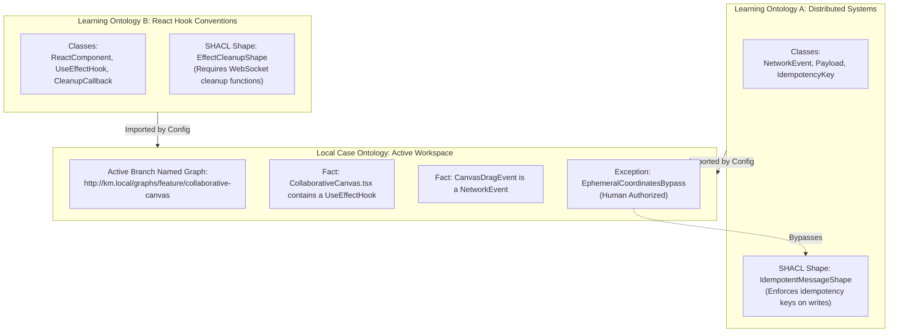

# Knowledge Management MCP: Multi-Ontology Software Feature Simulation

This document simulates the end-to-end operation of the **Knowledge Management (KM) MCP** design when implementing a new collaborative real-time feature in a software application. 

Unlike the recipe example, this simulation demonstrates the power of utilizing **multiple distinct Learning Ontologies** simultaneously to govern both **architectural principles** (distributed systems) and **implementation mechanics** (React patterns), showing how SHACL shapes validate correctness across different design layers.

---

## 1. The Scenario & Multi-Ontology Architecture

We are adding a **Real-Time Collaborative Canvas** feature to an existing project. Multiple users can edit the canvas simultaneously, sending updates over a WebSocket connection.

To build this safely, the system imports two separate Learning Ontologies to act as standard boundaries:
1.  **Distributed Systems Ontology** (`source: ../km-org-ontologies/distributed-systems`): Governs network protocols, message reliability, split-brain mitigation, and idempotency.
2.  **React Hook Conventions Ontology** (`source: ../km-org-ontologies/react-conventions`): Enforces React component memory safety, standard hook patterns, lifecycle cleanups, and performance limits.



### 1.1 Learning Ontology A: Distributed Systems (external source package)
Enforces design patterns that guarantee message consistency and prevent out-of-order message corruption. Lives in a separate repository at `../km-org-ontologies/distributed-systems/`.

```
../km-org-ontologies/distributed-systems/   ← separate Git repo (source)
├── README.md
├── config.json
├── lo_quads.db              # runtime (Git ignored)
└── exports/
    ├── main.ttl             # canonical graph (Git tracked)
    └── governance.ttl       # MR records (Git tracked)
```

Cached locally at `.km/lo-cache/distributed-systems/` in the workspace.

#### `README.md`
```markdown
# Distributed Systems Learning Ontology
**Domain:** Network messaging, synchronization, and event ordering.
**Purpose:** Ensure state stability in distributed, real-time communication systems.
```

#### SHACL Constraint Shape (from `exports/main.ttl` / canonical graph)
```turtle
# Ensures all write events over public transport have an Idempotency Key
dist:IdempotentMessageShape a sh:NodeShape ;
    sh:targetClass dist:NetworkEvent ;
    sh:property [
        sh:path dist:eventType ;
        sh:in ( "WRITE" "UPDATE" "DELETE" )
    ] ;
    sh:property [
        sh:path dist:payload ;
        sh:property [
            sh:path dist:idempotencyKey ;
            sh:minCount 1 ;
            sh:datatype xsd:string ;
            sh:message "Write events over distributed networks must carry a unique uuid v4 idempotencyKey to prevent duplicate execution." ;
        ]
    ] .
```

### 1.2 Learning Ontology B: React Hook Conventions (external source package)
Governs React frontend memory management, preventing connection leaks and memory corruption. Source at `../km-org-ontologies/react-conventions/`, cached at `.km/lo-cache/react-conventions/`.

#### `README.md`
```markdown
# React Hook Conventions Learning Ontology
**Domain:** React client hooks, performance guidelines, and resource lifecycle management.
**Purpose:** Enforce client-side memory safety and connection recycling.
```

#### SHACL Constraint Shape (from `exports/main.ttl` / canonical graph)
```turtle
# Ensures any useEffect that establishes a persistent WebSocket closes it on unmount
react:EffectCleanupShape a sh:NodeShape ;
    sh:targetClass react:UseEffectHook ;
    sh:property [
        sh:path react:allocatesResource ;
        sh:hasValue react:WebSocketConnection
    ] ;
    sh:property [
        sh:path react:hasCleanupCallback ;
        sh:minCount 1 ;
        sh:message "useEffect hooks that instantiate WebSockets must return a cleanup function containing a close/disconnect call to avoid memory and connection leaks." ;
    ] .
```

### 1.3 The Multi-Ontology Workspace Configuration
The local Case Ontology is configured to import **both** global learning ontologies.

#### Configuration File: `.km/config.json`
```json
{
  "workspace_id": "realtime-canvas-dev",
  "learning_ontologies": [
    {
      "ontology_id": "distributed-systems",
      "source": "../km-org-ontologies/distributed-systems",
      "mode": "read_only"
    },
    {
      "ontology_id": "react-conventions",
      "source": "../km-org-ontologies/react-conventions",
      "mode": "curator"
    }
  ],
  "quad_store": {
    "engine": "sqlite-quad",
    "storage_path": "./.km/case_quads.db"
  },
  "lo_cache": {
    "base_path": "./.km/lo-cache"
  }
}
```

---

## 2. Step-by-Step Simulation Flow

### Phase 1: Code Ingestion & Graph Registration
The developer is working on Git branch `feature/collaborative-canvas`. They write the first draft of the React collaborative component `CollaborativeCanvas.tsx` and the network payload structures.

The agent parses the AST of the proposed code and ingests these implementation details into the local Named Graph `http://km.local/graphs/feature/collaborative-canvas`.

#### Ingested Case Facts (JSON-LD)
```jsonld
{
  "@context": "http://km.local/context.jsonld",
  "@graph": [
    {
      "@id": "case:code/canvas_effect_1",
      "@type": "react:UseEffectHook",
      "react:allocatesResource": "react:WebSocketConnection",
      "react:hasCleanupCallback": 0
    },
    {
      "@id": "case:network/canvas_drag_event",
      "@type": "dist:NetworkEvent",
      "dist:eventType": "WRITE",
      "dist:payload": {
        "@id": "case:network/drag_payload",
        "dist:clientX": 482,
        "dist:clientY": 301
      }
    }
  ]
}
```

---

### Phase 2: The Multi-Ontology SHACL Linter Halts Execution

Before compiling or allowing code deployment, the KM MCP **SHACL Linter** runs structural validation. It processes the active case graph against the SHACL shapes imported from **both** active Learning Ontologies.

It detects **two separate violations** originating from two different ontologies:

1.  **Violation of `react:EffectCleanupShape`**: The `useEffect` hook (`case:code/canvas_effect_1`) instantiates a WebSocket connection but returns no cleanup callback.
2.  **Violation of `dist:IdempotentMessageShape`**: The client-side drag event (`case:network/canvas_drag_event`) is classified as a network `WRITE` event, but its payload lacks a `dist:idempotencyKey`.

#### SHACL Validation Report (JSON-LD)
```json
{
  "@type": "sh:ValidationReport",
  "sh:conforms": false,
  "sh:result": [
    {
      "@type": "sh:ValidationResult",
      "sh:focusNode": "case:code/canvas_effect_1",
      "sh:sourceShape": "react:EffectCleanupShape",
      "sh:resultSeverity": "sh:Violation",
      "sh:resultMessage": "useEffect hooks that instantiate WebSockets must return a cleanup function containing a close/disconnect call to avoid memory and connection leaks."
    },
    {
      "@type": "sh:ValidationResult",
      "sh:focusNode": "case:network/canvas_drag_event",
      "sh:sourceShape": "dist:IdempotentMessageShape",
      "sh:resultSeverity": "sh:Violation",
      "sh:resultMessage": "Write events over distributed networks must carry a unique uuid v4 idempotencyKey to prevent duplicate execution."
    }
  ]
}
```

#### System Execution Log
```
[KM MCP SHACL VALIDATOR] Validating active graph <http://km.local/graphs/feature/collaborative-canvas>...
[KM MCP SHACL VALIDATOR] [VIOLATION 1/2] Focus: case:code/canvas_effect_1 (Shape: react:EffectCleanupShape)
  Message: useEffect hooks that instantiate WebSockets must return a cleanup function to avoid leaks.
[KM MCP SHACL VALIDATOR] [VIOLATION 2/2] Focus: case:network/canvas_drag_event (Shape: dist:IdempotentMessageShape)
  Message: Write events over distributed networks must carry a unique uuid v4 idempotencyKey.
[KM MCP SHACL VALIDATOR] Validation failed. Halting agent code generation.
```

---

### Phase 3: Resolution & Local Exception Management

The agent analyzes the two halts and determines the appropriate remediation steps:

#### Action A: Automatic Hook Remediation (No Exception Allowed)
The React lifecycle constraint is a hard code-quality standard that cannot be bypassed. The agent must rewrite the React hook to ensure connection cleanup:

```typescript
// Component rewritten automatically by the agent to satisfy react:EffectCleanupShape
useEffect(() => {
  const ws = new WebSocket('wss://api.canvas.local');
  setSocket(ws);
  
  // Cleanup return added
  return () => {
    ws.close();
  };
}, []);
```
This updates the Case Ontology fact `react:hasCleanupCallback` to `1`, resolving the first violation.

#### Action B: Local Exception Propose (Human-in-the-Loop)
For the distributed message violation (`dist:IdempotentMessageShape`), the agent realizes that **canvas drag events** are high-frequency coordinate vectors (sending mouse coordinates 60 times a second).
*   Adding a UUID idempotency key to 60 events per second is a performance bottleneck.
*   More importantly, out-of-order coordinate delivery is self-correcting: the latest absolute coordinates always supersede previous ones, making idempotency redundant for this specific action.

The agent registers a proposed exception for this specific class of events:

```json
{
  "@id": "case:exceptions/ephemeral_coordinates_bypass",
  "@type": "km:LocalException",
  "km:bypassesShape": "dist:IdempotentMessageShape",
  "km:targetNode": "case:network/canvas_drag_event",
  "km:rationale": "High-frequency cursor coordinates (60Hz) are ephemeral. Absolute position is self-superseding, making duplicate protection redundant and computationally inefficient.",
  "km:status": "PENDING_APPROVAL"
}
```

#### Prompting the Developer for Authorization
The agent blocks execution and presents the exception:

> ### ⚠️ SHACL Linter Halt: Distributed Write Idempotency Needed
> **Conflict:** Your network event `CanvasDragEvent` is a write operation but lacks a required `idempotencyKey`. Under **Distributed Systems Shape: dist:IdempotentMessageShape**, all write operations require idempotency keys to prevent double-processing.
> 
> **Proposed Exception:**
> I have declared a local exception `ephemeral_coordinates_bypass`. High-frequency absolute coordinates (mouse positions) overwrite previous states continuously, rendering idempotency redundant. I will bypass the constraint *only* for coordinate payloads.
> 
> *Do you authorize this architectural exception?*
> 
> **[ Approve Exception ]**   **[ Reject & Enforce Idempotency ]**

The developer clicks **[ Approve Exception ]**. The system records the developer's approval signature in the Case Named Graph. The SHACL linter passes, and the code runs.

---

### Phase 4: Knowledge Discovery & Semantic Promotion

During building, the developer and agent discover that sending unthrottled cursor events still floods the WebSocket connection when multiple users are active. They create a custom React hook: `useThrottledSocketEvent.ts`.

This hook implements a smart throttling mechanism with immediate local optimistic coordinate updates.

Recognizing this as an excellent utility, the developer commands the agent: `"Promote this throttled socket hook pattern to the React Conventions learning ontology."`

#### Creating the Semantic Merge Request (MR)
The agent calls `propose_semantic_mr` (curator mode on `react-conventions` binding), writing proposal quads to the **source** LO package:

```
Proposal graph:  http://km.local/learning-ontologies/react-conventions/mr/MR-042
Governance graph: http://km.local/learning-ontologies/react-conventions/governance
```

The derived review document shows the diff against `exports/main.ttl`:

```diff
@@ exports/main.ttl @@
+# New SHACL Shape for Throttling High-Frequency Hooks
+react:HighFrequencyThrottleShape a sh:NodeShape ;
+    sh:targetClass react:HighFrequencyEventHook ;
+    sh:property [
+        sh:path react:throttleRateMs ;
+        sh:datatype xsd:integer ;
+        sh:minInclusive 16 ; # Maximum 60Hz update rate
+        sh:maxInclusive 200 ;
+        sh:message "Hooks emitting continuous canvas or mouse coordinates must be throttled between 16ms and 200ms to prevent network saturation." ;
+    ] .
```

On curator approval (`approve .km/mrs/mr-react-conventions-042.md`), the proposal merges into the source canonical graph, `{source}/exports/` are regenerated, and the workspace cache at `.km/lo-cache/react-conventions/` is refreshed. Agents validate against the updated cached canonical graph only.

---

## 3. Version Control & Git Synchronization

The local Case Ontology quad-store coordinates dual-governance across development branches. Each Learning Ontology is bound via `source` and materialized in `.km/lo-cache/`.

#### Case Ontology Graph Registry
```
┌────────────────────────────────────────────────────────┬──────────────────────────────────────────┐
│ Context/Named Graph URI                                │ Git Branch Association                   │
├────────────────────────────────────────────────────────┼──────────────────────────────────────────┤
│ http://km.local/graphs/main                            │ refs/heads/main                          │
│ http://km.local/graphs/feature/collaborative-canvas    │ refs/heads/feature/collaborative-canvas  │
└────────────────────────────────────────────────────────┴──────────────────────────────────────────┘
```

#### Learning Ontology Graph Registry (per ontology)
```
┌──────────────────────────────────────────────────────────────────────┬─────────────────────────────────────────┐
│ Named Graph URI                                                      │ Purpose                                 │
├──────────────────────────────────────────────────────────────────────┼─────────────────────────────────────────┤
│ http://km.local/learning-ontologies/react-conventions/canonical    │ Approved shapes (agent-visible)         │
│ http://km.local/learning-ontologies/react-conventions/governance   │ MR lifecycle records                    │
│ http://km.local/learning-ontologies/react-conventions/mr/MR-042    │ Pending throttling shape proposal       │
└──────────────────────────────────────────────────────────────────────┴─────────────────────────────────────────┘
```

1.  **Branch Switch (`git checkout main`)**:
    - The KM Daemon detects changes in `.git/HEAD`.
    - Active context switches to `http://km.local/graphs/main`.
    - Both the React hook correction facts and the `ephemeral_coordinates_bypass` exception hide in the background, keeping the clean main graph untouched.
2.  **Branch Merge (`git merge feature/collaborative-canvas`)**:
    - The daemon catches the Git merge event.
    - It warns the developer about the `ephemeral_coordinates_bypass` exception on `feature/collaborative-canvas`.
    - The developer confirms the sync, promoting the React component facts and the approved exception cleanly into `main`'s permanent workspace graph.

---

## 4. Summary of Multi-Ontology Execution

| Learning Ontology          | Governance Objective                                  | SHACL Shape Checked                | Resolution / Exception Outcome                                                                                              |
| :------------------------- | :---------------------------------------------------- | :--------------------------------- | :-------------------------------------------------------------------------------------------------------------------------- |
| **Distributed Systems**    | Network consistency, packet reliability, event order. | `dist:IdempotentMessageShape`      | **Approved Exception**: Ephemeral absolute mouse coordinates bypass idempotency checks due to self-superseding state rules. |
| **React Hook Conventions** | Client-side memory safety, socket leaks, performance. | `react:EffectCleanupShape`         | **Automatic Resolution**: Code refactored by the agent to return a `ws.close()` callback inside `useEffect`.                |
| **React Hook Conventions** | (Discovered & Promoted) Throttling rules.             | `react:HighFrequencyThrottleShape` | **Knowledge Promotion**: Promoted new throttling constraint structure to the global library.                                |
