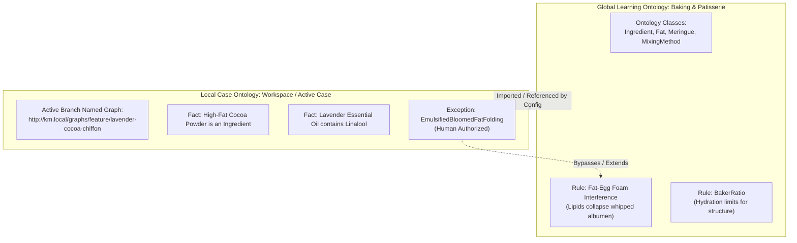

# Knowledge Management MCP: Cake Recipe Simulation Walkthrough

This document simulates the end-to-end operation of the **Knowledge Management (KM) MCP** design when applied to a non-software domain: **culinary engineering and baking science**. 

By applying the KM MCP's dual-ontology, neuro-symbolic approach to developing a complex **"Lavender & High-Fat Cocoa Chiffon Cake"**, we demonstrate how the system prevents failure (hallucinations/recipe collapses), manages state across Git branches, enforces hard constraints, handles human-in-the-loop exceptions, and promotes newly discovered knowledge back to global domain stores.

---

## 1. The Scenario & The Ontological Setup

A Chiffon cake is a notoriously delicate structure. It relies on a delicate balance of:
*   **Aeration:** Egg white foam (meringue) provides the rise.
*   **Fat/Moisture:** Oil and egg yolks provide tenderness and moisture, but lipids are catastrophic to foam stability if introduced too early.
*   **Gluten Control:** Enough gluten structure to hold the rise, but not enough to make it rubbery.

### The Dual-Ontology Configuration



### 1.1 The Learning Ontology (external source package)
This is the global, shared, version-controlled repository of baking science at `../km-org-ontologies/baking/`. Cached locally at `.km/lo-cache/baking/`.

```
../km-org-ontologies/baking/   ← separate Git repo (source)
├── README.md
├── config.json
├── lo_quads.db              # runtime (Git ignored)
└── exports/
    ├── main.ttl             # canonical graph (Git tracked)
    └── governance/          # one file per MR (Git tracked)
        └── MR-BAKING-017.ttl
```

#### `README.md` (Ontology Declaration)
```markdown
# Baking & Patisserie Learning Ontology
**Domain:** Chemical, structural, and thermodynamic principles of baking.
**Purpose:** Ensure standard safety, structural integrity, and structural metrics across all recipe-generation agents.
```

#### Core Axioms & Rules (from `exports/main.ttl` / canonical graph)
```turtle
# Class Definitions
baking:Ingredient a owl:Class .
baking:Lipid rdfs:subClassOf baking:Ingredient .
baking:EggWhiteFoam a owl:Class .
baking:ChiffonCake a owl:Class .

# SHACL Shape for Egg White Foam Integrity
# Ensures that no lipids are mixed directly into egg white foam during aeration
baking:EggWhiteFoamShape a sh:NodeShape ;
    sh:targetClass baking:MixingStep ;
    sh:property [
        sh:path baking:target ;
        sh:hasValue baking:EggWhiteFoam
    ] ;
    sh:sparql [
        a sh:SPARQLConstraint ;
        sh:message "Fat/Lipids detected in egg white whipping step. Lipids will deflate the meringue albumen network." ;
        sh:severity sh:Violation ;
        sh:prefixes [
            sh:declare [
                sh:prefix "baking" ;
                sh:namespace "http://ontologies.baking.org/core#"
            ]
        ] ;
        sh:select """
            SELECT $this ?ingredient
            WHERE {
                $this baking:add ?ingredient .
                ?ingredient baking:type baking:Lipid .
            }
        """
    ] .
```

### 1.2 The Case Ontology (Local Workspace)
The local Case Ontology captures the situational realities of our active recipe creation. It resides in the local developer workspace.

#### Configuration File: `.km/config.json`
```json
{
  "workspace_id": "lavender-cocoa-chiffon-dev",
  "learning_ontologies": [
    {
      "ontology_id": "baking",
      "source": "../km-org-ontologies/baking",
      "mode": "curator"
    }
  ],
  "quad_store": {
    "engine": "sqlite-quad",
    "storage_path": "./.km/case_quads.db"
  },
  "lo_cache": {
    "base_path": "./.km/lo-cache"
  }
}
```

---

## 2. Step-by-Step Simulation Flow

### Phase 1: Fact Ingestion & Logical Reference
The developer creates a branch `feature/lavender-cocoa-chiffon` and initializes the recipe generator agent.
The agent ingests the initial recipe specifications:
*   **Flour:** 100g Cake Flour
*   **Egg Whites:** 150g (to be whipped into meringue)
*   **Sugar:** 80g
*   **Fat:** 50g Vegetable Oil + 40g High-Fat Dutch-Processed Cocoa Powder (which contains 22% cocoa butter fat)
*   **Flavoring:** 10 drops of Lavender Essential Oil

The agent registers these facts into the active Git branch named graph `http://km.local/graphs/feature/lavender-cocoa-chiffon`.

```jsonld
{
  "@context": "http://km.local/context.jsonld",
  "@graph": [
    {
      "@id": "recipe:ingredients/cocoa_powder",
      "@type": "baking:Ingredient",
      "baking:hasFatContent": 0.22,
      "baking:type": "baking:Lipid"
    },
    {
      "@id": "recipe:process/step_2",
      "@type": "baking:MixingStep",
      "baking:target": "recipe:elements/egg_white_meringue",
      "baking:add": [
        "recipe:ingredients/cocoa_powder",
        "recipe:ingredients/lavender_oil"
      ]
    }
  ]
}
```

---

### Phase 2: The Logical Linter in Action (SHACL Validation Halting)

Before running the recipe simulation or outputting the kitchen instructions, the KM MCP **SHACL Validator** executes a semantic check on the active named graph against the shapes from the cached baking LO canonical graph (synced from `../km-org-ontologies/baking/exports/main.ttl`).

The linter detects a severe SHACL validation failure:
1.  `recipe:ingredients/cocoa_powder` is classified as `baking:Lipid` due to its high cocoa butter content.
2.  `recipe:process/step_2` attempts to add the lipid-heavy cocoa powder directly to the `recipe:elements/egg_white_meringue` (whose target is `baking:EggWhiteFoam`).
3.  This violates the SPARQL-based constraint defined in `baking:EggWhiteFoamShape`.

#### SHACL Validation Report (JSON-LD Representation)
```json
{
  "@type": "sh:ValidationReport",
  "sh:conforms": false,
  "sh:result": {
    "@type": "sh:ValidationResult",
    "sh:focusNode": "recipe:process/step_2",
    "sh:resultPath": "baking:target",
    "sh:value": "baking:EggWhiteFoam",
    "sh:sourceShape": "baking:EggWhiteFoamShape",
    "sh:resultSeverity": "sh:Violation",
    "sh:resultMessage": "Fat/Lipids detected in egg white whipping step. Lipids will deflate the meringue albumen network."
  }
}
```

#### System Execution Log
```
[KM MCP SHACL VALIDATOR] Validating active graph against baking shapes...
[KM MCP SHACL VALIDATOR] [VIOLATION DETECTED]
  Focus Node: recipe:process/step_2
  Source Shape: baking:EggWhiteFoamShape
  Message: Fat/Lipids detected in egg white whipping step. Lipids will deflate the meringue albumen network.
  Severity: sh:Violation (Hard Constraint)
  Action: HALTING AGENT EXECUTION.
```

> [!IMPORTANT]
> The agent is strictly prevented from outputting this recipe. The SHACL constraint violation acts as a hard logical guard, preventing physical waste in the test kitchen (or in software terms, preventing runtime crashes/invalid compilations).

---

### Phase 3: Exception Declaration & Human-in-the-Loop Approval

To resolve this halt, the agent cannot simply rewrite the global physics of baking (the learning ontology). Instead, it must formulate a **Local Exception** using domain-specific mitigation steps (aeration safety isolation) and request human authorization.

#### The Agent's Proposed Mitigation
Instead of mixing cocoa powder directly into the egg whites, the agent proposes to:
1.  **Bloom** the cocoa powder in hot water (emulsifying the lipids and hydrating starch).
2.  Mix the bloomed cocoa with the egg yolks and vegetable oil (creating a stable, high-fat emulsion base).
3.  Whip the egg whites and sugar separately into a highly stable French Meringue.
4.  **Fold** the chocolate yolk emulsion into the meringue at the very end, limiting contact time and mechanical agitation to prevent collapse.

The agent registers a proposed exception:

```json
{
  "@id": "recipe:exceptions/bloomed_cocoa_emulsion_folding",
  "@type": "km:LocalException",
  "km:bypassesShape": "baking:EggWhiteFoamShape",
  "km:targetNode": "recipe:process/step_2",
  "km:rationale": "High-fat Dutch cocoa is emulsified with yolk lecithin and water before folding. Mechanical folding replaces direct high-speed mixing, mitigating foam degradation.",
  "km:status": "PENDING_APPROVAL"
}
```

#### The Agent Prompts the User
The agent presents the issue and the proposed exception to the developer:

> ### ⚠️ Execution Halted: Recipe Structure Conflict Detected
> **Conflict:** Your recipe adds High-Fat Dutch-Processed Cocoa Powder (22% fat) directly into the egg whites during whipping. Under **SHACL Shape: baking:EggWhiteFoamShape**, lipids will immediately deflate the albumen protein network, preventing the Chiffon Cake from rising.
> 
> **Proposed Exception & Mitigation:**
> I have designed a local process exception `bloomed_cocoa_emulsion_folding`. I will separate the recipe into two streams:
> 1. An emulsion base of egg yolks, vegetable oil, and cocoa bloomed in hot water.
> 2. A separate French meringue of egg whites and sugar whipped to stiff peaks.
> 3. Gently folding the emulsion into the meringue at the very end.
> 
> *Do you authorize this local exception to bypass the direct fat interference constraint?*
> 
> **[ Approve Exception ]**   **[ Reject Exception & Redesign ]**

The developer clicks **[ Approve Exception ]**.

The system updates the case graph status to `APPROVED_BY_HUMAN` and stores the developer's digital signature in the named graph metadata:

```turtle
recipe:exceptions/bloomed_cocoa_emulsion_folding
    baking:exceptionStatus "APPROVED" ;
    baking:approvedBy "ChefDev" ;
    baking:timestamp "2026-05-30T01:45:00Z" .
```

The Linter re-evaluates the graph, sees the approved exception, and allows execution to proceed.

---

### Phase 4: Knowledge Discovery & Semantic Merge Request (MR)

During the trial baking phase, a new problem emerges: **Lavender oil volatiles collapse meringue elasticity**. 
The lavender essential oil contains high levels of the terpene **Linalool**, which acts as a surfactant, breaking down the bubble surface tension much faster than standard oils.

#### The Discovery
The agent, analyzing physical parameters or receiving test kitchen feedback ("Meringue is weeping and graining within 3 minutes of adding lavender oil"), performs a local search and discovers a chemical counter-measure:
*   Adding **Cream of Tartar (Potassium Bitartrate - Acid)** lowers the pH of the egg whites.
*   This protonates the ovalbumin proteins, making them resist unfolding too quickly, which effectively *shields* the bubbles from Linalool surfactant breakdown.

This is a **major baking science discovery** that is not currently in the global baking Learning Ontology (`ontology_id: "baking"`). The developer instructs the agent: `"Promote this lavender meringue stabilization technique to the global baking ontology."`

#### Creating the Semantic Merge Request (MR)
The agent calls `propose_semantic_mr` (curator mode), writing proposal quads to the **source** baking LO package at `../km-org-ontologies/baking/`:

```
Proposal graph:  http://km.local/learning-ontologies/baking/mr/MR-017
Governance graph: http://km.local/learning-ontologies/baking/governance
```

The derived review document shows the diff against `exports/main.ttl`:

```diff
@@ exports/main.ttl @@
+# New Concept
+baking:TerpeneSurfactant rdfs:subClassOf baking:Lipid .
+baking:Linalool rdfs:subClassOf baking:TerpeneSurfactant .
+
+# New Stabilization Mechanism
+baking:AcidicProtonation rdfs:subClassOf baking:StabilizationMethod .
+
+# New SHACL Shape Proposing Stabilization and Acid requirements
+baking:LavenderMeringueStabilizationShape a sh:NodeShape ;
+    sh:targetClass baking:MixingStep ;
+    sh:property [
+        sh:path baking:add ;
+        sh:qualifiedValueShape [
+            sh:class baking:AcidicProtonation
+        ] ;
+        sh:qualifiedMinCount 1 ;
+        sh:message "Whipping egg whites in the presence of lavender oil (TerpeneSurfactant) requires an acid stabilizer to prevent meringue collapse."
+    ] .
```

#### Review & Governance Cycle
The Semantic MR is recorded in the source baking LO governance graph and exported to `{source}/exports/governance/MR-BAKING-017.ttl`. The curator reviews the derived markdown document and physical test reports, then approves via `approve .km/mrs/mr-baking-017.md`. On merge, proposal quads flow into the source canonical graph, `{source}/exports/main.ttl` is regenerated, the workspace cache at `.km/lo-cache/baking/` is refreshed, and **any other agent** creating citrus, floral, or lavender chiffon cakes inherits the stabilization rule.

---

## 3. Version Control & State Synchronization

Because the Case Ontology is structured as a **Quad-Store**, every fact and assertion belongs to a specific named graph linked directly to the repository's Git branch structure. Learning Ontologies are bound via `source` paths and materialized in `.km/lo-cache/`; Git tracks LO exports in source repositories. Case facts are tracked in **`case-exports/`** in the application repo (same export model as LO; see spec §2.6).

```
case-exports/
├── graphs/
│   ├── refs-heads-main.ttl
│   └── refs-heads-feature-lavender-cocoa-chiffon.ttl
├── governance/
│   └── merge-lavender-cocoa-chiffon-20260530.ttl
└── sync-manifest.json
```

#### Case Ontology Graph Registry
```
┌────────────────────────────────────────────────────────┬──────────────────────────────────────────┬─────────────────────────────────────────────┐
│ Context/Named Graph URI                                │ Git Branch Association                   │ Git export file                             │
├────────────────────────────────────────────────────────┼──────────────────────────────────────────┼─────────────────────────────────────────────┤
│ http://km.local/graphs/main                            │ refs/heads/main                          │ case-exports/graphs/refs-heads-main.ttl     │
│ http://km.local/graphs/feature/lavender-cocoa-chiffon  │ refs/heads/feature/lavender-cocoa-chiffon│ case-exports/graphs/refs-heads-feature-…  │
└────────────────────────────────────────────────────────┴──────────────────────────────────────────┴─────────────────────────────────────────────┘
```

#### Baking LO Graph Registry
```
┌──────────────────────────────────────────────────────────────────────┬─────────────────────────────────────────┐
│ Named Graph URI                                                      │ Purpose                                 │
├──────────────────────────────────────────────────────────────────────┼─────────────────────────────────────────┤
│ http://km.local/learning-ontologies/baking/canonical               │ Approved baking science (agent-visible) │
│ http://km.local/learning-ontologies/baking/governance              │ MR lifecycle records                    │
│ http://km.local/learning-ontologies/baking/mr/MR-017               │ Pending lavender stabilization proposal │
└──────────────────────────────────────────────────────────────────────┴─────────────────────────────────────────┘
```

#### 3.1 Branch Switch Detection
The developer switches git branches:
```bash
git checkout main
```

1.  The KM Daemon monitors `.git/HEAD`.
2.  It detects a change from `ref: refs/heads/feature/lavender-cocoa-chiffon` to `ref: refs/heads/main`.
3.  The KM MCP system seamlessly swaps its active query target from `http://km.local/graphs/feature/lavender-cocoa-chiffon` to `http://km.local/graphs/main`.
4.  The Lavender-specific exceptions and facts disappear from the active context, leaving `main` clean and unpolluted.

#### 3.2 Branch Merging Logic
A few days later, the lavender cake is fully tested and approved. The developer merges the branch in Git:
```bash
git checkout main
git merge feature/lavender-cocoa-chiffon
```

The KM system monitors `.git/refs/heads/main`. It detects that `feature/lavender-cocoa-chiffon` was merged into `main`.

The workspace uses the default **`auto_merge_exception`** policy (`.km/config.json` → `"branch_merge": { "policy": "auto_merge_exception" }`). Because approved exceptions live as triples in the feature branch graph, the daemon **automatically copies** the `bloomed_cocoa_emulsion_folding` exception (rationale, approver signature, and timestamp) into `http://km.local/graphs/main` before prompting about remaining Case facts. With **`case-exports/`** committed, choosing `DELETE` clears only runtime non-exception triples on the feature graph; the exception and merge decision remain auditable in Git via graph snapshots and `case-exports/governance/merge-lavender-cocoa-chiffon-20260530.ttl`.

The system then prompts the developer about the **remaining** experimental Case facts (trial proportions, humidity notes, intermediate failures):

```
[KM MCP STATE SYNCHRONIZER] Git Merge Event Detected!
  Source: refs/heads/feature/lavender-cocoa-chiffon
  Target: refs/heads/main
  Policy: auto_merge_exception

✓ Auto-merged 1 approved exception to main:
  -> bloomed_cocoa_emulsion_folding (Approved by ChefDev)

The source branch still contains 47 Case fact triples (recipe proportions, trial notes).
Would you like to synchronize the remaining Case Ontology facts?
  [1] MERGE (promote finalized recipe structure to official stable status)
  [2] KEEP ISOLATED (leave feature graph intact; exception already on main)
  [3] DELETE (discard non-exception triples from feature graph only)

Select option [1-3]: _
```

The developer chooses `[1]`. The semantic facts representing the finalized recipe proportions are merged into `http://km.local/graphs/main`. The emulsion-folding exception was already present from the auto-merge step. The daemon upserts `case-exports/graphs/refs-heads-main.ttl` and writes `case-exports/governance/merge-lavender-cocoa-chiffon-20260530.ttl` recording `km:resolution "MERGE"` — creating a permanent Git-auditable record of both the recipe's physical parameters and its authorized constraint bypass.

---

## 4. Summary of Design Mechanics Demonstrated

| KM MCP Component                   | Culinary Domain Translation                                                                 | System Action / Benefit                                                                                                                                                         |
| :--------------------------------- | :------------------------------------------------------------------------------------------ | :------------------------------------------------------------------------------------------------------------------------------------------------------------------------------ |
| **Learning Ontology**              | Baking Science & Laws of Chemistry (Egg white behavior, fat interactions, acidity controls) | Prevents the generator from outputting impossible/collapsing recipe designs (no hallucinations).                                                                                |
| **Case Ontology**                  | The specific "Lavender & Cocoa Chiffon" recipe project                                      | Captures raw experimental variables, local kitchen humidity, exact ingredient batches.                                                                                          |
| **SHACL Constraint Linter**        | Structural shape validation check (Fat vs. Albumen Foam)                                    | Automatically validates active graph states against structural shapes and halts execution on violations.                                                                        |
| **Exception Authority**            | separation-of-streams emulsion and gentle folding technique                                 | Allows local workarounds for physical constraints with mandatory developer signature, linked to specific target nodes and bypassed shapes.                                      |
| **Knowledge Promotion**            | Promoting "Cream of Tartar stabilizes Linalool collapse" to global SHACL shapes             | Captures local empirical discoveries and generalizes them into organizational shapes and rules.                                                                                 |
| **Named Graphs / Git Integration** | Separating trial recipes according to current test branch                                   | Guarantees experimental changes to ingredient proportions don't corrupt the main production menu; default `auto_merge_exception` policy preserves approved exceptions on merge. |
