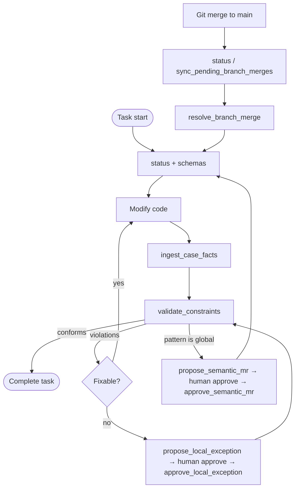

# KM MCP Usage Walkthrough

This guide walks through a complete **agent + developer** session using the Knowledge Management MCP tools end to end. It also serves as the **authoritative agent interface reference** for KM-governed workspaces.

For deeper operational detail, see [agents.md](agents.md) (lifecycle and patterns) and [skills.md](skills.md) (reusable recipes). Cursor always-applied rules: [agents.mdc](agents.mdc), [skills.mdc](skills.mdc).

---

## Agent interface contract

Two surfaces exist — do not conflate them or infer undocumented CLI commands.

| Surface                             | Who uses it                              | Purpose                                    |
| :---------------------------------- | :--------------------------------------- | :----------------------------------------- |
| **MCP tools** (`km mcp` via Cursor) | Agent                                    | All semantic operations during development |
| **`km` CLI** (shell)                | Developer (or agent only when user asks) | Bootstrap, inspect, export                 |

There is **no** `km validate` CLI command. SHACL validation is **MCP-only** via `validate_constraints`.

### CLI subcommands (shell)

| Command          | Purpose                                             |
| :--------------- | :-------------------------------------------------- |
| `km init`        | Initialize `.km/` workspace configuration           |
| `km status`      | Print system status JSON (developer inspection)     |
| `km mcp`         | Start MCP server (configured in `.cursor/mcp.json`) |
| `km export-case` | Export active branch case graph to `case-exports/`  |

Agent default: **do not run shell `km`** except when the user explicitly requests `km init` or another CLI command. Never call a KM MCP tool from memory — read its schema under the MCP descriptor folder first. If an MCP tool fails, report the exact error; do **not** substitute CLI commands, hand-edited TTL, or skipped validation.

Avoid opening a second KM process against `.km/case_quads.db` while `km mcp` is running (e.g. do not run shell `km status` or `km export-case` against the same workspace).

`km mcp` does not create or open `.km` files on startup. Agents call MCP **`setup`** first.

### MCP tools (agent operations)

| MCP tool                     | When to use                                                                |
| :--------------------------- | :------------------------------------------------------------------------- |
| `setup`                      | **First** — every MCP session; pass `workspace_directory` (project root)   |
| `status`                     | After setup; check branch, LO bindings, pending merges/exceptions/MRs      |
| `validate_constraints`       | After code/fact changes; SHACL lint against LO canonical graphs            |
| `ingest_case_facts`          | After structural code changes; write Turtle/JSON-LD to active branch graph |
| `query_semantic_graph`       | Read-only SPARQL over case + LO graphs                                     |
| `propose_local_exception`    | SHACL violation cannot be fixed without unacceptable harm                  |
| `approve_local_exception`    | After developer approves exception (requires signature)                    |
| `propose_semantic_mr`        | Promote local pattern to shared LO (curator mode binding)                  |
| `approve_semantic_mr`        | After developer approves MR doc                                            |
| `sync_pending_branch_merges` | After Git merge when no pending entry in `status` yet                      |
| `resolve_branch_merge`       | After developer approves `approval_command` from `status`                  |
| `export_case`                | Export active branch graph (MCP equivalent of `km export-case`)            |

### MCP resources

| URI                                        | Purpose                                       |
| :----------------------------------------- | :-------------------------------------------- |
| `km://schemas/learning-ontologies`         | Allowed classes, properties, SHACL boundaries |
| `km://case/active-graph`                   | Active branch case facts                      |
| `km://case/active-exceptions`              | Approved/pending local exceptions             |
| `km://case/pending-merges`                 | Pending branch merge events                   |
| `km://case/pending-merges/{event_id}`      | Raw prompt JSON for one merge event           |
| `km://learning-ontologies/{id}/canonical`  | One LO canonical export                       |
| `km://learning-ontologies/{id}/governance` | MR governance (source store)                  |
| `km://mr/{ontology-id}/{mr-id}`            | Derived MR review document                    |

### Workflow summary

**Start of task:** MCP `status` → `km://schemas/learning-ontologies` → `km://case/active-graph` or `query_semantic_graph`

**After code changes:** extract semantics → `ingest_case_facts` (confirm `triples_added > 0`) → `validate_constraints`

**SHACL outcomes:**

| Result                           | Action                                                                                           |
| :------------------------------- | :----------------------------------------------------------------------------------------------- |
| `conforms: true`                 | Proceed                                                                                          |
| `conforms: false`                | Read `focus_node`, `source_shape`, `message`; fix code + re-ingest, or `propose_local_exception` |
| Tool error (throws / non-result) | Report exact error; **do not** substitute CLI, skip validation, or treat tests as SHACL pass     |

**After Git merge into main/master:**

1. MCP `status` → check `pending_branch_merges`
2. If empty, **`sync_pending_branch_merges`** (`source_branch`, optional `target_branch`)
3. Present `approval_command` to developer; pause
4. **`resolve_branch_merge`** with `MERGE` \| `KEEP_ISOLATED` \| `DELETE`
5. MCP `status` → `pending_branch_merges_count` should be 0

### Protected paths

| Path                            | Rule                                                    |
| :------------------------------ | :------------------------------------------------------ |
| `.km/config.json`               | Developer-owned; never edit unless user explicitly asks |
| `.km/case_quads.db`             | Written by MCP ingest/merge — not hand-edited           |
| `case-exports/graphs/*.ttl`     | Generated by export policy — not hand-edited            |
| `case-exports/governance/*.ttl` | Generated by merge resolution — not hand-edited         |

---

## What you need

A workspace with KM initialized:

```
my-app/
├── .git/
├── case-exports/            # Case Git authority (commit with source)
│   ├── graphs/
│   ├── governance/
│   └── sync-manifest.json
├── .km/                     # runtime (Git ignored)
│   ├── config.json
│   ├── case_quads.db
│   ├── lo-cache/
│   └── mrs/                 # derived MR review docs (created on demand)
└── src/
```

MCP server entry: `.cursor/mcp.json` → `km mcp` (optionally with `cwd` = workspace root). Agents call MCP **`setup`** with `workspace_directory` before other tools.

Example `.km/config.json`:

```json
{
  "workspace_id": "my-app-dev",
  "learning_ontologies": [
    {
      "ontology_id": "react-conventions",
      "source": "../km-org-ontologies/react-conventions",
      "mode": "read_only"
    }
  ],
  "quad_store": {
    "engine": "sqlite-quad",
    "storage_path": "./.km/case_quads.db"
  },
  "lo_cache": { "base_path": "./.km/lo-cache" },
  "case_exports": { "base_path": "./case-exports", "export_policy": "on_commit" },
  "branch_merge": { "policy": "auto_merge_exception" }
}
```

LO bindings, export policy, and branch merge policy live in `.km/config.json` (developer-owned).

`case_exports.export_policy` controls when Case Turtle files are written (default `on_commit` — see spec §2.6). Commit `case-exports/` with application changes for audit and review.

`branch_merge.policy` controls Case graph sync after Git merge (see spec §5.3): `auto_merge_exception` (default) auto-imports approved exceptions then prompts for remaining facts; `auto_merge` imports everything; `no_auto_merge` prompts for the entire source graph (DELETE there also discards exceptions).

### External Learning Ontologies

Learning Ontology packages are maintained in a separate repository:

- **Repository:** https://github.com/isaacnugroho/ontologies.git
- **Clone:** `git clone https://github.com/isaacnugroho/ontologies.git`

Bind a package when initializing a workspace:

```bash
km init --lo-source ../ontologies/<package-dir>
```

Or add a binding manually in `.km/config.json`:

```json
{
  "learning_ontologies": [
    {
      "ontology_id": "<ontology-id-from-package>",
      "source": "../ontologies/<package-dir>",
      "mode": "read_only"
    }
  ]
}
```

Package layout and path resolution: [ontologies/README.md](ontologies/README.md).

The KM MCP server must be running and connected to your agent (Cursor, CLI, or other MCP client).

---

## Scenario

You add a React hook `useCanvasDrag.ts` that emits high-frequency pointer events. The agent must:

1. Align with loaded Learning Ontology schemas
2. Register what was built in the Case Ontology
3. Validate against SHACL shapes
4. Handle a violation (fix, or propose an exception)
5. Optionally promote a reusable pattern to a Learning Ontology (curator workspace only)

---

## Walkthrough

### Step 0 — Orient the session

**Tool:** `status`  
**Resource:** `km://schemas/learning-ontologies`

```text
status()
→ {
    "active_branch": "feature/collaborative-canvas",
    "learning_ontologies": [
      {
        "ontology_id": "react-conventions",
        "source": "/abs/path/km-org-ontologies/react-conventions",
        "mode": "read_only",
        "cache_path": ".km/lo-cache/react-conventions",
        "cache_synced_at": "2026-05-30T08:00:00Z"
      }
    ],
    "pending_exceptions_count": 0,
    "pending_mrs_count": 0,
    "branch_merge_policy": "auto_merge_exception",
    "pending_branch_merges_count": 0
  }
```

Read `km://schemas/learning-ontologies` to learn allowed classes (e.g. `react:HighFrequencyEventHook`) and governed properties (e.g. `react:throttleRateMs`).

Optionally inspect existing branch facts:

```text
Resource: km://case/active-graph
```

Or run a targeted query:

```text
query_semantic_graph({
  "query": "PREFIX local: <http://app.local/hooks#> SELECT ?hook WHERE { ?hook a <http://ontologies.react.org/core#HighFrequencyEventHook> }"
})
```

---

### Step 1 — Ingest case facts

After implementing or modifying code, extract **structural** facts (not raw source files) and write them to the active branch graph.

**Tool:** `ingest_case_facts`

```turtle
@prefix react: <http://ontologies.react.org/core#> .
@prefix local: <http://app.local/hooks#> .
@prefix xsd: <http://www.w3.org/2001/XMLSchema#> .

local:useCanvasDrag a react:HighFrequencyEventHook ;
    react:throttleRateMs 32 ;
    react:filePath "src/hooks/useCanvasDrag.ts"^^xsd:string .
```

```text
ingest_case_facts({
  "facts": "<turtle above>",
  "format": "turtle"
})
→ { "status": "success", "triples_added": 3 }
```

Confirm `triples_added > 0`. Facts land in the named graph for the active Git branch (e.g. `http://km.local/graphs/feature-collaborative-canvas`).

---

### Step 2 — Validate constraints

**Tool:** `validate_constraints`

```text
validate_constraints()
→ { "conforms": true, "violations": [] }
```

If `conforms` is `false`, inspect each violation:

| Field          | Meaning                         |
| :------------- | :------------------------------ |
| `focus_node`   | Case element that failed        |
| `source_shape` | SHACL shape URI                 |
| `message`      | Human-readable rule explanation |

**Branch A — Fix the code:** Adjust implementation, re-ingest facts, call `validate_constraints` again.

**Branch B — Request an exception:** Continue to Step 3.

If the tool itself errors (not a `conforms: false` result), report the exact message — do not substitute shell `km …`, hand-edited TTL, or test pass for SHACL.

---

### Step 3 — Propose a local exception (when refactoring is not acceptable)

Suppose validation fails because `react:throttleRateMs` is below the shape minimum, but zero throttle is required for rendering quality.

**Tool:** `propose_local_exception`

```text
propose_local_exception({
  "bypasses_shape": "http://ontologies.react.org/core#HighFrequencyThrottleShape",
  "target_node": "http://app.local/hooks#useCanvasDrag",
  "rationale": "Canvas drag requires unthrottled coordinates for sub-frame visual fidelity."
})
→ {
    "exception_id": "http://km.local/exceptions/uuid-88aef402-990a",
    "status": "PENDING_APPROVAL"
  }
```

Prompt the developer:

```text
approve km://case/active-exceptions/uuid-88aef402-990a
```

When the developer runs that command, the agent calls:

**Tool:** `approve_local_exception`

```text
approve_local_exception({
  "exception_id": "http://km.local/exceptions/uuid-88aef402-990a",
  "approver": "DeveloperJane",
  "signature": "sig_…"
})
→ { "status": "APPROVED", "timestamp": "2026-05-30T10:15:00Z" }
```

Re-run `validate_constraints()` — it should pass with the approved exception recorded in the branch graph.

**Resource:** `km://case/active-exceptions` lists pending and approved exceptions for the workspace.

---

### Step 4 — Promote knowledge to a Learning Ontology (curator only)

When a local pattern should become global policy, submit a semantic Merge Request. The target binding must have `"mode": "curator"`.

**Tool:** `propose_semantic_mr`

`target_ontology` accepts either the LO `base_uri` or `ontology_id`.

```text
propose_semantic_mr({
  "target_ontology": "react-conventions",
  "rationale": "High-frequency hooks must be throttled to prevent WebSocket saturation.",
  "diff_insertions": "@prefix react: <http://ontologies.react.org/core#> .\n@prefix sh: <http://www.w3.org/ns/shacl#> .\n\nreact:HighFrequencyThrottleShape a sh:NodeShape ;\n    sh:targetClass react:HighFrequencyEventHook ;\n    sh:property [\n        sh:path react:throttleRateMs ;\n        sh:minInclusive 16 ;\n        sh:maxInclusive 200\n    ] .",
  "diff_deletions": ""
})
→ { "mr_id": "MR-042", "status": "PENDING_APPROVAL" }
```

The server:

- Writes proposal + governance triples to the **source** LO package
- Upserts `{source}/exports/governance/MR-042.ttl`
- Does **not** update the workspace cache yet
- Creates a review doc at `.km/mrs/mr-react-conventions-042.md`

Prompt the developer:

```text
approve .km/mrs/mr-react-conventions-042.md
```

**Tool:** `approve_semantic_mr`

```text
approve_semantic_mr({
  "doc_identifier": ".km/mrs/mr-react-conventions-042.md"
})
→ {
    "status": "APPROVED",
    "mr_id": "MR-042",
    "target_ontology": "http://ontologies.react.org/core",
    "timestamp": "2026-05-30T11:00:00Z"
  }
```

On approval the server merges into the source canonical graph, regenerates `exports/main.ttl`, updates `exports/governance/{mr-id}.ttl`, and **fully rebuilds** `.km/lo-cache/`.

**Tool:** `status` — confirm cache sync and updated bindings.

**Resources for review:**

- `km://learning-ontologies/react-conventions/governance` — MR records (source store)
- `km://mr/react-conventions/MR-042` — derived review document

---

### Step 5 — Branch case merge (after Git merge)

After merging a feature branch into `main` or `master`, synchronize Case Ontology graphs per `branch_merge.policy` (spec §5.3). The git watcher inside `km mcp` may run policy steps automatically; you still complete human resolution via MCP.

**Tools:** `status`, `sync_pending_branch_merges`, `resolve_branch_merge`

```text
status()
→ { "pending_branch_merges": [ { "event_id": "...", "approval_command": "resolve_branch_merge ... MERGE" } ] }
```

If `pending_branch_merges` is empty:

```text
sync_pending_branch_merges({ "source_branch": "feature/collaborative-canvas" })
→ { "status": "PENDING_RESOLUTION", "approval_command": "..." }
```

Present `approval_command` to the developer and pause. On approval:

```text
resolve_branch_merge({ "event_id": "merge-feature-x-into-main-abc123", "resolution": "MERGE" })
```

Re-run `status` — `pending_branch_merges_count` should be `0`.

Optional: `km://case/pending-merges/{event_id}` for the raw prompt JSON.

---

## Typical agent loop



---

## Further reading

| Document                                                                                       | Contents                                                          |
| :--------------------------------------------------------------------------------------------- | :---------------------------------------------------------------- |
| [agents.md](agents.md)                                                                         | Agent lifecycle, tool patterns, MR lifecycle                      |
| [skills.md](skills.md)                                                                         | Step-by-step skills: ingestion, linting, exceptions, MR promotion |
| [agents.mdc](agents.mdc) / [skills.mdc](skills.mdc)                                            | Always-applied Cursor rules                                       |
| [../docs/brief.md](../docs/brief.md)                                                           | System overview and MCP interface summary                         |
| [../docs/knowledge-management-specification.md](../docs/knowledge-management-specification.md) | Full engineering specification                                    |
| [../docs/simulations/app-feature-simulation.md](../docs/simulations/app-feature-simulation.md) | Multi-ontology feature walkthrough                                |
| [../docs/simulations/cake-recipe-simulation.md](../docs/simulations/cake-recipe-simulation.md) | Single-ontology domain walkthrough                                |
