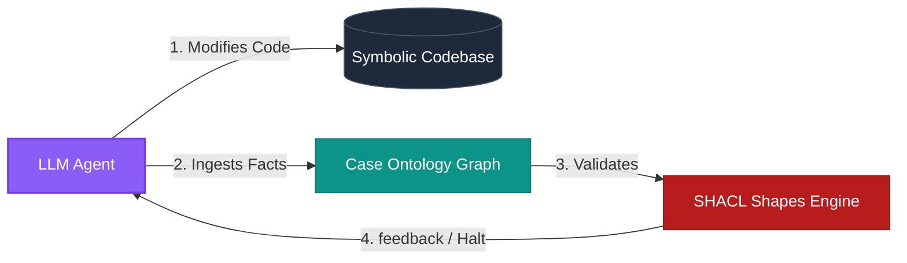
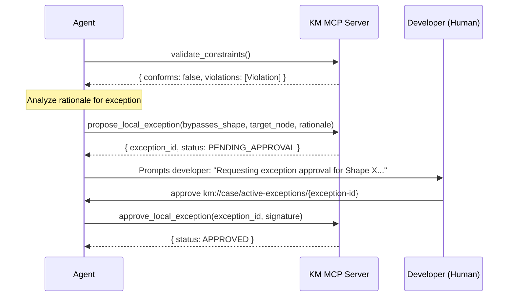

# Agent Usage Guide: Interacting with KM MCP

This document serves as the operational handbook for AI agents executing tasks in a workspace governed by the **Knowledge Management (KM) MCP**. It details the behavioral patterns, execution lifecycle integration, and tools usage protocols necessary to maintain semantic synchrony between code and knowledge.

---

## 1. The Neuro-Symbolic Agent Mindset

As an agent operating in this workspace, you do not just write code; you manage the formal semantics of your implementation. You operate as a **neuro-symbolic bridge**:
*   **The Symbolic:** The concrete source code, ASTs, and files in the workspace.
*   **The Semantic:** The RDF hyper-graph tracking the facts, conventions, and rules of the design.

Every structural change you make to the symbolic layer must be reflected, verified, and constrained in the semantic layer.



---

## 2. Agent Execution Lifecycle Integration

You MUST integrate KM MCP tool operations into your standard execution loop at specific checkpoints.

### Phase 1: Context Ingestion & Alignment (On Startup / Task Start)
Before writing any code or proposing plans, align your context window with the workspace's loaded ontologies:
1.  **Retrieve System Status:** Invoke `get_system_status` to determine the active Git branch, the effective `branch_merge_policy`, `pending_branch_merges_count`, and the loaded Learning Ontology bindings (ontology_id, source, mode, cache sync state).
2.  **Inspect Active Schemas:** Read the schema resource at `km://schemas/learning-ontologies` to understand available classes, properties, and constraint boundaries (sourced from cached LO **canonical graphs** only).
3.  **Read Case Triples:** Load `km://case/active-graph` or execute targeted SPARQL read queries (`query_semantic_graph`) to understand what structural facts have already been established for this branch.

### Phase 2: Fact Discovery & Ingestion (During Development)
As you write code (e.g., creating components, modules, endpoints, or data models), you must discover and register the facts:
1.  **Extract Semantics:** Identify concepts, types, and properties.
2.  **Serialize as RDF:** Format the discoveries as JSON-LD or Turtle triples.
3.  **Ingest Facts:** Invoke `ingest_case_facts` to write these facts into the active branch's Named Graph.

> [!TIP]
> Do not dump raw file contents into `ingest_case_facts`. Extract high-density structural facts such as dependency imports, event hook throttle rates, or service layer abstractions.

### Phase 3: Constraint Verification (Before Turn End / Planning Completion)
Before completing a task or presenting a completed change to the developer, verify system compliance against LO **canonical graphs** only (pending MR proposals are excluded):
1.  **Run SHACL Linter:** Invoke `validate_constraints`.
2.  **Interpret Validation Report:**
    *   If `conforms` is `true`, proceed with confidence.
    *   If `conforms` is `false`, analyze the `violations` array immediately. **DO NOT ignore validations.**

---

## 3. Detailed Tool Usage Patterns

### 3.1 Dynamic Fact Ingestion (`ingest_case_facts`)
When registering code features, express them using clean Turtle or JSON-LD syntax mapped to the schemas defined in your active Learning Ontologies.

#### Python Example: Ingesting an API Controller Structure
```python
# The agent discovers a new controller that handles payment processing
facts_turtle = """
@prefix app: <http://app.local/vocabulary#> .
@prefix xsd: <http://www.w3.org/2001/XMLSchema#> .

app:PaymentController a app:RestController ;
    app:route "/api/v1/payments" ;
    app:governedBy app:StrictAuthPolicy ;
    app:dependsOn app:StripeGatewayService ;
    app:executionTimeoutMs 5000 .
"""

# Call ingest_case_facts
mcp_client.call_tool(
    "ingest_case_facts",
    {"facts": facts_turtle, "format": "turtle"}
)
```

Facts are written to `.km/case_quads.db` first. The daemon updates `case-exports/graphs/{active-ref}.ttl` per `case_exports.export_policy` (default: on git commit or `km export-case`). **Do not** hand-edit export files.

---

### 3.2 Executing Targeted SPARQL Queries (`query_semantic_graph`)
Use compact SPARQL queries to locate patterns or find relationships instead of searching the directory recursively or parsing files manually.

#### Ask: Find all REST Controllers that depend on Unsecured Services
```sparql
PREFIX app: <http://app.local/vocabulary#>

SELECT ?controller ?route ?unsecuredService
WHERE {
    ?controller a app:RestController ;
                app:route ?route ;
                app:dependsOn ?unsecuredService .
    
    ?unsecuredService a app:ExternalService .
    FILTER NOT EXISTS { ?unsecuredService app:hasSecurityLayer ?security }
}
```

---

### 3.3 Navigating Violations & Proposing Exceptions

When `validate_constraints` flags a violation (e.g., an API route has an execution timeout that exceeds maximum global bounds), you have two choices:
1.  **Refactor the Code:** Adjust the symbolic implementation to conform to the shape.
2.  **Propose a Local Exception:** If there is a legitimate technical reason to bypass the shape, you must register a local exception.



#### Code Pattern: Proposing an Exception
```python
# A specific controller needs a longer timeout due to file-uploads
mcp_client.call_tool(
    "propose_local_exception",
    {
        "bypasses_shape": "http://ontologies.app.org/shapes#ExecutionTimeoutShape",
        "target_node": "http://app.local/vocabulary#LargeUploadController",
        "rationale": "Large document imports require streaming timeouts of up to 30000ms."
    }
)
```
*   **Next Step:** Present the generated `exception_id` to the developer and prompt them to run `approve km://case/active-exceptions/{exception-id}` before completing the transaction.
*   **Export:** After approval, the daemon upserts `case-exports/graphs/{active-ref}.ttl` (exceptions remain in the branch graph per spec §6.1).

---

## 4. Semantic MR Life Cycle (Knowledge Promotion)

When a local pattern or structural extension proves to be globally useful, promote it to a static **Learning Ontology** via the semantic Merge Request pipeline:

1.  **Draft Diff:** Assemble standard Turtle insertions and deletions (`diff_insertions` and `diff_deletions`).
2.  **Submit MR:** Invoke `propose_semantic_mr` passing the target ontology and structural rationale. Requires `mode: "curator"` on the target binding. Proposal quads are written to the **source** LO package; a derived review document is generated in `.km/mrs/`.
3.  **Review File (Derived):** The system generates a markdown review file under `.km/mrs/` from governance triples (or exposes it as `km://mr/{ontology-id}/{mr-id}`).
4.  **Await Approval:** Stop your autonomous loop and request the developer to run `approve <mr-file-path>` (e.g., `approve .km/mrs/mr-react-conventions-042.md`).
5.  **Apply Approval:** When the developer submits the approval command, parse the `doc_identifier` and invoke `approve_semantic_mr`:
    ```python
    mcp_client.call_tool(
        "approve_semantic_mr",
        {"doc_identifier": ".km/mrs/mr-react-conventions-042.md"},
    )
    ```
6.  **Re-align:** On `{ "status": "APPROVED" }`, invoke `get_system_status` to confirm the workspace LO cache is refreshed and the canonical graph cache is synchronized.

---

## 5. Branch Case Merge Resolution (Post-Git Merge)

After merging a feature branch into `main` or `master`, synchronize Case Ontology graphs per `branch_merge.policy` (§5.3):

1.  **`propose_branch_merge`** (`source_branch`, optional `target_branch`) — runs policy steps and returns `approval_command` when human input is required.
2.  **Do not** run `km merge-resolve` while `km mcp` is active; a second process cannot open `.km/case_quads.db`.
3.  Prompt the developer with the returned command, e.g. `resolve_branch_merge merge-feature-x-into-main-abc123 MERGE`.
4.  On approval, invoke **`resolve_branch_merge`** with `event_id` and `MERGE`, `KEEP_ISOLATED`, or `DELETE`.
5.  Confirm `pending_branch_merges_count` is 0 via `get_system_status`.

Read `km://case/pending-merges` or `km://case/pending-merges/{event_id}` for pending prompt payloads.
