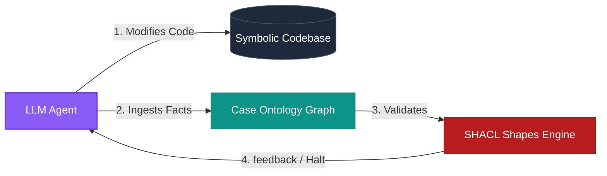
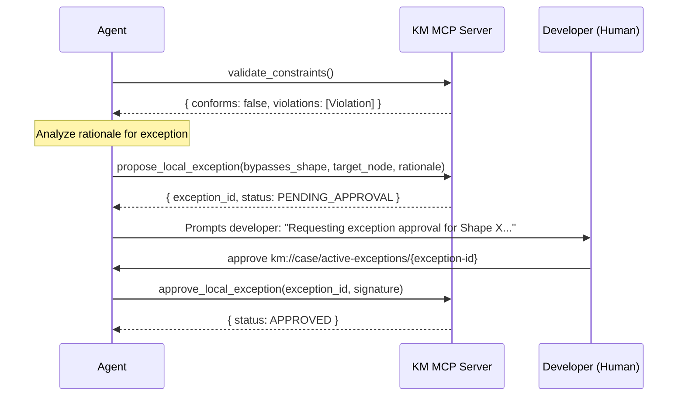

# Agent Usage Guide: Interacting with KM MCP

This document serves as the operational handbook for AI agents executing tasks in a workspace governed by the **Knowledge Management (KM) MCP**. It details the behavioral patterns, execution lifecycle integration, and tools usage protocols necessary to maintain semantic synchrony between code and knowledge.

---

## 1. The Neuro-Symbolic Agent Mindset

As an agent operating in this workspace, you do not just write code; you manage the formal semantics of your implementation. You operate as a **neuro-symbolic bridge**:
*   **The Symbolic:** The concrete source code, ASTs, and files in the workspace.
*   **The Semantic:** The RDF hyper-graph tracking the facts, conventions, and rules of the design.

Every structural change you make to the symbolic layer must be reflected, verified, and constrained in the semantic layer.

---

## 2. KM Interface Contract (Do Not Infer)

Two surfaces exist. Do not pattern-match CLI names to invent MCP tools or undocumented shell commands.

| Surface                          | Purpose                      | Allowed                                                                                                                                                                                                                                                                                                    |
| :------------------------------- | :--------------------------- | :--------------------------------------------------------------------------------------------------------------------------------------------------------------------------------------------------------------------------------------------------------------------------------------------------------- |
| **MCP tools** (agent KM work)    | All semantic operations      | `setup`, `status`, `validate_bindings`, `validate_constraints`, `ingest_case_facts`, `query_semantic_graph`, `propose_local_exception`, `approve_local_exception`, `propose_semantic_mr`, `approve_semantic_mr`, `reject_semantic_mr`, `sync_pending_branch_merges`, `resolve_branch_merge`, `export_case` |
| **`km` CLI** (shell, human-only) | Bootstrap / inspect / export | `init`, `status`, `mcp`, `export-case` only                                                                                                                                                                                                                                                                |

**Rules:**

- Agent KM operations **MUST** use MCP tools — never shell `km …` except when the user explicitly asks (`km init`, or human diagnostics).
- There is **no** `km validate`. Validation is MCP-only: **`validate_constraints`**.
- Never call a KM MCP tool from memory. Read its schema descriptor under `mcps/…/tools/<name>.json` before calling.
- If an MCP tool fails, report the exact error. Do **not** guess CLI fallbacks, alternate tool names, hand-edited TTL, or skipped validation.
- Do not map MCP `status` → shell `km status` unless the user asks for CLI output.
- Do not open a second KM process against `.km/case_quads.db` while `km mcp` is running (e.g. do not run shell `km status` or `km export-case` against the same workspace).

### Anti-patterns

- Do not infer undocumented `km` subcommands (e.g. `km validate`, `km merge-resolve`).
- Do not hand-edit `case-exports/` or `.km/case_quads.db`.
- Do not treat unit/integration test pass as a substitute for SHACL conformance.
- Do not rewrite `.km/config.json` to "repair" MCP errors.

### MCP tool errors (infrastructure)

If **`validate_constraints`** (or any KM MCP tool) throws or returns a non-result error:

1. Report the exact error message to the developer.
2. Do not substitute shell commands, hand-edited TTL, or skipped validation.
3. Optional read-only diagnostics: MCP **`status`**, MCP **`query_semantic_graph`**, or human-run **`km export-case`**.

---

## 3. Protected Workspace Configuration

**Never** create, edit, delete, or overwrite `.km/config.json` unless the user explicitly asks you to change workspace configuration.

- LO bindings, `case_exports`, and `branch_merge` policy are **developer-owned**.
- Use **`status`** and **`km://schemas/learning-ontologies`** for bindings — not direct file edits.
- If bindings must change, describe the exact JSON diff and let the user edit the file or run `km init` themselves.
- Do not use the shell (`cp`, `tee`, `jq`, redirects, etc.) to modify this file.



---

## 4. Agent Execution Lifecycle Integration

You MUST integrate KM MCP tool operations into your standard execution loop at specific checkpoints.

### Phase 0: Workspace Setup (On Startup / Task Start)

Before any other MCP tool or resource:

1.  **`setup`** — pass `workspace_directory` (absolute project root). Optional `lo_source` when binding an LO package for the first time (same semantics as `km init --lo-source`).
2.  Confirm `"status": "ready"` in the response.
3.  Required on every MCP session start, and when switching projects. Especially when the IDE runs `km mcp` globally without per-workspace `cwd` (e.g. Antigravity).

`km mcp` itself does not create or open `.km` files; only **`setup`** prepares the workspace.

### Phase 1: Context Ingestion & Alignment (On Startup / Task Start)
After Phase 0, before writing any code or proposing plans, align your context window with the workspace's loaded ontologies:
1.  **`status`** — active Git branch, `branch_merge_policy`, `pending_branch_merges` (full entries with `approval_command`), `pending_branch_merges_count`, and loaded Learning Ontology bindings (ontology_id, source, mode, cache sync state). Same JSON as CLI `km status`.
2.  **Inspect Active Schemas:** Read `km://schemas/learning-ontologies` for available classes, properties, and constraint boundaries (cached LO **canonical graphs** only).
3.  **Read Case Triples:** Load `km://case/active-graph` or run targeted SPARQL via `query_semantic_graph` for existing branch facts.

### Phase 2: Fact Discovery & Ingestion (During Development)
As you write code (e.g., creating components, modules, endpoints, or data models), you must discover and register the facts:
1.  **Extract Semantics:** Identify concepts, types, and properties.
2.  **Serialize as RDF:** Format the discoveries as JSON-LD or Turtle triples.
3.  **Ingest Facts:** Invoke `ingest_case_facts` to write these facts into the active branch's Named Graph.

> [!TIP]
> Do not dump raw file contents into `ingest_case_facts`. Extract high-density structural facts such as dependency imports, event hook throttle rates, or service layer abstractions.

### Phase 3: Constraint Verification (Before Turn End / Planning Completion)
Before completing a task or presenting a completed change to the developer, verify system compliance against LO **canonical graphs** only (pending MR proposals are excluded):
1.  **Run SHACL Linter:** Invoke `validate_constraints`.
2.  **Interpret Validation Report:**
    *   If `conforms` is `true`, proceed with confidence.
    *   If `conforms` is `false`, analyze the `violations` array immediately. **DO NOT ignore validations.**

See **§2 MCP tool errors (infrastructure)** when the tool itself fails (not a `conforms: false` result).

---

## 5. Detailed Tool Usage Patterns

### MCP / CLI surface alignment

| Capability                     | CLI              | MCP tool                                                           |
| :----------------------------- | :--------------- | :----------------------------------------------------------------- |
| Workspace status               | `km status`      | `status`                                                           |
| SHACL validation               | —                | `validate_constraints`                                             |
| Fact ingestion                 | —                | `ingest_case_facts`                                                |
| SPARQL query                   | —                | `query_semantic_graph`                                             |
| Local exceptions               | —                | `propose_local_exception`, `approve_local_exception`               |
| LO binding validation          | —                | `validate_bindings`                                                |
| Semantic MR                    | —                | `propose_semantic_mr`, `approve_semantic_mr`, `reject_semantic_mr` |
| Export active branch graph     | `km export-case` | `export_case`                                                      |
| Branch merge sync (idempotent) | —                | `sync_pending_branch_merges`                                       |
| Branch merge resolve           | —                | `resolve_branch_merge`                                             |

MCP-only capabilities have **no** CLI mirror. Do not invent one.

Avoid opening a second KM process against `.km/case_quads.db` while `km mcp` is running.

### 5.1 Dynamic Fact Ingestion (`ingest_case_facts`)
When registering code features, express them using clean Turtle or JSON-LD syntax mapped to the schemas defined in your active Learning Ontologies.

#### Python Example: Ingesting an API Controller Structure
```python
# The agent discovers a new controller that handles payment processing
facts_turtle = """
@prefix app: <http://app.local/vocabulary#> .
@prefix xsd: <http://www.w3.org/2001/XMLSchema#> .

app:PaymentController a app:RestController ;
    app:route "/api/v1/payments" ;
    app:governedBy app:StrictAuthPolicy ;
    app:dependsOn app:StripeGatewayService ;
    app:executionTimeoutMs 5000 .
"""

# Call ingest_case_facts
mcp_client.call_tool(
    "ingest_case_facts",
    {"facts": facts_turtle, "format": "turtle"}
)
```

Facts are written to `.km/case_quads.db` first. Exports land in `case-exports/graphs/{active-ref}.ttl` per `case_exports.export_policy` (default: before commit). Use MCP **`export_case`** or CLI **`km export-case`** when policy is `on_commit` or `manual`. **Do not** hand-edit export files.

---

### 5.2 Executing Targeted SPARQL Queries (`query_semantic_graph`)
Use compact SPARQL queries to locate patterns or find relationships instead of searching the directory recursively or parsing files manually.

#### Ask: Find all REST Controllers that depend on Unsecured Services
```sparql
PREFIX app: <http://app.local/vocabulary#>

SELECT ?controller ?route ?unsecuredService
WHERE {
    ?controller a app:RestController ;
                app:route ?route ;
                app:dependsOn ?unsecuredService .
    
    ?unsecuredService a app:ExternalService .
    FILTER NOT EXISTS { ?unsecuredService app:hasSecurityLayer ?security }
}
```

---

### 5.3 Navigating Violations & Proposing Exceptions

When `validate_constraints` flags a violation (e.g., an API route has an execution timeout that exceeds maximum global bounds), you have two choices:
1.  **Refactor the Code:** Adjust the symbolic implementation to conform to the shape.
2.  **Propose a Local Exception:** If there is a legitimate technical reason to bypass the shape, you must register a local exception.



#### Code Pattern: Proposing an Exception
```python
# A specific controller needs a longer timeout due to file-uploads
mcp_client.call_tool(
    "propose_local_exception",
    {
        "bypasses_shape": "http://ontologies.app.org/shapes#ExecutionTimeoutShape",
        "target_node": "http://app.local/vocabulary#LargeUploadController",
        "rationale": "Large document imports require streaming timeouts of up to 30000ms."
    }
)
```
*   **Next Step:** Present the generated `exception_id` to the developer and prompt them to run `approve km://case/active-exceptions/{exception-id}` before completing the transaction.
*   **Export:** After approval, the daemon upserts `case-exports/graphs/{active-ref}.ttl` (exceptions remain in the branch graph per spec §6.1).

---

## 6. Semantic MR Life Cycle (Knowledge Promotion)

When a local pattern or structural extension proves to be globally useful, promote it to a static **Learning Ontology** via the semantic Merge Request pipeline:

1.  **Draft Diff:** Assemble standard Turtle insertions and deletions (`diff_insertions` and `diff_deletions`).
2.  **Submit MR:** Invoke `propose_semantic_mr` passing the target ontology and structural rationale. Requires `mode: "curator"` on the target binding. Proposal quads are written to the **source** LO package; a derived review document is generated in `.km/mrs/`.
3.  **Review File (Derived):** The system generates a markdown review file under `.km/mrs/` from governance triples (or exposes it as `km://mr/{ontology-id}/{mr-id}`).
4.  **Await Decision:** Stop your autonomous loop and request the developer to run `approve <mr-file-path>` or `reject MR-{id}`.
5.  **Apply Approval:** When the developer submits the approval command, parse the `doc_identifier` and invoke `approve_semantic_mr`:
    ```python
    mcp_client.call_tool(
        "approve_semantic_mr",
        {"doc_identifier": ".km/mrs/mr-react-conventions-042.md"},
    )
    ```
6.  **Apply Rejection:** When the developer submits `reject MR-{id}`, invoke `reject_semantic_mr` with the MR id (or doc path / `km://mr/...`). Response `{ "status": "REJECTED" }` — no canonical merge or LO cache rebuild.
7.  **Re-align:** On `{ "status": "APPROVED" }`, invoke `status` to confirm the workspace LO cache is refreshed. On `REJECTED`, confirm `pending_mrs_count` decreased and review doc shows `REJECTED`.

---

## 7. Branch Case Merge Resolution (Post-Git Merge)

After merging a feature branch into `main` or `master`, synchronize Case Ontology graphs per `branch_merge.policy` (spec §5.3). The git watcher inside `km mcp` may run policy steps automatically; you still complete human resolution via MCP.

**When:** `pending_branch_merges` is non-empty in **`status`**, or immediately after `git merge` on the target branch.

1.  **`status`** — if `pending_branch_merges` has entries, use each `approval_command`, `options`, and `warning` directly.
2.  Else **`sync_pending_branch_merges`** (`source_branch`, optional `target_branch`, optional `event_fingerprint`). Idempotent: returns existing prompt, `PENDING_RESOLUTION`, `ALREADY_SYNCED`, `AUTO_MERGED`, or `NO_ACTION` without duplicating governance writes (processed events persist in `.km/processed-merge-events.json`).
3.  If the sync response `status` is `PENDING_RESOLUTION`, prompt the developer with `approval_command` (default suggests `MERGE`; choices: `MERGE`, `KEEP_ISOLATED`, `DELETE`).
4.  On approval, **`resolve_branch_merge`** (`event_id`, `resolution`).
5.  **`status`** again — `pending_branch_merges_count` should be `0`.

Optional: `km://case/pending-merges/{event_id}` for the raw prompt JSON.
