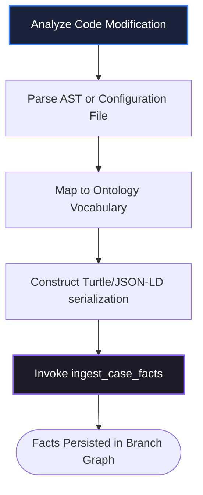
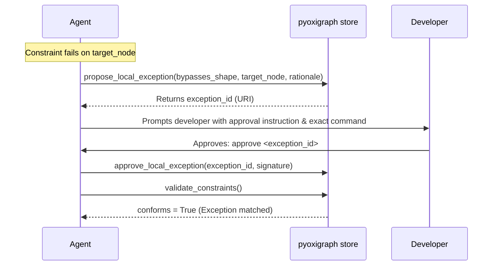

# Agent Workspace Skills: KM MCP Integration

This document defines reusable, step-by-step workspace recipes ("skills") that agents and developer daemons can execute to automate Knowledge Management operations. 

---

## Skill 1: AST-to-RDF Fact Extraction (Ingestion)

**Purpose:** Extract semantic facts from concrete code files (ASTs, configurations, declarations) and ingest them into the Case Ontology.



### Execution Steps
1.  **Locate Changes:** Scan the modified code files (e.g. React components, REST endpoints, database schemas).
2.  **Verify Vocabulary:** Look up allowed classes and relations in `km://schemas/learning-ontologies`.
3.  **Construct Triple Serialization:** Use Turtle syntax. Always group statements by their subject URI (usually `local-app:<ElementName>`).
4.  **Inject and Verify:**
    ```bash
    # Call ingest_case_facts tool with serialization
    ```
5.  **Confirm Entry:** Verify the returned `triples_added` parameter in the tool response is $> 0$.

### Example: Mapping a React High-Frequency Canvas Hook
*   **Source Code (`src/hooks/useCanvasDrag.ts`):**
    ```typescript
    export const useCanvasDrag = () => {
      // Emits continuous coordinates. Throttled to 32ms.
      const throttleRate = 32; 
      ...
    };
    ```
*   **Resulting Turtle Payload:**
    ```turtle
    @prefix react: <http://ontologies.react.org/core#> .
    @prefix local: <http://app.local/hooks#> .
    @prefix xsd: <http://www.w3.org/2001/XMLSchema#> .

    local:useCanvasDrag a react:HighFrequencyEventHook ;
        react:throttleRateMs 32 ;
        react:filePath "src/hooks/useCanvasDrag.ts"^^xsd:string .
    ```

---

## Skill 2: The Continuous SHACL Linter Cycle (Validation)

**Purpose:** Execute continuous constraint validation after any symbolic code edit to guarantee immediate alignment with structural constraints from LO **canonical graphs** only.

### Execution Steps
1.  **Trigger Validation:** Call `validate_constraints` immediately after any local code edit or file generation.
2.  **Evaluate Results:**
    *   **Case A: Success (`conforms = true`)** -> Proceed with standard Git staging/commits.
    *   **Case B: Failure (`conforms = false`)** -> Halt the pipeline. Read the violation details:
        *   `focus_node`: The node violating constraints.
        *   `source_shape`: The SHACL constraint definition.
        *   `message`: Explanation of the rule violation.
3.  **Auto-Correction Loop:**
    *   Assess if the violation can be fixed by modifying the code.
    *   If yes, execute the correction and return to Step 1.
    *   If no, proceed to **Skill 3: Local Exception Provisioning**.

---

## Skill 3: Local Exception Provisioning (Governance)

**Purpose:** Bypass a global SHACL constraint for a specific, justified workspace node under developer supervision.



### Execution Steps
1.  **Extract Parameters:** Identify the violated `source_shape` URI and the target element's node URI.
2.  **Formulate Rationale:** Write a highly descriptive justification detailing why conforming to the shape causes degradation or is technically impossible in this specific case.
3.  **Propose Exception:** Call `propose_local_exception` with parameters.
4.  **Register Human Prompt:** Present the developer with a clear, outstanding visual block:
    > [!WARNING]
    > **Local Shape Exception Requested!**
    > *   **Shape:** `http://ontologies.react.org/core#HighFrequencyThrottleShape`
    > *   **Target:** `local:useCanvasDrag`
    > *   **Rationale:** "Canvas drag updates require absolute zero latency (no throttle) to preserve visual rendering quality."
    > 
    > To approve this bypass, please reply with the following command:
    > ```
    > approve km://case/active-exceptions/uuid-88aef402-990a
    >
    > Use the exact `exception_id` URI returned by `propose_local_exception`.
    > ```
5.  **Await Approval:** Pause agent execution until the human developer submits the approval.
6.  **Apply Signature:** Once approved, invoke `approve_local_exception` using the developer's approval signature to permanently register the exception in the branch graph; the daemon upserts `case-exports/graphs/{active-ref}.ttl`. Approved exceptions are branch-scoped triples; when the feature branch is later merged in Git, the default `auto_merge_exception` policy (`.km/config.json` → `branch_merge.policy`) automatically copies them to the target branch before prompting about remaining Case facts — see spec §5.3.

---

## Skill 4: Semantic MR Promotion (Evolution)

**Purpose:** Promote a localized structural pattern to the global static Learning Ontologies to evolve the shared organizational knowledge base.

```mermaid
sequenceDiagram
    participant Agent
    participant MCP as KM MCP Server
    participant LO as Source LO lo_quads.db
    participant Cache as .km/lo-cache/
    participant Human as Developer

    Agent->>MCP: propose_semantic_mr(target_ontology, rationale, diff)
    MCP->>LO: Write proposal graph + governance triples
    MCP->>LO: Upsert exports/governance/MR-042.ttl
    MCP->>MCP: Generate derived review doc .km/mrs/mr-042.md
    MCP-->>Agent: { mr_id, status: PENDING_APPROVAL }
    Agent->>Human: Prompts: approve .km/mrs/mr-042.md
    Human->>Agent: approve .km/mrs/mr-042.md
    Agent->>MCP: approve_semantic_mr(doc_identifier)
    MCP->>LO: Merge proposal → canonical; regenerate exports/
    MCP->>Cache: Full cache rebuild
    MCP-->>Agent: { status: APPROVED, mr_id, target_ontology, timestamp }
    Agent->>MCP: get_system_status()
```

### Execution Steps
1.  **Draft Semantic Changes:** Write the structural Turtle modifications.
    *   `diff_insertions`: New OWL classes, properties, or SHACL constraint shapes.
    *   `diff_deletions`: Deprecated structural properties or shapes.
2.  **Submit Propose Command:** Call `propose_semantic_mr`. Requires `mode: "curator"` on the target binding. The server writes proposal quads to the **source** LO package's `mr/{mr-id}` graph and MR metadata to the source governance graph.
3.  **Review Document (Derived):** The system generates a markdown review document at `.km/mrs/mr-<mr-id>.md` from governance triples, containing:
    *   Human-readable metadata.
    *   The `approve <doc name>` command path (the agent will call `approve_semantic_mr` when the developer runs it).
    *   A structured summary of engineering rationale.
    *   Standard `diff` blocks against `exports/main.ttl` containing the Turtle serialization edits.
4.  **Instruct the Human:**
    > [!IMPORTANT]
    > **Semantic Knowledge Promotion Submitted!**
    > A new semantic Merge Request has been materialized at `.km/mrs/mr-react-conventions-042.md`.
    > 
    > Please review the changes and run the following command to finalize:
    > ```
    > approve .km/mrs/mr-react-conventions-042.md
    > ```
5.  **Apply Approval:** When the developer submits the approval command, invoke `approve_semantic_mr`:
    ```python
    mcp_client.call_tool(
        "approve_semantic_mr",
        {"doc_identifier": ".km/mrs/mr-react-conventions-042.md"},
    )
    ```
6.  **Reload Memory System:** On `{ "status": "APPROVED" }`, invoke `get_system_status` to confirm the workspace LO cache (`.km/lo-cache/`) is refreshed from source exports and the in-memory canonical cache is reloaded.
