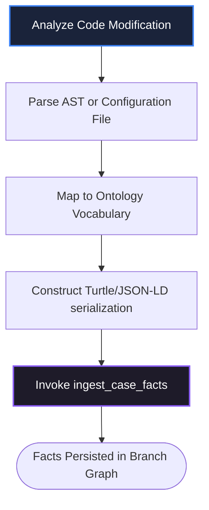
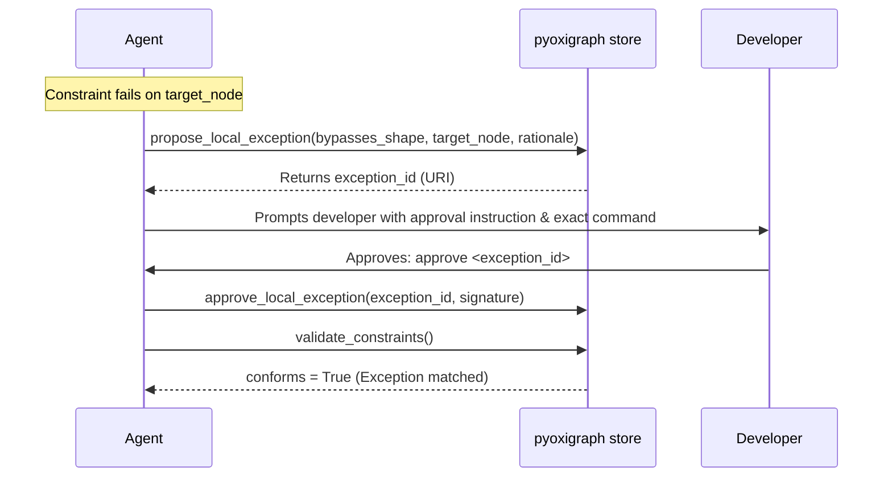
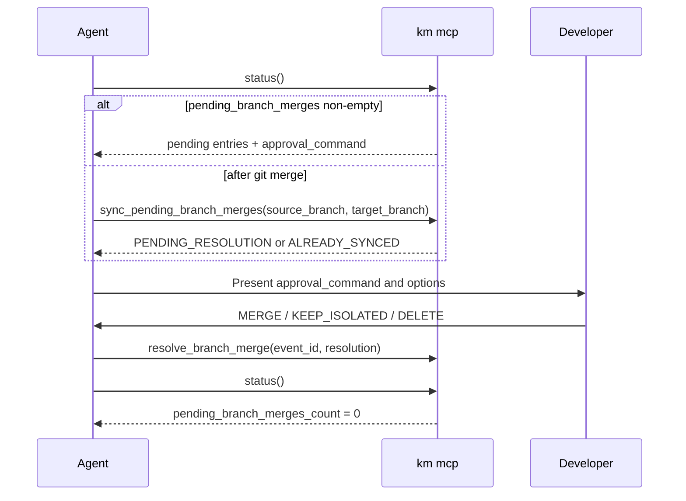

# Agent Workspace Skills: KM MCP Integration

This document defines reusable, step-by-step workspace recipes ("skills") that agents and developer daemons can execute to automate Knowledge Management operations.

**MCP tools (agent):** `setup`, `status`, `validate_bindings`, `validate_constraints`, `ingest_case_facts`, `patch_case_facts`, `query_semantic_graph`, `propose_local_exception`, `approve_local_exception`, `propose_semantic_mr`, `approve_semantic_mr`, `reject_semantic_mr`, `sync_pending_branch_merges`, `resolve_branch_merge`, `export_case`.

**CLI (human / no MCP):** `km init`, `km status`, `km mcp`, `km export-case` only. There is **no** `km validate` — use MCP **`validate_constraints`**.

Never edit `.km/config.json` unless the user explicitly requests a config change (see [agents.md](agents.md) §3).

Never call a KM MCP tool from memory; read `mcps/…/tools/<name>.json` first. On tool failure, report the error — do not invent CLI fallbacks or skip validation. See [agents.md](agents.md) §2 for the full interface contract and error-handling policy.

## Workspace Setup (run first)

**When:** Every MCP session start, or when switching projects (especially IDEs without per-workspace MCP `cwd`).

1. **`setup`** with `workspace_directory` (project root path). Optional `lo_source` for first-time LO binding.
2. Confirm `"status": "ready"` in the response.
3. Proceed with the skills below.

---

## Skill 1: AST-to-RDF Fact Extraction (Ingestion)

**Purpose:** Extract semantic facts from concrete code files (ASTs, configurations, declarations) and ingest them into the Case Ontology.



### Execution Steps
1.  **Locate Changes:** Scan the modified code files (e.g. React components, REST endpoints, database schemas).
2.  **Verify Vocabulary:** Look up allowed classes and relations in `km://schemas/learning-ontologies`.
3.  **Construct Triple Serialization:** Use Turtle syntax. Always group statements by their subject URI (usually `local-app:<ElementName>`).
4.  **Inject and Verify:**
    ```bash
    # Call ingest_case_facts tool with serialization
    ```
5.  **Confirm Entry:** Verify the returned `triples_added` parameter in the tool response is $> 0$.

### Example: Mapping a React High-Frequency Canvas Hook
*   **Source Code (`src/hooks/useCanvasDrag.ts`):**
    ```typescript
    export const useCanvasDrag = () => {
      // Emits continuous coordinates. Throttled to 32ms.
      const throttleRate = 32; 
      ...
    };
    ```
*   **Resulting Turtle Payload:**
    ```turtle
    @prefix react: <http://ontologies.react.org/core#> .
    @prefix local: <http://app.local/hooks#> .
    @prefix xsd: <http://www.w3.org/2001/XMLSchema#> .

    local:useCanvasDrag a react:HighFrequencyEventHook ;
        react:throttleRateMs 32 ;
        react:filePath "src/hooks/useCanvasDrag.ts"^^xsd:string .
    ```

---

## Skill 1b: Case Graph Correction (`patch_case_facts`)

**Purpose:** Remove or replace incorrect Case facts without hand-editing `case-exports/` or rebuilding the store via ad-hoc scripts.

**When:** Wrong `rdf:type`, phantom subject URI, obsolete triples after a rename, or graph/modeling mistakes surfaced by `validate_constraints`.

### Execution Steps

1.  **`query_semantic_graph`** — find the focus node and triples to change on the active branch.
2.  **`patch_case_facts`** with Turtle `diff_deletions` and/or `diff_insertions` (`format`: `turtle`).
    *   **Exact removal:** list ground triples in `diff_deletions`.
    *   **Subject wipe:** `km:deleteSubject true` on the subject (patch directive only; not stored).
3.  Confirm `triples_removed` / `triples_added`; on `status: "error"` the graph is unchanged.
4.  **`validate_constraints`** — re-run SHACL.

Use **`ingest_case_facts`** for new facts only; use **`patch_case_facts`** for corrections and deletions.

---

## Skill 2: The Continuous SHACL Linter Cycle (Validation)

**Purpose:** Execute continuous constraint validation after any symbolic code edit to guarantee immediate alignment with structural constraints from LO **canonical graphs** only.

### Execution Steps
1.  **Trigger Validation:** Call `validate_constraints` immediately after any local code edit or file generation.
2.  **Evaluate Results:**
    *   **Case A: Success (`conforms = true`)** -> Proceed with Git staging/commits; run **Skill 6** if export policy is `on_commit` or `manual`.
    *   **Case B: Failure (`conforms = false`)** -> Halt the pipeline. Read the violation details:
        *   `focus_node`: The node violating constraints.
        *   `source_shape`: The SHACL constraint definition.
        *   `message`: Explanation of the rule violation.
3.  **Auto-Correction Loop:**
    *   Assess if the violation can be fixed by modifying the code and/or **`patch_case_facts`** (stale graph facts).
    *   If yes, execute the correction and return to Step 1.
    *   If no, proceed to **Skill 3: Local Exception Provisioning**.
4.  **Tool error (infrastructure):** If the call fails (not a `conforms: false` result):
    *   Report the exact error message — do not substitute shell `km …`, hand-edited TTL, or test pass for SHACL.
    *   Optional read-only diagnostics: MCP **`status`**, MCP **`query_semantic_graph`**, human **`km export-case`**.

---

## Skill 3: Local Exception Provisioning (Governance)

**Purpose:** Bypass a global SHACL constraint for a specific, justified workspace node under developer supervision.



### Execution Steps
1.  **Extract Parameters:** Identify the violated `source_shape` URI and the target element's node URI.
2.  **Formulate Rationale:** Write a highly descriptive justification detailing why conforming to the shape causes degradation or is technically impossible in this specific case.
3.  **Propose Exception:** Call `propose_local_exception` with parameters.
4.  **Register Human Prompt:** Present the developer with a clear, outstanding visual block:
    > [!WARNING]
    > **Local Shape Exception Requested!**
    > *   **Shape:** `http://ontologies.react.org/core#HighFrequencyThrottleShape`
    > *   **Target:** `local:useCanvasDrag`
    > *   **Rationale:** "Canvas drag updates require absolute zero latency (no throttle) to preserve visual rendering quality."
    > 
    > To approve this bypass, please reply with the following command:
    > ```
    > approve km://case/active-exceptions/uuid-88aef402-990a
    >
    > Use the exact `exception_id` URI returned by `propose_local_exception`.
    > ```
5.  **Await Approval:** Pause agent execution until the human developer submits the approval.
6.  **Apply Signature:** Once approved, invoke `approve_local_exception` using the developer's approval signature to permanently register the exception in the branch graph; the daemon upserts `case-exports/graphs/{active-ref}.ttl`. Approved exceptions are branch-scoped triples; when the feature branch is later merged in Git, the default `auto_merge_exception` policy (`.km/config.json` → `branch_merge.policy`) automatically copies them to the target branch before prompting about remaining Case facts — see spec §5.3.

---

## Skill 0: LO Binding Validation

**When:** Task start, after developer edits `.km/config.json`, or when `status` shows missing/stale LO bindings.

1. **`validate_bindings`** — returns `{ valid, rootPath, catalog_loaded, explicit_bindings, effective_cache_set, implicit_dependencies, bindings[], errors[] }`. Each binding includes `binding_kind` (`explicit` | `implicit`), `dependencies`, and `cache_synced`. Use when `rootPath` and LO package `dependencies` are configured (Addendum 2).
2. If `valid: false`, report `errors[]` and pause (do not hand-edit config).
3. **Not** a substitute for **`validate_constraints`** (SHACL).

---

## Skill 4: Semantic MR Promotion (Evolution)

**Purpose:** Promote a localized structural pattern to the global static Learning Ontologies to evolve the shared organizational knowledge base.

```mermaid
sequenceDiagram
    participant Agent
    participant MCP as KM MCP Server
    participant LO as Source LO lo_quads.db
    participant Cache as .km/lo-cache/
    participant Human as Developer

    Agent->>MCP: propose_semantic_mr(target_ontology, rationale, diff)
    MCP->>LO: Write proposal graph + governance triples
    MCP->>LO: Upsert exports/governance/MR-042.ttl
    MCP->>MCP: Generate derived review doc .km/mrs/mr-042.md
    MCP-->>Agent: { mr_id, status: PENDING_APPROVAL }
    Agent->>Human: Prompts: approve or reject MR-042
    alt approve
        Human->>Agent: approve .km/mrs/mr-042.md
        Agent->>MCP: approve_semantic_mr(doc_identifier)
        MCP->>LO: Merge proposal → canonical; regenerate exports/
        MCP->>Cache: Full cache rebuild
        MCP-->>Agent: { status: APPROVED, mr_id, target_ontology, timestamp }
    else reject
        Human->>Agent: reject MR-042
        Agent->>MCP: reject_semantic_mr(doc_identifier)
        MCP->>LO: Update governance shard only
        MCP-->>Agent: { status: REJECTED, mr_id, timestamp }
    end
    Agent->>MCP: status()
```

### Execution Steps
1.  **Draft Semantic Changes:** Write the structural Turtle modifications.
    *   `diff_insertions`: New OWL classes, properties, or SHACL constraint shapes.
    *   `diff_deletions`: Deprecated structural properties or shapes.
2.  **Submit Propose Command:** Call `propose_semantic_mr`. Requires `mode: "curator"` on the target binding. The server writes proposal quads to the **source** LO package's `mr/{mr-id}` graph and MR metadata to the source governance graph.
3.  **Review Document (Derived):** The system generates a markdown review document at `.km/mrs/mr-<mr-id>.md` from governance triples, containing:
    *   Human-readable metadata.
    *   **High-Level Impact** bullets (classes, SHACL shapes, predicates parsed from the diff).
    *   **Approval Command:** `approve <doc name>` and **Reject Command:** `reject MR-{id}`.
    *   A structured summary of engineering rationale.
    *   Standard `diff` blocks against `exports/main.ttl` containing the Turtle serialization edits.
4.  **Instruct the Human:**
    > [!IMPORTANT]
    > **Semantic Knowledge Promotion Submitted!**
    > A new semantic Merge Request has been materialized at `.km/mrs/mr-react-conventions-042.md`.
    > 
    > Please review the changes and run one of:
    > ```
    > approve .km/mrs/mr-react-conventions-042.md
    > reject MR-REACT_CONVENTIONS-042
    > ```
5.  **Apply Approval:** When the developer submits the approval command, invoke `approve_semantic_mr`:
    ```python
    mcp_client.call_tool(
        "approve_semantic_mr",
        {"doc_identifier": ".km/mrs/mr-react-conventions-042.md"},
    )
    ```
6.  **Apply Rejection:** When the developer submits `reject MR-{id}`, invoke `reject_semantic_mr` — governance shard and review doc only; no canonical merge or cache rebuild.
7.  **Reload Memory System:** On `{ "status": "APPROVED" }`, invoke `status` to confirm the workspace LO cache (`.km/lo-cache/`) is refreshed. On `REJECTED`, confirm `pending_mrs_count` decreased.

---

## Skill 5: Branch Case Merge Resolution

**Purpose:** Synchronize Case Ontology graphs after Git merges a feature branch into `main`/`master` (spec §5.3).

**When:** `pending_branch_merges` is non-empty in **`status`**, or immediately after `git merge` on the target branch.



### Execution Steps

1.  **`status`** — read `pending_branch_merges` and `branch_merge_policy`. Each pending entry includes `event_id`, `options`, `warning`, and `approval_command`.
2.  If the list is empty after a Git merge, call **`sync_pending_branch_merges`** (`source_branch`, optional `target_branch`, optional `event_fingerprint`). Safe to call repeatedly: returns an existing prompt, `ALREADY_SYNCED`, `AUTO_MERGED`, or `NO_ACTION` without rewriting governance (see `.km/processed-merge-events.json`).
3.  When the response `status` is `PENDING_RESOLUTION`, present `approval_command` to the developer and **pause** (e.g. `resolve_branch_merge merge-feature-x-into-main-abc123 MERGE`).
4.  **`resolve_branch_merge`** (`event_id`, `resolution`) with `MERGE`, `KEEP_ISOLATED`, or `DELETE`.
5.  **`status`** — confirm `pending_branch_merges_count` is `0`.

Optional: `km://case/pending-merges/{event_id}` for the raw prompt file.

---

## Skill 6: Case Graph Export (Git commit)

**Purpose:** Write the active branch graph to `case-exports/` when export policy requires an explicit export.

**When:** `case_exports.export_policy` is `on_commit` or `manual` (default is often `on_commit`).

1.  **`export_case`** (MCP) or **`km export-case`** (CLI) — returns `{ "status": "success", "export_path": "..." }`.
2.  Stage the updated `case-exports/graphs/{active-ref}.ttl` with the code commit.

Do not hand-edit export TTL files.
